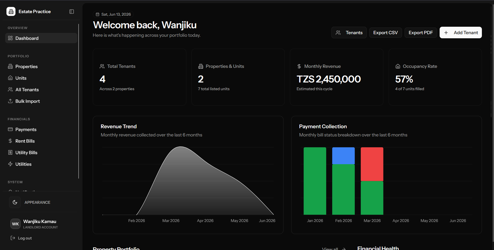

# Estate — the modern Property management software

🌐 **[Live Demo → estate-6icx.onrender.com](https://estate-6icx.onrender.com)**

## The Problem

Managing rental properties still means juggling spreadsheets, chasing payments over WhatsApp, and sending PDF receipts by hand. Estate replaces that chaos with a single platform where landlords track every unit, bill, and payment — and tenants have a clear view of what they owe and when.

## What is Estate?

Estate is a full-stack web platform that gives landlords complete control over their rental portfolio and gives tenants a transparent, self-serve view of their tenancy — all in one place.

## Features

### For Landlords
- **Property & unit management** — Organise properties into individual units, track occupancy, and assign tenants to specific units without spreadsheets.
- **Tenant onboarding** — Add tenants manually or bulk-import them from a CSV file, with lease details attached from day one.
- **Rent & utility billing** — Generate rent bills and utility charges per unit, with a clear record of what's been issued, paid, and outstanding.
- **Payment tracking** — Log and reconcile payments against bills, with a full transaction history and overdue visibility at a glance.
- **Revenue dashboard** — See income across all properties in one view, with the option to export a financial summary as a PDF.
- **Document management** — Store and share lease agreements and receipts with tenants directly through the platform.
- **Real-time notifications** — Get alerted the moment a payment is received or a bill goes past its due date.

### For Tenants
- **Personal dashboard** — A single view of current rent balance, utility charges, and recent payment activity — no need to contact the landlord for updates.
- **Payment history** — Full record of every payment made, with downloadable receipts.
- **Document access** — View and download lease agreements and any documents the landlord has shared.
- **Notifications** — Receive alerts when a new bill is issued or a payment is confirmed.

### For Mobile
- **REST API** — All core functionality is available through a versioned, Sanctum-authenticated API, ready for a companion mobile app.

## Tech & Architecture

Stack choices were driven by developer productivity, type safety end-to-end, and keeping the codebase maintainable as it scales.

| Layer | Technology | Why |
|---|---|---|
| Backend | Laravel 12 (PHP 8.5) | Structured service layer keeps business logic out of controllers and fully testable |
| Frontend | React 19 + Inertia.js v2 | Full SPA feel without a separate API — server-side routing stays in Laravel |
| Styling | Tailwind CSS v4 | Utility-first, consistent design system with zero unused CSS in production |
| Auth | Laravel Fortify + Sanctum | Covers both session-based web auth and token-based API auth from one config |
| Queue | Redis (prod) / Database (local) | Async notifications and background jobs without blocking the request cycle |
| PDF | barryvdh/laravel-dompdf | Server-side report generation, no client-side dependencies |
| Deployment | Docker + Render | Reproducible builds, environment parity between local and production |

## Live Demo

🌐 [estate-6icx.onrender.com](https://estate-6icx.onrender.com)
