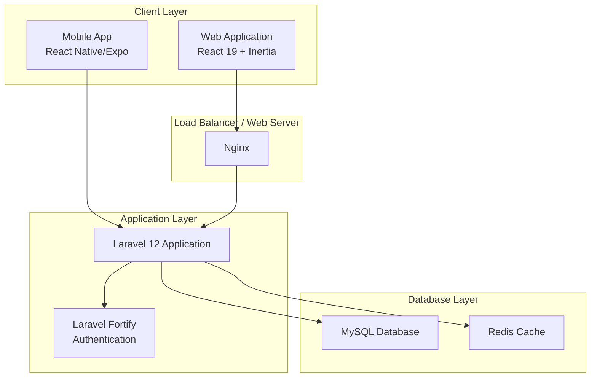
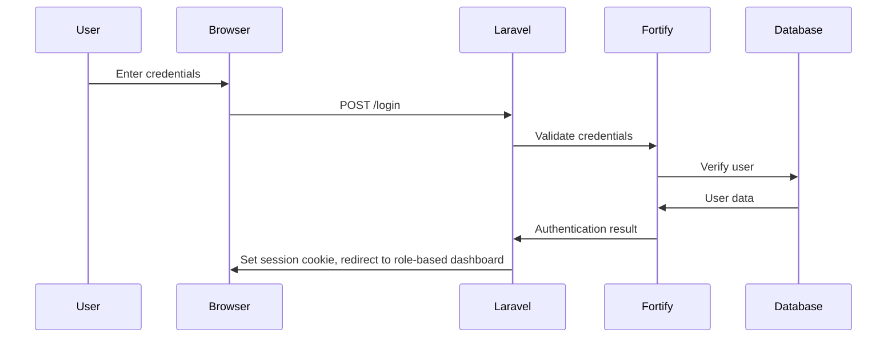
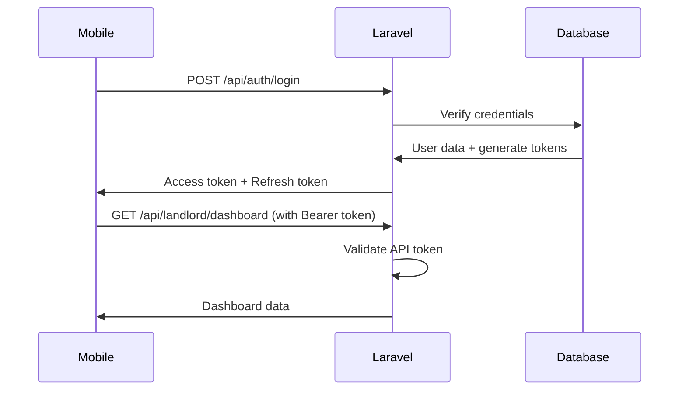
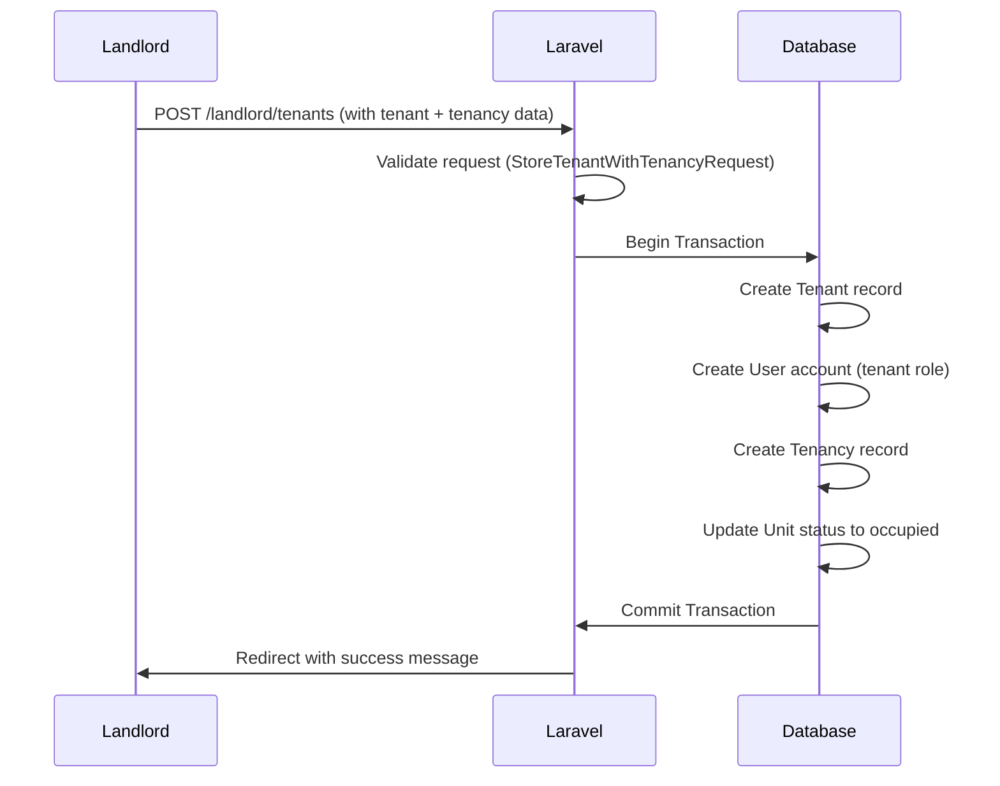

# Project Architecture

## Overview
This is a Laravel 12 + React 19 full-stack property management application called "Estate Practice". It provides a multi-tenant property management system with three user roles: Admin, Landlord, and Tenant.

## Technology Stack

### Backend
- **Framework**: Laravel 12.x
- **PHP Version**: 8.2+
- **Authentication**: Laravel Fortify (session-based for web, token-based for API)
- **Server-Side Rendering**: Inertia.js with React 19

### Frontend (Web)
- **UI Framework**: React 19 with TypeScript
- **Styling**: TailwindCSS 4.0 with CSS variables
- **Component Library**: shadcn/ui (New York style, neutral base color, lucide icons)
- **Charts**: Recharts
- **Build Tool**: Vite 7.0.4

### Mobile (React Native/Expo)
- **Framework**: React Native with Expo
- **Target**: iOS and Android

## System Architecture Diagram



## Application Layers

### 1. Presentation Layer (React + Inertia)
Located in the root (not resources/js), using Inertia.js for SSR:
- **Web Controllers**: `app/Http/Controllers/Web/`
- **Pages**: Inertia page components rendered server-side
- **Middleware**: HandleInertiaRequests, HandleAppearance

### 2. API Layer (REST)
Located in `app/Http/Controllers/Api/`:
- **Authentication API**: `app/Http/Controllers/Api/Auth/`
- **Tenant API**: `app/Http/Controllers/Api/Tenant/`
- **Landlord API**: `app/Http/Controllers/Api/Landlord/`

### 3. Business Logic Layer
Located in:
- **Services**: `app/Services/` (PaymentService, TenantService, UtilityService)
- **Models**: `app/Models/` (User, Property, Unit, Tenant, Tenancy, Payment, etc.)
- **Actions**: `app/Actions/Fortify/` (User creation, password validation)

### 4. Data Access Layer
- **Eloquent Models**: `app/Models/`
- **Migrations**: `database/migrations/`
- **Seeders**: `database/seeders/`

## Module Structure

### User Management Module
```
app/Models/User.php
app/Http/Controllers/Web/Settings/
app/Actions/Fortify/
```
- **Roles**: admin, landlord, tenant
- **Features**: Profile management, password changes, two-factor authentication

### Property Management Module
```
app/Http/Controllers/Web/Admin/AdminPropertyController.php
app/Http/Controllers/Web/Landlord/LandlordPropertyController.php
app/Models/Property.php
```
- **Features**: CRUD operations, property details, images

### Unit Management Module
```
app/Http/Controllers/Web/Landlord/LandlordUnitController.php
app/Models/Unit.php
```
- **Features**: Unit CRUD, property association, availability status

### Tenant Management Module
```
app/Http/Controllers/Web/Landlord/LandlordTenantController.php
app/Models/Tenant.php
app/Models/Tenancy.php
app/Services/TenantService.php
```
- **Features**: Tenant registration, tenancy creation, tenant identification

### Payment Module
```
app/Http/Controllers/Web/Landlord/LandlordPaymentController.php
app/Models/Payment.php
app/Services/PaymentService.php
```
- **Features**: Payment tracking, payment history

### Notification Module
```
app/Http/Controllers/Web/*/NotificationController.php
app/Models/Notification.php
app/Notifications/
```
- **Features**: In-app notifications, email notifications, tenancy expiry alerts

### Utility Module
```
app/Http/Controllers/Web/Tenant/TenantUtilitiesController.php
app/Models/Utility.php
app/Services/UtilityService.php
```
- **Features**: Utility tracking (water, electricity, etc.)

### Security Module
```
app/Http/Middleware/AuthenticateApiToken.php
app/Models/ApiToken.php
app/Models/SecurityEvent.php
```
- **Features**: API token management, device tracking, security event logging

## Data Flow

### Web Authentication Flow


### API Authentication Flow


### Tenant Creation Flow


## Route Structure

### Web Routes (Session-based)
```
/admin/dashboard        -> AdminDashboardController
/admin/users           -> AdminUserController
/admin/properties      -> AdminPropertyController

/landlord/dashboard    -> LandlordDashboardController
/landlord/properties   -> LandlordPropertyController
/landlord/units       -> LandlordUnitController
/landlord/tenants     -> LandlordTenantController
/landlord/payments    -> LandlordPaymentController
/landlord/notifications -> LandlordNotificationController

/tenant/dashboard     -> TenantDashboardController
/tenant/payments     -> TenantPaymentsController
/tenant/utilities    -> TenantUtilitiesController
/tenant/notifications -> TenantNotificationController

/settings/profile     -> ProfileController
/settings/password   -> PasswordController
```

### API Routes (Token-based)
```
/api/auth/login       -> AuthController@login
/api/auth/refresh     -> AuthController@refresh
/api/auth/logout      -> AuthController@logout
/api/auth/me          -> AuthController@me
/api/auth/sessions    -> SessionController

/api/tenant/dashboard -> Tenant\DashboardController
/api/tenant/payments  -> Tenant\PaymentsController
/api/tenant/utilities -> Tenant\UtilitiesController

/api/landlord/dashboard   -> Landlord\DashboardController
/api/landlord/properties  -> Landlord\PropertyController
/api/landlord/units       -> Landlord\UnitController
/api/landlord/tenants     -> Landlord\TenantController
/api/landlord/payments    -> Landlord\PaymentController
/api/landlord/notifications -> Landlord\NotificationController
```

## Middleware Stack

1. **web** - Session encryption, cookie signing, CSRF protection
2. **auth** - User authentication verification
3. **auth.role** - Role-based redirect after login
4. **auth.api** - API token authentication
5. **throttle** - Rate limiting (30 requests/minute for sessions)
6. **HandleAppearance** - Inertia theme handling
7. **HandleInertiaRequests** - Inertia share data, version checking

## Database Connections

- **MySQL**: Primary database for application data
- **Redis**: Caching, session storage, queue management
- **File Storage**: Laravel filesystem for property images, documents

## Environment Configuration

The application uses environment variables for configuration:
- Database credentials
- Application key
- Session driver
- Cache driver
- Mail configuration
- API URLs for mobile

## Command Scheduler

Laravel scheduler handles:
- `EndExpiredTenancies` - Automatically ends expired tenancies
- `TestTenancyNotifications` - Tests expiry notifications

## Summary

This architecture follows:
- **MVC pattern** with Laravel
- **Repository pattern** through Eloquent
- **Service layer** for complex business logic
- **Middleware pattern** for cross-cutting concerns
- **Role-based access control** (RBAC)
- **API-first design** supporting both web and mobile clients
- **Server-side rendering** with Inertia.js for optimal performance
