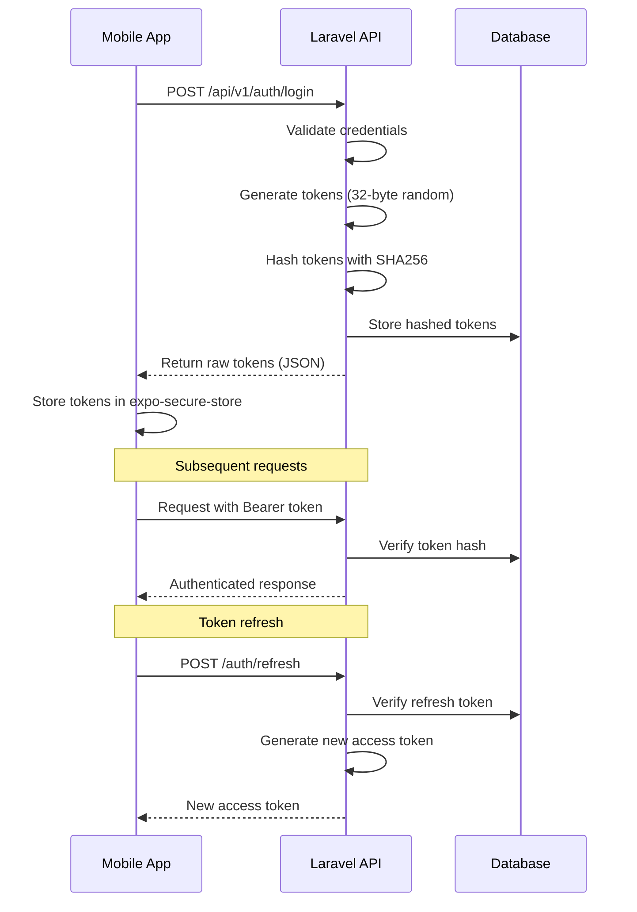
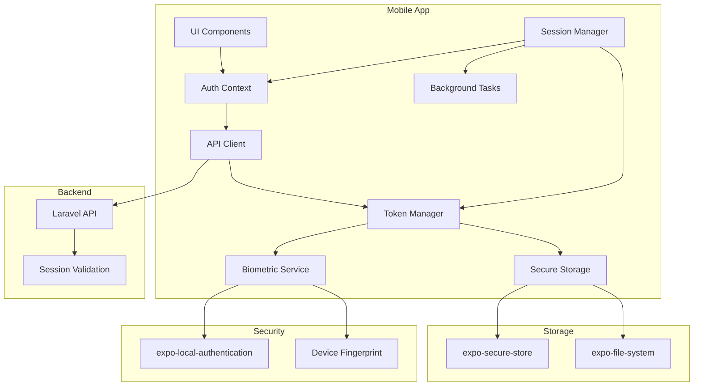
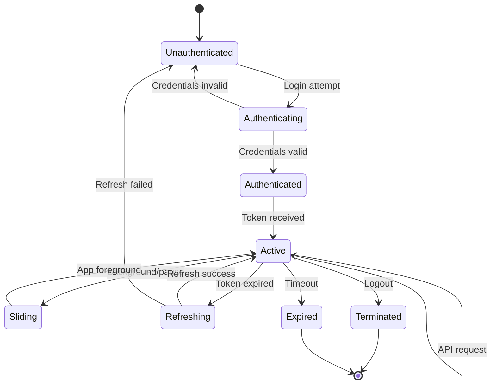
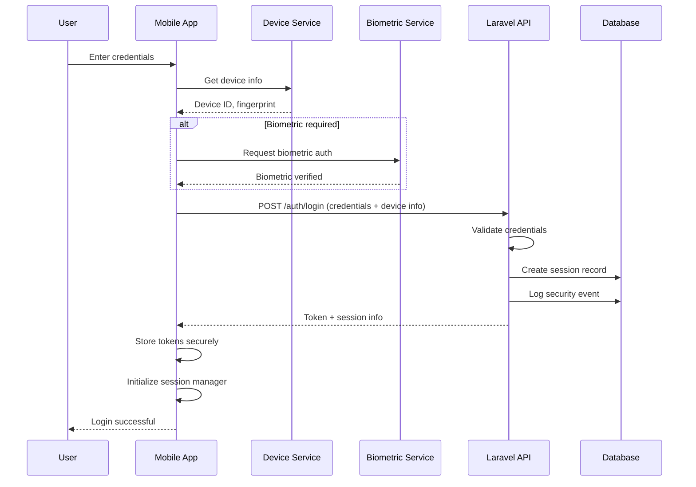

# Authentication and Session Management Architecture

## Document Overview

This document outlines a comprehensive authentication and session management architecture for the Estate Practice mobile application. The system extends the existing Laravel backend with React Native/Expo mobile client to support multiple concurrent sessions, biometric authentication, and robust session lifecycle management.

---

## 1. Current Architecture Analysis

### 1.1 Existing System Components

The current implementation consists of:

| Component | Technology | Description |
|-----------|------------|-------------|
| Backend | Laravel 11 | RESTful API with token-based authentication |
| Mobile Client | React Native/Expo | Cross-platform mobile application |
| Token Storage | expo-secure-store | Encrypted secure storage for tokens |
| Token Strategy | Dual-token | 8-hour access token + 30-day refresh token |
| Hashing Algorithm | SHA256 | Token hashing for secure storage |

### 1.2 Current Authentication Flow



### 1.3 Identified Gaps

| Gap | Current State | Required State |
|-----|---------------|----------------|
| Multiple Sessions | Single token per user | Multiple concurrent sessions per user |
| Device Tracking | Not implemented | Device fingerprinting and tracking |
| Biometrics | Not implemented | Face ID / Fingerprint support |
| Session Persistence | Basic token storage | Full session lifecycle management |
| Session Invalidation | Manual logout only | Auto-timeout, password change, security events |
| Background Handling | App termination | Sliding expiration, background persistence |

---

## 2. Session Data Model

### 2.1 Enhanced Database Schema

The session management requires an expanded data model to track devices, sessions, and security events.

#### 2.1.1 Updated api_tokens Table

```php
// database/migrations/YYYY_MM_DDHHMMSS_update_api_tokens_table.php

Schema::table('api_tokens', function (Blueprint $table) {
    // Add device tracking columns
    $table->string('device_id', 64)->nullable()->after('user_id');
    $table->string('device_name', 255)->nullable();
    $table->string('device_type', 20)->nullable(); // 'ios', 'android', 'web'
    $table->string('device_fingerprint', 64)->nullable()->unique();
    
    // Add session metadata
    $table->string('ip_address', 45)->nullable();
    $table->text('user_agent')->nullable();
    $table->string('location', 255)->nullable(); // Approximate location
    
    // Add biometric flags
    $table->boolean('biometric_enabled')->default(false)->nullable();
    $table->string('biometric_key_id', 255)->nullable();
    
    // Add sliding expiration support
    $table->integer('sliding_window_minutes')->default(30)->nullable();
    $table->timestamp('last_activity_at')->nullable();
    
    // Add session security events
    $table->string('security_event', 50)->nullable();
    $table->timestamp('suspicious_activity_at')->nullable();
    
    // Add indexes for efficient querying
    $table->index(['user_id', 'device_id']);
    $table->index(['user_id', 'revoked_at']);
    $table->index(['device_fingerprint']);
});
```

#### 2.1.2 New Device Registrations Table

```php
// database/migrations/YYYY_MM_DDHHMMSS_create_device_registrations_table.php

Schema::create('device_registrations', function (Blueprint $table) {
    $table->id();
    $table->foreignId('user_id')->constrained()->cascadeOnDelete();
    
    $table->string('device_id', 64);
    $table->string('device_name', 255);
    $table->string('device_type', 20);
    $table->string('device_fingerprint', 64)->unique();
    
    // Push notification tokens
    $table->string('push_token', 255)->nullable();
    $table->string('push_service', 20)->nullable(); // 'apns', 'fcm'
    
    // Biometric settings
    $table->boolean('biometric_enabled')->default(false);
    $table->boolean('biometric_required')->default(false);
    
    // Device capabilities
    $table->json('capabilities')->nullable();
    
    // Trust level (trusted, untrusted)
    $table->string('trust_level', 20)->default('untrusted');
    
    //Timestamps
    $table->timestamps();
    $table->timestamp('last_login_at')->nullable();
    $table->timestamp('registered_at')->nullable();
    
    $table->unique(['user_id', 'device_id']);
    $table->index(['user_id', 'trust_level']);
});
```

#### 2.1.3 New Security Events Table

```php
// database/migrations/YYYY_MM_DDHHMMSS_create_security_events_table.php

Schema::create('security_events', function (Blueprint $table) {
    $table->id();
    $table->foreignId('user_id')->constrained()->cascadeOnDelete();
    $table->foreignId('api_token_id')->nullable()->constrained('api_tokens')->nullOnDelete();
    
    $table->string('event_type', 50); // 'login', 'logout', 'password_change', 'suspicious_activity'
    $table->string('severity', 20); // 'low', 'medium', 'high', 'critical'
    
    $table->string('ip_address', 45)->nullable();
    $table->string('device_id', 64)->nullable();
    $table->string('device_name', 255)->nullable();
    $table->string('user_agent', 512)->nullable();
    $table->string('location', 255)->nullable();
    
    $table->text('description')->nullable();
    $table->json('metadata')->nullable();
    
    $table->boolean('resolved')->default(false);
    $table->timestamp('resolved_at')->nullable();
    
    $table->timestamps();
    
    $table->index(['user_id', 'created_at']);
    $table->index(['event_type', 'severity']);
});
```

### 2.2 Laravel Models

#### 2.2.1 ApiToken Model Enhancement

```php
// app/Models/ApiToken.php

namespace App\Models;

use Illuminate\Database\Eloquent\Model;
use Illuminate\Database\Eloquent\Relations\BelongsTo;

class ApiToken extends Model
{
    protected $fillable = [
        'user_id',
        'token_hash',
        'refresh_token_hash',
        'expires_at',
        'refresh_expires_at',
        'last_used_at',
        'revoked_at',
        // New fields
        'device_id',
        'device_name',
        'device_type',
        'device_fingerprint',
        'ip_address',
        'user_agent',
        'location',
        'biometric_enabled',
        'biometric_key_id',
        'sliding_window_minutes',
        'last_activity_at',
        'security_event',
        'suspicious_activity_at',
    ];

    protected function casts(): array
    {
        return [
            'expires_at' => 'datetime',
            'refresh_expires_at' => 'datetime',
            'last_used_at' => 'datetime',
            'last_activity_at' => 'datetime',
            'revoked_at' => 'datetime',
            'biometric_enabled' => 'boolean',
            'suspicious_activity_at' => 'datetime',
        ];
    }

    // Scope for active sessions
    public function scopeActive($query)
    {
        return $query->whereNull('revoked_at')
            ->where('expires_at', '>', now());
    }

    // Scope for user's sessions
    public function scopeForUser($query, int $userId)
    {
        return $query->where('user_id', $userId)
            ->whereNull('revoked_at');
    }

    // Check if session requires biometric
    public function requiresBiometric(): bool
    {
        return $this->biometric_enabled && $this->biometric_key_id !== null;
    }

    // Update sliding expiration
    public function refreshSlidingWindow(): void
    {
        $this->forceFill([
            'last_activity_at' => now(),
            'expires_at' => now()->addMinutes($this->sliding_window_minutes ?? 30),
        ])->save();
    }

    // Check for suspicious activity
    public function hasSuspiciousActivity(): bool
    {
        return $this->suspicious_activity_at !== null;
    }

    public function user(): BelongsTo
    {
        return $this->belongsTo(User::class);
    }
}
```

#### 2.2.2 DeviceRegistration Model

```php
// app/Models/DeviceRegistration.php

namespace App\Models;

use Illuminate\Database\Eloquent\Model;
use Illuminate\Database\Eloquent\Relations\BelongsTo;
use Illuminate\Database\Eloquent\Relations\HasMany;

class DeviceRegistration extends Model
{
    protected $fillable = [
        'user_id',
        'device_id',
        'device_name',
        'device_type',
        'device_fingerprint',
        'push_token',
        'push_service',
        'biometric_enabled',
        'biometric_required',
        'capabilities',
        'trust_level',
        'last_login_at',
        'registered_at',
    ];

    protected function casts(): array
    {
        return [
            'capabilities' => 'array',
            'biometric_enabled' => 'boolean',
            'biometric_required' => 'boolean',
            'last_login_at' => 'datetime',
            'registered_at' => 'datetime',
        ];
    }

    public function user(): BelongsTo
    {
        return $this->belongsTo(User::class);
    }

    public function apiTokens(): HasMany
    {
        return $this->hasMany(ApiToken::class, 'device_fingerprint', 'device_fingerprint');
    }

    public function isTrusted(): bool
    {
        return $this->trust_level === 'trusted';
    }

    public function markAsTrusted(): void
    {
        $this->forceFill(['trust_level' => 'trusted'])->save();
    }
}
```

#### 2.2.3 SecurityEvent Model

```php
// app/Models/SecurityEvent.php

namespace App\Models;

use Illuminate\Database\Eloquent\Model;
use Illuminate\Database\Eloquent\Relations\BelongsTo;

class SecurityEvent extends Model
{
    protected $fillable = [
        'user_id',
        'api_token_id',
        'event_type',
        'severity',
        'ip_address',
        'device_id',
        'device_name',
        'user_agent',
        'location',
        'description',
        'metadata',
        'resolved',
        'resolved_at',
    ];

    protected function casts(): array
    {
        return [
            'metadata' => 'array',
            'resolved' => 'boolean',
            'resolved_at' => 'datetime',
        ];
    }

    public const EVENT_TYPES = [
        'login' => 'Login',
        'logout' => 'Logout',
        'password_change' => 'Password Change',
        'password_reset' => 'Password Reset',
        'suspicious_activity' => 'Suspicious Activity',
        'biometric_enabled' => 'Biometric Enabled',
        'biometric_disabled' => 'Biometric Disabled',
        'session_expired' => 'Session Expired',
        'session_revoked' => 'Session Revoked',
        'device_added' => 'Device Added',
        'device_removed' => 'Device Removed',
        'multiple_login' => 'Multiple Login',
    ];

    public const SEVERITY_LEVELS = [
        'low',
        'medium',
        'high',
        'critical',
    ];

    public function user(): BelongsTo
    {
        return $this->belongsTo(User::class);
    }

    public function apiToken(): BelongsTo
    {
        return $this->belongsTo(ApiToken::class);
    }

    public function markAsResolved(): void
    {
        $this->forceFill([
            'resolved' => true,
            'resolved_at' => now(),
        ])->save();
    }
}
```

---

## 3. API Endpoints for Session Management

### 3.1 Endpoint Overview

| Method | Endpoint | Description | Auth Required |
|--------|----------|-------------|---------------|
| POST | /auth/login | Authenticate user | No |
| POST | /auth/logout | Logout current session | Yes |
| POST | /auth/refresh | Refresh access token | No |
| GET | /auth/me | Get current user | Yes |
| GET | /auth/sessions | List all user sessions | Yes |
| DELETE | /auth/sessions/{id} | Revoke specific session | Yes |
| DELETE | /auth/sessions | Revoke all other sessions | Yes |
| POST | /auth/sessions/{id}/refresh | Extend specific session | Yes |
| GET | /auth/devices | List registered devices | Yes |
| DELETE | /auth/devices/{id} | Remove device registration | Yes |
| PUT | /auth/devices/{id}/trust | Trust/untrust device | Yes |
| PUT | /auth/biometric | Enable/disable biometric | Yes |
| POST | /auth/biometric/verify | Verify biometric auth | Yes |
| POST | /auth/logout-all | Logout all sessions | Yes |
| POST | /auth/revoke-security | Revoke sessions after security event | Yes |

### 3.2 Request/Response Schemas

#### 3.2.1 Login with Device Information

```typescript
// Request
interface LoginRequest {
  email: string;
  password: string;
  device: {
    id: string;           // UUID generated on device
    name: string;        // Device name (e.g., "John's iPhone 14")
    type: 'ios' | 'android' | 'web';
    fingerprint: string; // Device fingerprint hash
    capabilities?: {
      biometric: boolean;
      biometricType?: 'faceId' | 'fingerprint' | 'both';
    };
  };
  biometric_token?: string; // If biometric auth is enabled
}

// Response
interface LoginResponse {
  token: string;
  refresh_token: string;
  expires_in: 28800; // 8 hours in seconds
  refresh_expires_in: 2592000; // 30 days in seconds
  session: {
    id: number;
    device_id: string;
    device_name: string;
    device_type: string;
    last_activity_at: string;
    biometric_enabled: boolean;
    sliding_window_minutes: number;
  };
  user: AuthUser;
}
```

#### 3.2.2 Sessions List Response

```typescript
// GET /auth/sessions Response
interface SessionsResponse {
  sessions: Array<{
    id: number;
    device_id: string;
    device_name: string;
    device_type: string;
    ip_address: string;
    location: string;
    last_used_at: string;
    last_activity_at: string;
    expires_at: string;
    biometric_enabled: boolean;
    current: boolean; // Is this the current session
  }>;
  total_active: number;
}
```

#### 3.2.3 Device Registration Response

```typescript
// GET /auth/devices Response
interface DevicesResponse {
  devices: Array<{
    id: number;
    device_id: string;
    device_name: string;
    device_type: string;
    trust_level: 'trusted' | 'untrusted';
    biometric_enabled: boolean;
    last_login_at: string;
    registered_at: string;
    current: boolean;
  }>;
}
```

### 3.3 Controller Implementation Plan

#### 3.3.1 Session Management Controller

```php
// app/Http/Controllers/Api/Auth/SessionController.php

namespace App\Http\Controllers\Api\Auth;

use App\Http\Controllers\Controller;
use App\Models\ApiToken;
use App\Models\SecurityEvent;
use Illuminate\Http\Request;
use Illuminate\Http\JsonResponse;
use Illuminate\Support\Facades\Auth;

class SessionController extends Controller
{
    /**
     * List all active sessions for current user
     */
    public function index(Request $request): JsonResponse
    {
        $sessions = ApiToken::forUser($request->user()->id)
            ->with(['user'])
            ->orderBy('last_used_at', 'desc')
            ->get()
            ->map(function ($session) use ($request) {
                return [
                    'id' => $session->id,
                    'device_id' => $session->device_id,
                    'device_name' => $session->device_name,
                    'device_type' => $session->device_type,
                    'ip_address' => $session->ip_address,
                    'location' => $session->location,
                    'last_used_at' => $session->last_used_at?->toIso8601String(),
                    'last_activity_at' => $session->last_activity_at?->toIso8601String(),
                    'expires_at' => $session->expires_at?->toIso8601String(),
                    'biometric_enabled' => $session->biometric_enabled,
                    'current' => $session->token_hash === hash('sha256', $request->bearerToken()),
                ];
            });

        return response()->json([
            'sessions' => $sessions,
            'total_active' => $sessions->count(),
        ]);
    }

    /**
     * Revoke specific session
     */
    public function destroy(Request $request, int $sessionId): JsonResponse
    {
        $session = ApiToken::where('user_id', $request->user()->id)
            ->findOrFail($sessionId);

        // Prevent revoking current session through this endpoint
        $currentTokenHash = hash('sha256', $request->bearerToken());
        if ($session->token_hash === $currentTokenHash) {
            return response()->json([
                'message' => 'Cannot revoke current session. Use logout instead.',
            ], 422);
        }

        $session->forceFill(['revoked_at' => now()])->save();

        // Log security event
        SecurityEvent::create([
            'user_id' => $request->user()->id,
            'api_token_id' => $session->id,
            'event_type' => 'session_revoked',
            'severity' => 'low',
            'ip_address' => $request->ip(),
            'device_name' => $session->device_name,
            'description' => 'Session revoked by user',
        ]);

        return response()->json(['message' => 'Session revoked successfully']);
    }

    /**
     * Revoke all other sessions (keep current)
     */
    public function revokeOthers(Request $request): JsonResponse
    {
        $currentTokenHash = hash('sha256', $request->bearerToken());
        
        $revoked = ApiToken::where('user_id', $request->user()->id)
            ->where('token_hash', '!=', $currentTokenHash)
            ->whereNull('revoked_at')
            ->update(['revoked_at' => now()]);

        return response()->json([
            'message' => "Revoked {$revoked} sessions",
        ]);
    }

    /**
     * Extend session sliding window
     */
    public function extend(Request $request, int $sessionId): JsonResponse
    {
        $session = ApiToken::where('user_id', $request->user()->id)
            ->findOrFail($sessionId);

        // Only allow extending current session
        $currentTokenHash = hash('sha256', $request->bearerToken());
        if ($session->token_hash !== $currentTokenHash) {
            return response()->json([
                'message' => 'Can only extend current session',
            ], 422);
        }

        $session->refreshSlidingWindow();

        return response()->json([
            'message' => 'Session extended',
            'expires_at' => $session->expires_at?->toIso8601String(),
        ]);
    }

    /**
     * Logout from all sessions
     */
    public function logoutAll(Request $request): JsonResponse
    {
        ApiToken::where('user_id', $request->user()->id)
            ->whereNull('revoked_at')
            ->update(['revoked_at' => now()]);

        // Log security event
        SecurityEvent::create([
            'user_id' => $request->user()->id,
            'event_type' => 'logout',
            'severity' => 'low',
            'ip_address' => $request->ip(),
            'description' => 'All sessions logged out',
        ]);

        return response()->json(['message' => 'Logged out from all devices']);
    }
}
```

#### 3.3.2 Device Management Controller

```php
// app/Http/Controllers/Api/Auth/DeviceController.php

namespace App\Http\Controllers\Api\Auth;

use App\Http\Controllers\Controller;
use App\Models\DeviceRegistration;
use App\Models\SecurityEvent;
use Illuminate\Http\Request;
use Illuminate\Http\JsonResponse;

class DeviceController extends Controller
{
    public function index(Request $request): JsonResponse
    {
        $devices = DeviceRegistration::where('user_id', $request->user()->id)
            ->orderBy('last_login_at', 'desc')
            ->get()
            ->map(function ($device) use ($request) {
                return [
                    'id' => $device->id,
                    'device_id' => $device->device_id,
                    'device_name' => $device->device_name,
                    'device_type' => $device->device_type,
                    'trust_level' => $device->trust_level,
                    'biometric_enabled' => $device->biometric_enabled,
                    'last_login_at' => $device->last_login_at?->toIso8601String(),
                    'registered_at' => $device->registered_at?->toIso8601String(),
                    'current' => $device->device_id === $request->header('X-Device-ID'),
                ];
            });

        return response()->json(['devices' => $devices]);
    }

    public function destroy(Request $request, int $deviceId): JsonResponse
    {
        $device = DeviceRegistration::where('user_id', $request->user()->id)
            ->findOrFail($deviceId);

        // Revoke all sessions for this device
        $device->apiTokens()->update(['revoked_at' => now()]);

        $device->delete();

        return response()->json(['message' => 'Device removed']);
    }

    public function trust(Request $request, int $deviceId): JsonResponse
    {
        $device = DeviceRegistration::where('user_id', $request->user()->id)
            ->findOrFail($deviceId);

        $device->forceFill(['trust_level' => 'trusted'])->save();

        return response()->json(['message' => 'Device marked as trusted']);
    }

    public function untrust(Request $request, int $deviceId): JsonResponse
    {
        $device = DeviceRegistration::where('user_id', $request->user()->id)
            ->findOrFail($deviceId);

        $device->forceFill(['trust_level' => 'untrusted'])->save();

        return response()->json(['message' => 'Device marked as untrusted']);
    }
}
```

---

## 4. Mobile Implementation Approach

### 4.1 Architecture Overview



### 4.2 Required Dependencies

#### 4.2.1 Package.json Updates

```json
{
  "dependencies": {
    // Existing
    "expo-secure-store": "~55.0.8",
    
    // New dependencies for enhanced auth
    "expo-local-authentication": "~15.0.1",
    "expo-crypto": "~14.0.1",
    "expo-task-manager": "~12.0.4",
    "expo-background-fetch": "~13.0.4",
    "expo-notifications": "~0.30.1",
    "expo-device": "~7.0.1",
    "expo-network": "~7.0.3",
    "expo-location": "~18.0.5",
    "react-native-mmkv": "^3.2.0",
    "axios": "^1.12.2",
    "uuid": "^11.0.0"
  }
}
```

### 4.3 Core Implementation Modules

#### 4.3.1 Device Information Service

```typescript
// mobile/src/services/DeviceService.ts

import * as Device from 'expo-device';
import * as SecureStore from 'expo-secure-store';
import * as Crypto from 'expo-crypto';
import Constants from 'expo-constants';

export interface DeviceInfo {
  id: string;
  name: string;
  type: 'ios' | 'android' | 'web';
  fingerprint: string;
  modelName: string;
  osVersion: string;
  capabilities: {
    biometric: boolean;
    biometricType?: 'faceId' | 'fingerprint' | 'both';
  };
}

const DEVICE_ID_KEY = 'device_id';

class DeviceService {
  private cachedDeviceInfo: DeviceInfo | null = null;

  async getDeviceInfo(): Promise<DeviceInfo> {
    if (this.cachedDeviceInfo) {
      return this.cachedDeviceInfo;
    }

    const deviceId = await this.getOrCreateDeviceId();
    const biometricType = await this.getBiometricType();
    
    const deviceInfo: DeviceInfo = {
      id: deviceId,
      name: this.getDeviceName(),
      type: Platform.OS as 'ios' | 'android' | 'web',
      fingerprint: await this.generateFingerprint(deviceId),
      modelName: Device.modelName || 'Unknown',
      osVersion: Device.osVersion || 'Unknown',
      capabilities: {
        biometric: biometricType !== null,
        biometricType: biometricType || undefined,
      },
    };

    this.cachedDeviceInfo = deviceInfo;
    return deviceInfo;
  }

  private async getOrCreateDeviceId(): Promise<string> {
    let deviceId = await SecureStore.getItemAsync(DEVICE_ID_KEY);
    
    if (!deviceId) {
      deviceId = Crypto.randomUUID();
      await SecureStore.setItemAsync(DEVICE_ID_KEY, deviceId);
    }
    
    return deviceId;
  }

  private getDeviceName(): string {
    return Device.deviceName || Constants.expoConfig?.name || 'Unknown Device';
  }

  private async generateFingerprint(deviceId: string): Promise<string> {
    const data = `${deviceId}|${Device.modelName}|${Device.osVersion}`;
    return Crypto.digestStringAsync(
      Crypto.CryptoDigestAlgorithm.SHA256,
      data
    );
  }

  private async getBiometricType(): Promise<'faceId' | 'fingerprint' | null> {
    const { supported } = await LocalAuthentication.hasHardwareAsync();
    if (!supported) return null;

    const types = await LocalAuthentication.supportedAuthenticationTypesAsync();
    
    if (types.includes(LocalAuthentication.AuthenticationType.FACIAL_RECOGNITION)) {
      return 'faceId';
    } else if (types.includes(LocalAuthentication.AuthenticationType.FINGERPRINT)) {
      return 'fingerprint';
    }
    
    return null;
  }
}

export const deviceService = new DeviceService();
```

#### 4.3.2 Biometric Authentication Service

```typescript
// mobile/src/services/BiometricService.ts

import * as LocalAuthentication from 'expo-local-authentication';
import * as SecureStore from 'expo-secure-store';
import * as Crypto from 'expo-crypto';

const BIOMETRIC_KEY_ID = 'biometric_key_id';
const BIOMETRIC_TOKEN_KEY = 'biometric_token';

export interface BiometricResult {
  success: boolean;
  error?: string;
}

class BiometricService {
  private isEnrolled = false;

  async initialize(): Promise<void> {
    const compatible = await LocalAuthentication.hasHardwareAsync();
    const enrolled = await LocalAuthentication.isEnrolledAsync();
    
    this.isEnrolled = compatible && enrolled;
  }

  async isAvailable(): Promise<boolean> {
    return this.isEnrolled;
  }

  async getBiometricType(): Promise<'faceId' | 'fingerprint' | null> {
    const types = await LocalAuthentication.supportedAuthenticationTypesAsync();
    
    if (types.includes(LocalAuthentication.AuthenticationType.FACIAL_RECOGNITION)) {
      return 'faceId';
    } else if (types.includes(LocalAuthentication.AuthenticationType.FINGERPRINT)) {
      return 'fingerprint';
    }
    
    return null;
  }

  async authenticate(reason: string): Promise<BiometricResult> {
    try {
      const result = await LocalAuthentication.authenticateAsync({
        promptMessage: reason,
        cancelLabel: 'Cancel',
        disableDeviceFallback: true,
        fallbackLabel: 'Use Password',
      });

      if (result.success) {
        return { success: true };
      }

      return {
        success: false,
        error: result.error || 'Authentication failed',
      };
    } catch (error) {
      return {
        success: false,
        error: error instanceof Error ? error.message : 'Unknown error',
      };
    }
  }

  async storeBiometricKey(userId: string, token: string): Promise<string> {
    // Generate a biometric-protected key
    const keyId = Crypto.randomUUID();
    
    // Store encrypted token with biometric protection
    await SecureStore.setItemAsync(`${BIOMETRIC_TOKEN_KEY}_${keyId}`, token, {
      keychainAccessible: SecureStore.WHEN_PASSCODE_SET_THIS_DEVICE_ONLY,
    });
    
    await SecureStore.setItemAsync(BIOMETRIC_KEY_ID, keyId);
    
    return keyId;
  }

  async getBiometricToken(): Promise<string | null> {
    const keyId = await SecureStore.getItemAsync(BIOMETRIC_KEY_ID);
    
    if (!keyId) {
      return null;
    }
    
    return SecureStore.getItemAsync(`${BIOMETRIC_TOKEN_KEY}_${keyId}`);
  }

  async removeBiometricKey(): Promise<void> {
    const keyId = await SecureStore.getItemAsync(BIOMETRIC_KEY_ID);
    
    if (keyId) {
      await SecureStore.deleteItemAsync(`${BIOMETRIC_TOKEN_KEY}_${keyId}`);
    }
    
    await SecureStore.deleteItemAsync(BIOMETRIC_KEY_ID);
  }

  async isBiometricSetup(): Promise<boolean> {
    const keyId = await SecureStore.getItemAsync(BIOMETRIC_KEY_ID);
    return keyId !== null;
  }
}

export const biometricService = new BiometricService();
```

#### 4.3.3 Session Manager with Sliding Expiration

```typescript
// mobile/src/services/SessionManager.ts

import * as SecureStore from 'expo-secure-store';
import { AppState, AppStateStatus } from 'react-native';
import * as TaskManager from 'expo-task-manager';
import * as BackgroundFetch from 'expo-background-fetch';
import { api } from '../api/client';

const SESSION_KEY = 'session_data';
const LAST_ACTIVITY_KEY = 'last_activity';

interface SessionData {
  sessionId: number;
  deviceId: string;
  expiresAt: string;
  slidingWindowMinutes: number;
  lastActivityAt: string;
}

class SessionManager {
  private appStateSubscription: ReturnType<typeof AppState.addListener> | null = null;
  private slidingTimer: ReturnType<typeof setInterval> | null = null;
  private sessionData: SessionData | null = null;

  async initialize(): Promise<void> {
    await this.loadSessionData();
    this.setupAppStateListener();
    this.setupSlidingExpiration();
  }

  async saveSessionData(data: Omit<SessionData, 'lastActivityAt'>): Promise<void> {
    const sessionData: SessionData = {
      ...data,
      lastActivityAt: new Date().toISOString(),
    };
    
    await SecureStore.setItemAsync(SESSION_KEY, JSON.stringify(sessionData));
    this.sessionData = sessionData;
  }

  private async loadSessionData(): Promise<void> {
    const data = await SecureStore.getItemAsync(SESSION_KEY);
    if (data) {
      this.sessionData = JSON.parse(data);
    }
  }

  async getSessionData(): Promise<SessionData | null> {
    if (!this.sessionData) {
      await this.loadSessionData();
    }
    return this.sessionData;
  }

  async clearSessionData(): Promise<void> {
    await SecureStore.deleteItemAsync(SESSION_KEY);
    this.sessionData = null;
  }

  private setupAppStateListener(): void {
    this.appStateSubscription = AppState.addEventListener('change', 
      this.handleAppStateChange.bind(this)
    );
  }

  private async handleAppStateChange(nextAppState: AppStateStatus): Promise<void> {
    // When app comes to foreground, verify session and extend if needed
    if (nextAppState === 'active') {
      await this.verifyAndExtendSession();
    }
    
    // Update last activity on any state change
    await this.updateLastActivity();
  }

  private setupSlidingExpiration(): void {
    // Check session validity every minute
    this.slidingTimer = setInterval(() => {
      this.checkSessionExpiration();
    }, 60000);
  }

  private async checkSessionExpiration(): Promise<void> {
    if (!this.sessionData) return;

    const expiresAt = new Date(this.sessionData.expiresAt);
    const now = new Date();

    if (now >= expiresAt) {
      // Session expired, clear and trigger re-login
      await this.handleSessionExpired();
    }
  }

  private async handleSessionExpired(): Promise<void> {
    await this.clearSessionData();
    
    // Emit event for UI to show login screen
    // This would typically be handled through the AuthContext
    console.log('Session expired');
  }

  async verifyAndExtendSession(): Promise<boolean> {
    if (!this.sessionData) {
      return false;
    }

    try {
      // Verify session with backend and get new expiration
      const response = await api.post<{ expires_at: string }>('/auth/sessions/extend-current');
      
      this.sessionData.expiresAt = response.expires_at;
      this.sessionData.lastActivityAt = new Date().toISOString();
      await SecureStore.setItemAsync(SESSION_KEY, JSON.stringify(this.sessionData));
      
      return true;
    } catch (error) {
      // Session invalid, clear data
      await this.clearSessionData();
      return false;
    }
  }

  async updateLastActivity(): Promise<void> {
    if (!this.sessionData) return;

    this.sessionData.lastActivityAt = new Date().toISOString();
    await SecureStore.setItemAsync(SESSION_KEY, JSON.stringify(this.sessionData));
  }

  // Handle background fetch to extend session
  async handleBackgroundFetch(): Promise<BackgroundFetch.BackgroundFetchResult> {
    if (!this.sessionData) {
      return BackgroundFetch.BackgroundFetchResult.NoData;
    }

    try {
      const success = await this.verifyAndExtendSession();
      return success 
        ? BackgroundFetch.BackgroundFetchResult.NewData 
        : BackgroundFetch.BackgroundFetchResult.NoData;
    } catch {
      return BackgroundFetch.BackgroundFetchResult.Failed;
    }
  }

  cleanup(): void {
    if (this.appStateSubscription) {
      this.appStateSubscription.remove();
    }
    if (this.slidingTimer) {
      clearInterval(this.slidingTimer);
    }
  }
}

export const sessionManager = new SessionManager();
```

#### 4.3.4 Enhanced Auth Context

```typescript
// mobile/src/context/AuthContext.tsx (Enhanced)

import React, { createContext, useContext, useEffect, useState, ReactNode, useCallback } from 'react';
import { deleteItem, getItem, setItem } from '../utils/storage';
import { authApi } from '../api/auth';
import { deviceService, DeviceInfo } from '../services/DeviceService';
import { biometricService } from '../services/BiometricService';
import { sessionManager } from '../services/SessionManager';
import type { AuthUser, LoginCredentials, AuthResponse } from '../types';

interface SessionInfo {
  id: number;
  deviceId: string;
  expiresAt: string;
  slidingWindowMinutes: number;
}

interface AuthContextType {
  user: AuthUser | null;
  isLoading: boolean;
  isAuthenticated: boolean;
  session: SessionInfo | null;
  device: DeviceInfo | null;
  biometricAvailable: boolean;
  biometricEnabled: boolean;
  login: (credentials: LoginCredentials) => Promise<void>;
  loginWithBiometric: () => Promise<void>;
  enableBiometric: () => Promise<void>;
  disableBiometric: () => Promise<void>;
  logout: () => Promise<void>;
  logoutAll: () => Promise<void>;
  refreshSession: () => Promise<void>;
  updateUser: (user: AuthUser) => void;
}

const AuthContext = createContext<AuthContextType | undefined>(undefined);

async function saveTokens(response: AuthResponse, session: SessionInfo): Promise<void> {
  await setItem('auth_token', response.token);
  if (response.refresh_token) {
    await setItem('refresh_token', response.refresh_token);
  }
  
  // Save session info for sliding expiration
  await sessionManager.saveSessionData({
    sessionId: session.id,
    deviceId: session.deviceId,
    expiresAt: response.expires_at,
    slidingWindowMinutes: session.slidingWindowMinutes,
  });
}

async function clearTokens(): Promise<void> {
  await deleteItem('auth_token');
  await deleteItem('refresh_token');
  await sessionManager.clearSessionData();
}

export function AuthProvider({ children }: { children: ReactNode }) {
  const [user, setUser] = useState<AuthUser | null>(null);
  const [isLoading, setIsLoading] = useState(true);
  const [session, setSession] = useState<SessionInfo | null>(null);
  const [device, setDevice] = useState<DeviceInfo | null>(null);
  const [biometricAvailable, setBiometricAvailable] = useState(false);
  const [biometricEnabled, setBiometricEnabled] = useState(false);

  useEffect(() => {
    initializeAuth();
  }, []);

  useEffect(() => {
    // Set up activity tracking listeners
    if (isAuthenticated) {
      sessionManager.initialize();
    }
    
    return () => {
      sessionManager.cleanup();
    };
  }, [isAuthenticated]);

  const initializeAuth = async () => {
    try {
      // Initialize services
      await deviceService.getDeviceInfo().then(setDevice);
      await biometricService.initialize().then(setBiometricAvailable);
      await sessionManager.initialize();

      // Check biometric status
      const biometricSetup = await biometricService.isBiometricSetup();
      setBiometricEnabled(biometricSetup);

      // Check for existing token
      const token = await getItem('auth_token');
      if (token) {
        const userData = await authApi.me();
        setUser(userData);
        
        // Restore session info
        const sessionData = await sessionManager.getSessionData();
        if (sessionData) {
          setSession(sessionData);
        }
      }
    } catch (error) {
      console.log('Auth initialization failed:', error);
      await clearTokens();
    } finally {
      setIsLoading(false);
    }
  };

  const login = async (credentials: LoginCredentials) => {
    const deviceInfo = await deviceService.getDeviceInfo();
    
    // Check if biometric is required
    const biometricRequired = await checkBiometricRequired();
    
    if (biometricRequired && biometricEnabled) {
      // Require biometric authentication first
      const biometricResult = await biometricService.authenticate(
        'Authenticate to login'
      );
      
      if (!biometricResult.success) {
        throw new Error(biometricResult.error || 'Biometric authentication failed');
      }
    }

    const response = await authApi.login({
      ...credentials,
      device: deviceInfo,
    });

    const sessionInfo: SessionInfo = {
      id: response.session.id,
      deviceId: deviceInfo.id,
      expiresAt: new Date(Date.now() + 8 * 60 * 60 * 1000).toISOString(),
      slidingWindowMinutes: response.session.slidingWindowMinutes,
    };

    await saveTokens(response, sessionInfo);
    setSession(sessionInfo);
    setUser(response.user);
  };

  const loginWithBiometric = async () => {
    const result = await biometricService.authenticate('Authenticate to login');
    
    if (!result.success) {
      throw new Error(result.error || 'Biometric authentication failed');
    }

    // Get stored biometric token
    const token = await biometricService.getBiometricToken();
    if (!token) {
      throw new Error('No biometric credentials found');
    }

    // Attempt to refresh session with biometric
    const response = await authApi.loginWithBiometric(token);
    
    const deviceInfo = await deviceService.getDeviceInfo();
    const sessionInfo: SessionInfo = {
      id: response.session.id,
      deviceId: deviceInfo.id,
      expiresAt: new Date(Date.now() + 8 * 60 * 60 * 1000).toISOString(),
      slidingWindowMinutes: response.session.slidingWindowMinutes,
    };

    await saveTokens(response, sessionInfo);
    setSession(sessionInfo);
    setUser(response.user);
  };

  const enableBiometric = async () => {
    // Authenticate first to enable
    const result = await biometricService.authenticate(
      'Authenticate to enable biometric login'
    );
    
    if (!result.success) {
      throw new Error(result.error || 'Biometric authentication failed');
    }

    // Get current token
    const token = await getItem('auth_token');
    if (!token) {
      throw new Error('No active session');
    }

    // Store biometric-protected token
    const keyId = await biometricService.storeBiometricKey(
      user?.id?.toString() || '',
      token
    );

    // Update backend
    await authApi.enableBiometric({ key_id: keyId });
    
    setBiometricEnabled(true);
  };

  const disableBiometric = async () => {
    await biometricService.removeBiometricKey();
    await authApi.disableBiometric();
    setBiometricEnabled(false);
  };

  const logout = async () => {
    try {
      await authApi.logout();
    } catch (error) {
      console.log('Logout API error:', error);
    } finally {
      await clearTokens();
      setUser(null);
      setSession(null);
    }
  };

  const logoutAll = async () => {
    try {
      await authApi.logoutAll();
    } finally {
      await clearTokens();
      setUser(null);
      setSession(null);
    }
  };

  const refreshSession = async () => {
    const success = await sessionManager.verifyAndExtendSession();
    
    if (!success) {
      await clearTokens();
      setUser(null);
      setSession(null);
      throw new Error('Session expired');
    }

    const sessionData = await sessionManager.getSessionData();
    if (sessionData) {
      setSession(sessionData);
    }
  };

  const checkBiometricRequired = async (): Promise<boolean> => {
    try {
      const response = await authApi.checkBiometricRequired();
      return response.required;
    } catch {
      return false;
    }
  };

  return (
    <AuthContext.Provider
      value={{
        user,
        isLoading,
        isAuthenticated: !!user,
        session,
        device,
        biometricAvailable,
        biometricEnabled,
        login,
        loginWithBiometric,
        enableBiometric,
        disableBiometric,
        logout,
        logoutAll,
        refreshSession,
        updateUser: setUser,
      }}
    >
      {children}
    </AuthContext.Provider>
  );
}

export function useAuth() {
  const context = useContext(AuthContext);
  if (context === undefined) {
    throw new Error('useAuth must be used within an AuthProvider');
  }
  return context;
}
```

---

## 5. Session Lifecycle Management

### 5.1 Session States and Transitions



### 5.2 Session Creation Flow



### 5.3 Token Refresh Strategy

| Scenario | Strategy |
|----------|----------|
| Access token expires | Use refresh token to get new access token |
| Refresh token expires | Force re-login |
| Session idle | Sliding window extends expiration |
| Multiple concurrent requests | Queue refresh, share token |
| Background refresh fails | Retry with exponential backoff |
| Biometric required | Verify biometric before refresh |

### 5.4 Session Invalidation Events

```php
// app/Listeners/InvalidateSessions.php

namespace App\Listeners;

use App\Models\ApiToken;
use App\Models\SecurityEvent;

class InvalidateSessions
{
    /**
     * Handle password change - revoke all sessions except current
     */
    public function handlePasswordChange(int $userId, string $currentTokenHash): void
    {
        ApiToken::where('user_id', $userId)
            ->where('token_hash', '!=', $currentTokenHash)
            ->whereNull('revoked_at')
            ->update(['revoked_at' => now()]);

        SecurityEvent::create([
            'user_id' => $userId,
            'event_type' => 'password_change',
            'severity' => 'high',
            'description' => 'All other sessions invalidated due to password change',
        ]);
    }

    /**
     * Handle suspicious activity - revoke compromised sessions
     */
    public function handleSuspiciousActivity(int $userId, array $sessionIds): void
    {
        ApiToken::whereIn('id', $sessionIds)
            ->update([
                'revoked_at' => now(),
                'security_event' => 'suspicious_activity',
                'suspicious_activity_at' => now(),
            ]);

        // Notify user via push notification
        // ...
    }

    /**
     * Handle admin action - revoke specific user's all sessions
     */
    public function handleAdminRevoke(int $userId, string $reason): void
    {
        ApiToken::where('user_id', $userId)
            ->whereNull('revoked_at')
            ->update(['revoked_at' => now()]);

        SecurityEvent::create([
            'user_id' => $userId,
            'event_type' => 'session_revoked',
            'severity' => 'high',
            'description' => 'Sessions revoked by admin: ' . $reason,
        ]);
    }
}
```

---

## 6. Platform-Specific Implementation

### 6.1 iOS Implementation

#### 6.1.1 Keychain Configuration

```typescript
// For expo-secure-store, ensure iOS keychain is properly configured
// In ios/YourApp/Info.plist add:

/*
<key>NSFaceIDUsageDescription</key>
<string>We use Face ID to secure your account</string>
*/
```

#### 6.1.2 Background Task Registration

```typescript
// mobile/src/services/ios/BackgroundTasks.ts

import * as TaskManager from 'expo-task-manager';
import * as BackgroundFetch from 'expo-background-fetch';

const BACKGROUND_SESSION_TASK = 'background-session-refresh';

export function registerBackgroundTasks(): void {
  TaskManager.defineTask(BACKGROUND_SESSION_TASK, async () => {
    try {
      const sessionManager = (await import('../SessionManager')).sessionManager;
      const result = await sessionManager.handleBackgroundFetch();
      return result;
    } catch {
      return BackgroundFetch.BackgroundFetchResult.Failed;
    }
  });
}

export async function requestBackgroundPermissions(): Promise<boolean> {
  const status = await BackgroundFetch.requestPermissionsAsync();
  return status.status === BackgroundFetch.BackgroundFetchStatus.Available;
}

export async function startBackgroundFetch(): Promise<void> {
  await BackgroundFetch.registerTaskAsync(BACKGROUND_SESSION_TASK, {
    minimumInterval: 15 * 60, // 15 minutes
    stopOnTerminate: false,
    startOnBoot: true,
  });
}
```

### 6.2 Android Implementation

#### 6.2.1 Biometric Prompt

```typescript
// mobile/src/services/android/BiometricPrompt.ts

import * as LocalAuthentication from 'expo-local-authentication';

export async function showAndroidBiometricPrompt(): Promise<boolean> {
  const result = await LocalAuthentication.authenticateAsync({
    promptMessage: 'Authenticate to continue',
    cancelLabel: 'Cancel',
    disableDeviceFallback: false,
    fallbackLabel: 'Use PIN',
  });

  return result.success;
}
```

#### 6.2.2 WorkManager for Background Tasks

```typescript
// For Android, use WorkManager via expo-workflow or react-native-background-fetch
// Configuration in android/app/src/main/AndroidManifest.xml:

/*
<uses-permission android:name="android.permission.RECEIVE_BOOT_COMPLETED"/>
<uses-permission android:name="android.permission.WAKE_LOCK"/>
*/
```

---

## 7. Security Considerations and Best Practices

### 7.1 Token Security

| Practice | Implementation |
|----------|----------------|
| Token Storage | Use expo-secure-store (iOS Keychain / Android Keystore) |
| Token Transmission | Always use HTTPS |
| Token Validation | Server-side hash verification |
| Token Entropy | 32-byte random tokens (256-bit) |
| Hash Algorithm | SHA-256 (already implemented) |

### 7.2 Biometric Security

| Consideration | Implementation |
|---------------|----------------|
| Fallback | Require password as fallback |
| Lockout | After 5 failed attempts |
| Key Storage | Use secure enclave / keychain |
| Verification | Always verify with biometric before sensitive operations |

### 7.3 Session Security

| Threat | Mitigation |
|--------|------------|
| Token Theft | Short-lived access tokens, secure storage |
| Session Hijacking | Device fingerprinting, IP validation |
| Replay Attacks | Unique token per request (optional) |
| Session Fixation | New token on login |
| Concurrent Sessions | Track and manage per device |

### 7.4 Security Audit Checklist

```markdown
## Security Audit Checklist

### Authentication
- [ ] Passwords properly hashed (bcrypt)
- [ ] Rate limiting on login endpoint
- [ ] Account lockout after failed attempts
- [ ] Secure password reset flow

### Token Management
- [ ] Tokens stored securely (encrypted)
- [ ] Token expiration enforced
- [ ] Refresh token rotation
- [ ] Token revocation implemented

### Session Management
- [ ] Session tracking per device
- [ ] Concurrent session limits
- [ ] Session timeout enforced
- [ ] Logout clears all session data

### Mobile Security
- [ ] Biometric authentication integrated
- [ ] Secure storage used for sensitive data
- [ ] Certificate pinning (optional)
- [ ] Debug mode disabled in production

### API Security
- [ ] HTTPS enforced
- [ ] CORS properly configured
- [ ] Input validation
- [ ] SQL injection prevention
- [ ] XSS prevention

### Monitoring
- [ ] Login attempt logging
- [ ] Suspicious activity detection
- [ ] Security event notifications
- [ ] Audit trail for sensitive actions
```

---

## 8. Recommended Libraries

### 8.1 Laravel Backend

| Category | Library | Purpose |
|----------|---------|---------|
| API Authentication | Laravel Sanctum | Token management (or custom) |
| Security Events | Laravel Auditing | Audit logging |
| Rate Limiting | Laravel Throttle | Login rate limiting |
| Notifications | Laravel Notifications | Push notifications |
| Background Jobs | Laravel Queue | Session cleanup |

### 8.2 React Native/Expo Mobile

| Category | Library | Purpose |
|----------|---------|---------|
| Secure Storage | expo-secure-store | Token storage |
| Biometrics | expo-local-authentication | Face ID / Fingerprint |
| Device Info | expo-device | Device identification |
| Background Tasks | expo-task-manager | Background session refresh |
| Push Notifications | expo-notifications | Push notifications |
| Network | expo-network | Network state |
| Location | expo-location | Approximate location |
| Encryption | expo-crypto | Device fingerprinting |
| Fast Storage | react-native-mmkv | Session metadata cache |

---

## 9. Implementation Roadmap

### Phase 1: Core Session Management
- [ ] Update database schema with device tracking
- [ ] Create DeviceRegistration model
- [ ] Create SecurityEvent model
- [ ] Enhance ApiToken model
- [ ] Implement session management endpoints

### Phase 2: Mobile Session Manager
- [ ] Implement DeviceService
- [ ] Implement SessionManager with sliding expiration
- [ ] Update AuthContext with session tracking
- [ ] Handle background/foreground transitions

### Phase 3: Biometric Integration
- [ ] Implement BiometricService
- [ ] Add biometric login flow
- [ ] Add biometric enable/disable endpoints
- [ ] Implement biometric-protected token storage

### Phase 4: Security Enhancements
- [ ] Implement security event logging
- [ ] Add session revocation on password change
- [ ] Add suspicious activity detection
- [ ] Implement concurrent session limits

### Phase 5: Polish & Testing
- [ ] Comprehensive testing
- [ ] Security audit
- [ ] Performance optimization
- [ ] Documentation

---

## 10. Appendix

### A. Environment Variables

```env
# Laravel
SESSION_LIFETIME=480  # 8 hours in minutes
REFRESH_TOKEN_LIFETIME=43200  # 30 days in minutes
SLIDING_WINDOW_MINUTES=30
MAX_CONCURRENT_SESSIONS=5

# Mobile
BIOMETRIC_REQUIRED=false
SESSION_REFRESH_INTERVAL=900  # 15 minutes
```

### B. API Response Codes

| Code | Meaning |
|------|---------|
| 200 | Success |
| 401 | Unauthenticated |
| 403 | Forbidden |
| 422 | Validation Error |
| 429 | Rate Limited |
| 419 | Session Expired |

### C. Security Event Types

| Type | Severity | Description |
|------|----------|-------------|
| login | low | User logged in |
| logout | low | User logged out |
| password_change | high | Password changed |
| suspicious_activity | high | Suspicious activity detected |
| session_revoked | medium | Session was revoked |
| biometric_enabled | low | Biometric enabled |
| device_added | low | New device registered |

---

*Document Version: 1.0*
*Last Updated: 2026-03-07*
