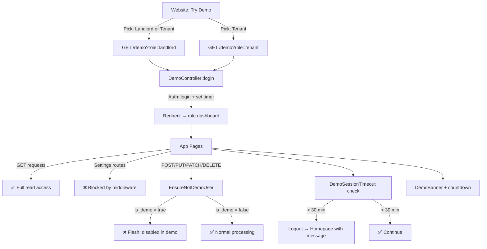

# Demo Mode: Read-Only Landlord & Tenant Experience

Allow prospective users to explore the app as a pre-configured **landlord or tenant** without signing up. A "Try Demo" button on the website auto-logs them into a dedicated demo account with realistic seed data, where all **mutating actions are blocked** and **Settings pages are inaccessible**. Sessions auto-expire after **30 minutes**.

---

## Decisions (Confirmed)

| Question | Decision |
|---|---|
| Try Demo on login page? | **No** — only on website (hero, CTA, navbar) |
| Which pages to expose? | Dashboard, properties, tenants, payments, rent bills, utilities, notifications **only**. No Settings. |
| Session timeout? | **30 minutes** auto-expiry |
| Scope? | **Both** landlord and tenant demo accounts |

---

## Proposed Changes

### Backend — Demo Infrastructure

#### [NEW] [DemoController.php](file:///c:/Users/Admin/Desktop/SurveyCorps/Projects/estate/app/Http/Controllers/Web/DemoController.php)

A controller with a single `login` action:

```php
public function login(Request $request): RedirectResponse
```

- Accepts a `role` query param (`landlord` or `tenant`) — defaults to `landlord`.
- Finds the demo user via `User::where('is_demo', true)->where('role', $role)->firstOrFail()`.
- Logs them in with `Auth::login($demoUser)`.
- Stores `session(['demo_started_at' => now()])` for the 30-min timer.
- Redirects to `landlord.dashboard` or `tenant.dashboard` based on role.

---

#### [NEW] [EnsureNotDemoUser.php](file:///c:/Users/Admin/Desktop/SurveyCorps/Projects/estate/app/Http/Middleware/EnsureNotDemoUser.php)

Middleware that enforces two restrictions for demo users (`is_demo === true`):

1. **Blocks all mutating HTTP methods** (`POST`, `PUT`, `PATCH`, `DELETE`) — returns an Inertia flash or JSON response: *"This action is disabled in demo mode."*
2. **Blocks access to Settings routes** (any route matching `*/settings*`) — redirects back with a flash message.

This is the **single enforcement point** — no changes needed in individual controllers or policies.

---

#### [NEW] [DemoSessionTimeout.php](file:///c:/Users/Admin/Desktop/SurveyCorps/Projects/estate/app/Http/Middleware/DemoSessionTimeout.php)

Middleware that checks `session('demo_started_at')` on every request for demo users:

- If the session is **older than 30 minutes**, logs the user out, flushes the session, and redirects to the homepage with a flash: *"Your demo session has expired. Sign up to continue exploring!"*
- Non-demo users are passed through unaffected.

Applied to the web middleware group (or the auth group) so it runs on every authenticated request.

---

#### [MODIFY] [bootstrap/app.php](file:///c:/Users/Admin/Desktop/SurveyCorps/Projects/estate/bootstrap/app.php)

Register middleware aliases:
- `demo.readonly` → `EnsureNotDemoUser::class`
- `demo.timeout` → `DemoSessionTimeout::class`

Append `DemoSessionTimeout` to the `web` middleware group so it runs globally for all authenticated requests.

---

#### [MODIFY] [web.php](file:///c:/Users/Admin/Desktop/SurveyCorps/Projects/estate/routes/web.php)

- Add **public route**: `GET /demo` → `DemoController::login` (named `demo.login`). Throttled to prevent abuse.
- Apply `demo.readonly` middleware to the authenticated route group so all POST/PUT/PATCH/DELETE requests are blocked for demo users.
- The middleware itself blocks settings access, so no route changes needed for settings.

---

#### [MODIFY] [HandleInertiaRequests.php](file:///c:/Users/Admin/Desktop/SurveyCorps/Projects/estate/app/Http/Middleware/HandleInertiaRequests.php)

Share new props globally:

```php
'isDemoUser' => $request->user()?->is_demo ?? false,
'demoExpiresAt' => $request->session()->has('demo_started_at')
    ? Carbon::parse($request->session()->get('demo_started_at'))
        ->addMinutes(30)->toIso8601String()
    : null,
```

- `isDemoUser` — enables demo banner and UI guards.
- `demoExpiresAt` — enables a countdown timer on the frontend.

---

#### [MODIFY] [User.php](file:///c:/Users/Admin/Desktop/SurveyCorps/Projects/estate/app/Models/User.php)

- Add `is_demo` to `$fillable`.
- Add `'is_demo' => 'boolean'` to the `casts()` method.

---

#### [NEW] Migration: `add_is_demo_to_users_table`

```php
$table->boolean('is_demo')->default(false)->after('role');
```

---

#### [MODIFY] [DevelopmentSeeder.php](file:///c:/Users/Admin/Desktop/SurveyCorps/Projects/estate/database/seeders/DevelopmentSeeder.php)

Mark the existing "Wanjiku Kamau" landlord as `is_demo => true` (she already has rich seeded data with 2 properties, 4 tenants, payments, bills, etc.).

Create a new dedicated **demo tenant user** with `is_demo => true`, linked to one of Wanjiku's tenants (e.g., Amina Juma Salim's account as the demo tenant — she has a clean payment history and good data to showcase). Alternatively, mark Amina's existing user record as `is_demo => true`.

---

### Frontend — Demo UI

#### [MODIFY] [hero-section.tsx](file:///c:/Users/Admin/Desktop/SurveyCorps/Projects/estate/resources/js/pages/website/components/hero-section.tsx)

Add a "Try Demo" secondary button alongside the existing primary CTA. Links to `demo.login` route (via Wayfinder). Will open a small dropdown/popover to pick **Landlord** or **Tenant** demo.

---

#### [MODIFY] [cta-section.tsx](file:///c:/Users/Admin/Desktop/SurveyCorps/Projects/estate/resources/js/pages/website/components/cta-section.tsx)

Add "Try Demo" as a secondary CTA with role picker.

---

#### [MODIFY] [navbar.tsx](file:///c:/Users/Admin/Desktop/SurveyCorps/Projects/estate/resources/js/pages/website/components/navbar.tsx)

Add "Try Demo" button in the navbar. **Not** on the login page — only on website pages.

---

#### [NEW] [demo-banner.tsx](file:///c:/Users/Admin/Desktop/SurveyCorps/Projects/estate/resources/js/components/demo-banner.tsx)

A sticky top banner displayed on every app page when `isDemoUser` is `true`:

- **Text**: "You're exploring Estate in demo mode · No real data is affected"
- **Countdown timer**: Shows remaining time (e.g., "23:45 remaining") using the `demoExpiresAt` prop
- **CTA**: "Sign Up" → links to registration page
- **Styling**: Distinctive amber/orange gradient bar, clearly separate from app UI
- Pushes the main content down (not overlapping)

---

#### [MODIFY] [app-layout.tsx](file:///c:/Users/Admin/Desktop/SurveyCorps/Projects/estate/resources/js/layouts/app-layout.tsx)

Conditionally render `<DemoBanner />` above the main layout when `isDemoUser` is `true`.

---

#### [NEW] [use-demo-guard.ts](file:///c:/Users/Admin/Desktop/SurveyCorps/Projects/estate/resources/js/hooks/use-demo-guard.ts)

A lightweight hook that provides:

```ts
const { isDemoUser, guardAction } = useDemoGuard();
```

- `guardAction(callback)` — wraps form submissions/button clicks. If demo user, shows a toast ("This action is disabled in demo mode") instead of executing. If not demo, runs the callback normally.
- Used as **progressive enhancement** — the real guard is the server middleware.

---

#### Sidebar/Navigation Modification

Hide the **Settings** nav item when `isDemoUser` is `true` so demo users don't see a link to a page they can't access.

---

## Architecture Summary



## Verification Plan

### Automated Tests

```bash
php artisan test --compact --filter=Demo
```

Tests for:
- `GET /demo?role=landlord` logs in demo landlord and redirects to landlord dashboard
- `GET /demo?role=tenant` logs in demo tenant and redirects to tenant dashboard
- Demo user can access all allowed GET routes (dashboard, properties, tenants, payments, etc.)
- Demo user is **blocked** on all POST/PUT/PATCH/DELETE routes with flash message
- Demo user is **blocked** from Settings routes
- `isDemoUser` shared prop is `true` for demo users, `false` for regular users
- After 30 minutes, demo user is logged out and redirected to homepage
- Non-demo users are completely unaffected by all demo middleware

### Manual Verification
- Click "Try Demo" on the website → pick Landlord → lands on landlord dashboard with banner
- Click "Try Demo" → pick Tenant → lands on tenant dashboard with banner
- Navigate through all allowed pages — everything loads with real data
- Attempt to create/edit/delete anything → see "Disabled in demo mode" feedback
- Try to visit Settings → redirected back
- Demo banner with countdown visible on all pages
- Countdown reaches 0 → auto-logged out to homepage
- Logging out from demo returns to homepage
