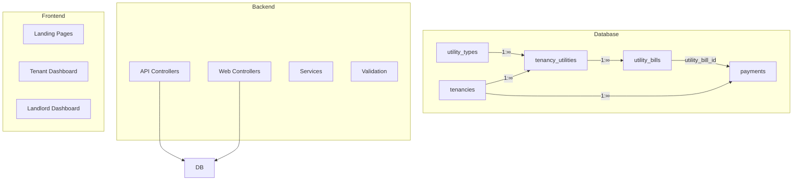
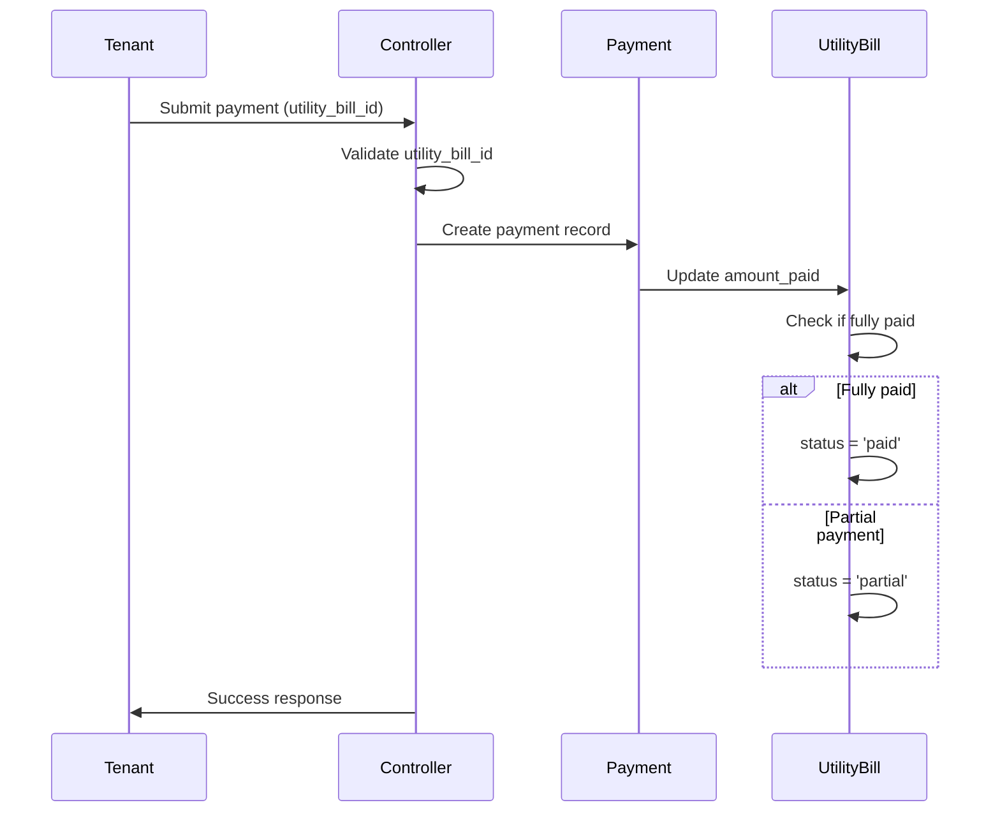
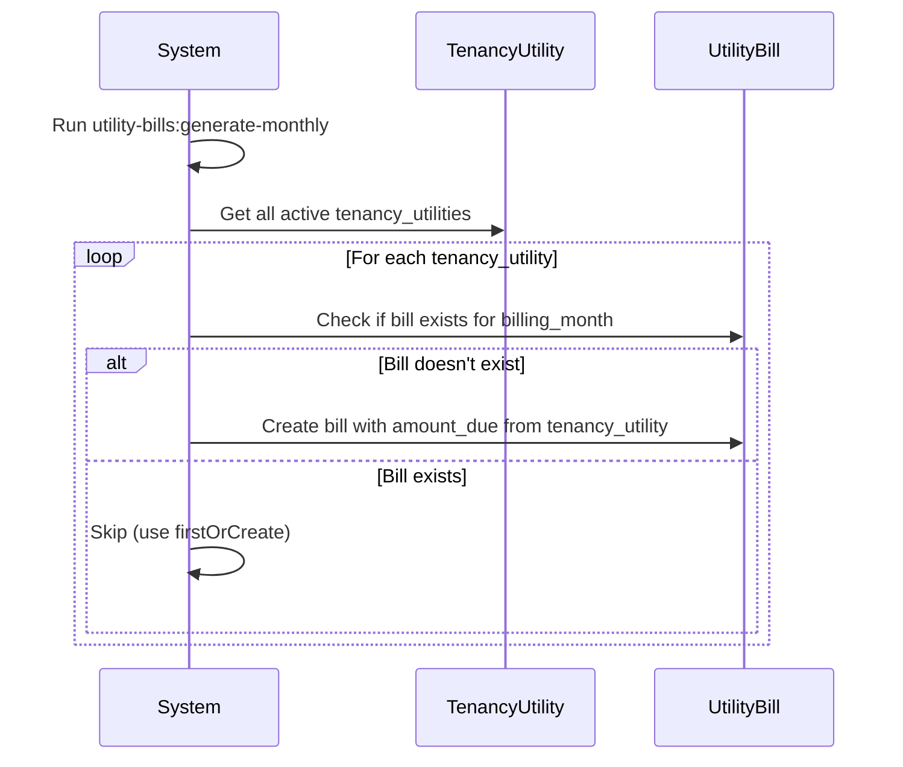

# Utility Payment System Implementation Plan

## Executive Summary

This document outlines a comprehensive implementation plan to support the new utility billing system in the Estate Practice property management application. The refactor introduces a three-table pattern (`utility_types` → `tenancy_utilities` → `utility_bills`) that enables tracking of utility charges per tenancy with proper payment linkage.

---

## System Architecture Overview



---

## Phase 1: Backend Implementation

### 1.1 API Controllers for Utility Management

#### 1.1.1 Utility Types Controller
**File:** `app/Http/Controllers/Api/Landlord/UtilityTypeController.php`

| Method | Endpoint | Description |
|--------|----------|-------------|
| GET | `/api/v1/landlord/utility-types` | List all utility types |
| GET | `/api/v1/landlord/utility-types/{id}` | Get single utility type |

#### 1.1.2 Tenancy Utilities Controller  
**File:** `app/Http/Controllers/Api/Landlord/TenancyUtilityController.php`

| Method | Endpoint | Description |
|--------|----------|-------------|
| GET | `/api/v1/landlord/tenancies/{tenancy}/utilities` | List utilities for a tenancy |
| POST | `/api/v1/landlord/tenancies/{tenancy}/utilities` | Assign utility to tenancy |
| GET | `/api/v1/landlord/tenancy-utilities/{id}` | Get single tenancy utility |
| PUT | `/api/v1/landlord/tenancy-utilities/{id}` | Update tenancy utility |
| DELETE | `/api/v1/landlord/tenancy-utilities/{id}` | Remove utility from tenancy |

#### 1.1.3 Utility Bills Controller
**File:** `app/Http/Controllers/Api/Landlord/UtilityBillController.php`

| Method | Endpoint | Description |
|--------|----------|-------------|
| GET | `/api/v1/landlord/utility-bills` | List all utility bills (with filters) |
| GET | `/api/v1/landlord/utility-bills/{id}` | Get single utility bill |
| PUT | `/api/v1/landlord/utility-bills/{id}` | Update utility bill |
| PUT | `/api/v1/landlord/utility-bills/{id}/waive` | Waive a utility bill |

#### 1.1.4 Tenant Utility API Controller
**File:** `app/Http/Controllers/Api/Tenant/UtilitiesController.php`

| Method | Endpoint | Description |
|--------|----------|-------------|
| GET | `/api/v1/tenant/utilities` | Get tenant's utilities |
| GET | `/api/v1/tenant/utility-bills` | Get tenant's pending utility bills |

### 1.2 Web Controllers for Utility Management

#### 1.2.1 Landlord Utilities Controller
**File:** `app/Http/Controllers/Web/Landlord/LandlordUtilityController.php`

| Method | Route | Description |
|--------|-------|-------------|
| index | `/landlord/utilities` | List all tenancies with their utilities |
| show | `/landlord/utilities/{tenancy}` | Show utilities for specific tenancy |
| create | `/landlord/utilities/{tenancy}/create` | Show assign utility form |
| store | POST `/landlord/utilities` | Assign utility to tenancy |
| edit | `/landlord/utilities/{tenancyUtility}/edit` | Edit utility assignment |
| update | PUT `/landlord/utilities/{tenancyUtility}` | Update utility assignment |
| destroy | DELETE `/landlord/utilities/{tenancyUtility}` | Remove utility |

#### 1.2.2 Landlord Utility Bills Controller
**File:** `app/Http/Controllers/Web/Landlord/LandlordUtilityBillController.php`

| Method | Route | Description |
|--------|-------|-------------|
| index | `/landlord/utility-bills` | List all utility bills |
| show | `/landlord/utility-bills/{bill}` | View utility bill details |
| waive | POST `/landlord/utility-bills/{bill}/waive` | Waive a bill |

### 1.3 Form Request Validation

#### 1.3.1 StoreTenancyUtilityRequest
```php
[
    'utility_type_id' => 'required|exists:utility_types,id',
    'amount' => 'required|numeric|min:0',
    'billing_cycle' => 'required|in:monthly,quarterly,annual',
    'provider' => 'nullable|string|max:255',
    'account_number' => 'nullable|string|max:100',
    'meter_number' => 'nullable|string|max:100',
    'status' => 'required|in:active,suspended,disconnected',
]
```

#### 1.3.2 UpdateUtilityBillRequest
```php
[
    'amount_due' => 'sometimes|numeric|min:0',
    'units_consumed' => 'nullable|numeric|min:0',
    'status' => 'sometimes|in:pending,paid,partial,overdue,waived',
]
```

#### 1.3.3 RecordUtilityPaymentRequest
```php
[
    'utility_bill_id' => 'required|exists:utility_bills,id',
    'amount' => 'required|numeric|min:0.01',
    'payment_method' => 'required|in:cash,bank_transfer,mobile_money,card',
    'reference_number' => 'nullable|string|max:100',
    'notes' => 'nullable|string|max:500',
]
```

### 1.4 Service Layer Updates

#### 1.4.1 Update PaymentService
**File:** `app/Services/PaymentService.php`

Add method:
- `processUtilityPayment(Payment $payment, UtilityBill $bill): void` - Updates utility bill amount_paid and status when payment is recorded

#### 1.4.2 Create UtilityService
**File:** `app/Services/UtilityService.php`

```php
class UtilityService
{
    public function assignUtilityToTenancy(Tenancy $tenancy, array $data): TenancyUtility;
    public function removeUtilityFromTenancy(TenancyUtility $tenancyUtility): void;
    public function getPendingBillsForTenant(Tenant $tenant): Collection;
    public function calculateTotalMonthlyUtilities(Tenancy $tenancy): float;
}
```

---

## Phase 2: Frontend Implementation

### 2.1 Landlord Utility Management Pages

#### 2.1.1 Utilities Index Page
**File:** `resources/js/pages/landlord/utilities/index.tsx`

**Features:**
- List all tenancies with their assigned utilities
- Show utility summary per tenancy (count, monthly total)
- Quick actions: Add utility, View bills
- Filters: Property, Unit, Status

#### 2.1.2 Assign Utility Form
**File:** `resources/js/pages/landlord/utilities/create.tsx`

**Features:**
- Select utility type from catalog (Water, Electricity, Security, etc.)
- Set billing amount
- Select billing cycle (monthly, quarterly, annual)
- Enter provider details (meter number, account number)
- Set status (active, suspended, disconnected)

#### 2.1.3 Utility Bills List Page
**File:** `resources/js/pages/landlord/utility-bills/index.tsx`

**Features:**
- Table view of all utility bills
- Columns: Tenant, Unit, Property, Utility Type, Billing Month, Amount Due, Amount Paid, Status, Due Date
- Filters: Status, Property, Date Range
- Actions: View Details, Waive Bill

#### 2.1.4 Utility Bill Detail Page
**File:** `resources/js/pages/landlord/utility-bills/show.tsx`

**Features:**
- Display full bill details
- Show payment history for this bill
- Record payment against bill
- Waive bill option (landlord only)

### 2.2 Tenant Utility Pages

#### 2.2.1 Tenant Utilities Dashboard
**File:** `resources/js/pages/tenant/utilities.tsx`

**Features:**
- Display all utilities assigned to tenant's tenancy
- Show utility type, amount, billing cycle, status
- Total monthly utilities amount
- Link to view bill details

#### 2.2.2 Tenant Pending Bills Page
**File:** `resources/js/pages/tenant/utilities/bills.tsx`

**Features:**
- List all pending/overdue utility bills
- Show bill details: utility type, billing month, amount due, amount paid, due date
- Quick pay button (links to payment page with bill pre-selected)
- Payment status indicators

### 2.3 Payment Flow Updates

#### 2.3.1 Tenant Make Payment Page Updates
**File:** `resources/js/pages/tenant/payments/make.tsx`

**Updates Required:**
1. Add utility bill selector when payment_type = 'utility'
2. Display pending utility bills as selectable options
3. Show bill details (utility type, billing month, amount due) when selected
4. Pre-fill amount from selected bill

**New Props Interface:**
```typescript
interface UtilityBill {
  id: number;
  billing_month: string;
  amount_due: number;
  amount_paid: number;
  status: 'pending' | 'paid' | 'partial' | 'overdue' | 'waived';
  utility_type: {
    id: number;
    name: string;
    unit: string;
  };
  tenancy_utility: {
    id: number;
    amount: number;
  };
}
```

#### 2.3.2 Landlord Payment Record Updates
**File:** `resources/js/pages/landlord/tenants/show.tsx`

**Updates Required:**
- Add "Link to Utility Bill" option when recording utility payment
- Display utility bill information in payment list

### 2.4 New TypeScript Types

**File:** `resources/js/types/utility.ts`

```typescript
export interface UtilityType {
  id: number;
  name: string;
  unit: string | null;
  description: string | null;
  is_metered: boolean;
  is_active: boolean;
}

export interface TenancyUtility {
  id: number;
  tenancy_id: number;
  utility_type_id: number;
  amount: number;
  billing_cycle: 'monthly' | 'quarterly' | 'annual';
  provider: string | null;
  account_number: string | null;
  meter_number: string | null;
  status: 'active' | 'suspended' | 'disconnected';
  utility_type: UtilityType;
}

export interface UtilityBill {
  id: number;
  tenancy_utility_id: number;
  billing_month: string;
  units_consumed: number | null;
  amount_due: number;
  amount_paid: number;
  due_date: string;
  status: 'pending' | 'paid' | 'partial' | 'overdue' | 'waived';
  notes: string | null;
  tenancy_utility: TenancyUtility;
  payments: Payment[];
}
```

---

## Phase 3: Route Updates

### 3.1 API Routes
**File:** `routes/api.php`

```php
// Landlord Utility Management
Route::prefix('landlord')->group(function () {
    Route::get('/utility-types', [UtilityTypeController::class, 'index']);
    Route::get('/utility-types/{utilityType}', [UtilityTypeController::class, 'show']);
    
    Route::get('/tenancies/{tenancy}/utilities', [TenancyUtilityController::class, 'index']);
    Route::post('/tenancies/{tenancy}/utilities', [TenancyUtilityController::class, 'store']);
    Route::get('/tenancy-utilities/{tenancyUtility}', [TenancyUtilityController::class, 'show']);
    Route::put('/tenancy-utilities/{tenancyUtility}', [TenancyUtilityController::class, 'update']);
    Route::delete('/tenancy-utilities/{tenancyUtility}', [TenancyUtilityController::class, 'destroy']);
    
    Route::get('/utility-bills', [UtilityBillController::class, 'index']);
    Route::get('/utility-bills/{utilityBill}', [UtilityBillController::class, 'show']);
    Route::put('/utility-bills/{utilityBill}', [UtilityBillController::class, 'update']);
    Route::post('/utility-bills/{utilityBill}/waive', [UtilityBillController::class, 'waive']);
});

// Tenant Utility Access
Route::prefix('tenant')->middleware(['auth:sanctum', 'tenant'])->group(function () {
    Route::get('/utilities', [TenantUtilitiesController::class, 'index']);
    Route::get('/utility-bills', [TenantUtilitiesController::class, 'bills']);
});
```

### 3.2 Web Routes
**File:** `routes/web.php`

```php
// Landlord Utilities
Route::prefix('landlord')->middleware(['auth', 'role:landlord'])->group(function () {
    Route::resource('utilities', LandlordUtilityController::class)->only(['index', 'show']);
    Route::get('tenancies/{tenancy}/utilities/create', [LandlordUtilityController::class, 'create'])->name('landlord.utilities.create');
    Route::post('tenancies/{tenancy}/utilities', [LandlordUtilityController::class, 'store'])->name('landlord.utilities.store');
    Route::get('utilities/{tenancyUtility}/edit', [LandlordUtilityController::class, 'edit'])->name('landlord.utilities.edit');
    Route::put('utilities/{tenancyUtility}', [LandlordUtilityController::class, 'update'])->name('landlord.utilities.update');
    Route::delete('utilities/{tenancyUtility}', [LandlordUtilityController::class, 'destroy'])->name('landlord.utilities.destroy');
    
    Route::get('utility-bills', [LandlordUtilityBillController::class, 'index'])->name('landlord.utility-bills.index');
    Route::get('utility-bills/{utilityBill}', [LandlordUtilityBillController::class, 'show'])->name('landlord.utility-bills.show');
    Route::post('utility-bills/{utilityBill}/waive', [LandlordUtilityBillController::class, 'waive'])->name('landlord.utility-bills.waive');
});

// Tenant Utilities
Route::prefix('tenant')->middleware(['auth', 'role:tenant'])->group(function () {
    Route::get('utilities', [TenantUtilitiesController::class, 'index'])->name('tenant.utilities');
    Route::get('utilities/bills', [TenantUtilitiesController::class, 'bills'])->name('tenant.utilities.bills');
});
```

---

## Phase 4: Navigation Updates

### 4.1 Landlord Sidebar
**File:** `resources/js/components/layout/landlord-sidebar.tsx`

Add menu items:
- **Utilities** (under Properties section)
  - Manage Utilities → `/landlord/utilities`
  - Utility Bills → `/landlord/utility-bills`

### 4.2 Tenant Sidebar
**File:** `resources/js/components/layout/tenant-sidebar.tsx`

Add/Update menu items:
- **Utilities** (replace existing)
  - My Utilities → `/tenant/utilities`
  - Pending Bills → `/tenant/utilities/bills`

---

## Phase 5: Data Flow & Integration

### 5.1 Payment Recording Flow (Updated)



### 5.2 Monthly Bill Generation



---

## Implementation Priority

### Sprint 1: Backend Foundation
1. Create API controllers for utility types, tenancy utilities, utility bills
2. Add form request validations
3. Update Payment model with utility bill relationship
4. Create service methods for utility operations

### Sprint 2: Web Controllers & Routes
1. Create web controllers for landlord and tenant utility management
2. Add all routes (API and web)
3. Test backend API endpoints

### Sprint 3: Frontend Core
1. Create TypeScript types for utilities
2. Build landlord utilities index and create pages
3. Build tenant utilities dashboard
4. Update navigation sidebars

### Sprint 4: Payment Integration
1. Update tenant make payment page with bill selection
2. Update landlord payment recording to support utility bills
3. Test complete payment flow

### Sprint 5: Polish & Testing
1. Add utility bills list and detail pages
2. Add bill waiver functionality
3. Comprehensive testing
4. UI/UX refinements

---

## Key Files to Modify

### Backend (Create/Modify)
- `app/Http/Controllers/Api/Landlord/UtilityTypeController.php` (NEW)
- `app/Http/Controllers/Api/Landlord/TenancyUtilityController.php` (NEW)
- `app/Http/Controllers/Api/Landlord/UtilityBillController.php` (NEW)
- `app/Http/Controllers/Api/Tenant/UtilitiesController.php` (NEW)
- `app/Http/Controllers/Web/Landlord/LandlordUtilityController.php` (NEW)
- `app/Http/Controllers/Web/Landlord/LandlordUtilityBillController.php` (NEW)
- `app/Http/Controllers/Web/Tenant/TenantUtilitiesController.php` (NEW)
- `app/Http/Requests/StoreTenancyUtilityRequest.php` (NEW)
- `app/Http/Requests/UpdateUtilityBillRequest.php` (NEW)
- `app/Http/Requests/RecordUtilityPaymentRequest.php` (NEW)
- `app/Services/UtilityService.php` (NEW)
- `app/Services/PaymentService.php` (MODIFY)
- `routes/api.php` (MODIFY)
- `routes/web.php` (MODIFY)

### Frontend (Create/Modify)
- `resources/js/types/utility.ts` (NEW)
- `resources/js/pages/landlord/utilities/index.tsx` (NEW)
- `resources/js/pages/landlord/utilities/create.tsx` (NEW)
- `resources/js/pages/landlord/utilities/edit.tsx` (NEW)
- `resources/js/pages/landlord/utility-bills/index.tsx` (NEW)
- `resources/js/pages/landlord/utility-bills/show.tsx` (NEW)
- `resources/js/pages/tenant/utilities.tsx` (MODIFY - currently empty)
- `resources/js/pages/tenant/utilities/bills.tsx` (NEW)
- `resources/js/pages/tenant/payments/make.tsx` (MODIFY)
- `resources/js/components/layout/landlord-sidebar.tsx` (MODIFY)
- `resources/js/components/layout/tenant-sidebar.tsx` (MODIFY)

---

## Testing Strategy

### Unit Tests
- UtilityService methods
- PaymentService utility payment processing
- Model relationships and scopes
- Validation rules

### Feature Tests
- API endpoints for all controllers
- Web route access control
- Payment recording flow
- Utility assignment flow

### Integration Tests
- End-to-end payment flow
- Monthly bill generation
- Overdue bill marking
