# Business Logic Documentation

## Overview
This document provides comprehensive documentation of all business logic, domain-specific rules, operational workflows, user roles, permissions, and data flow in the Estate Practice property management system.

---

## User Roles and Hierarchy

### Role Definitions

The system supports three distinct user roles with a hierarchical permission structure:

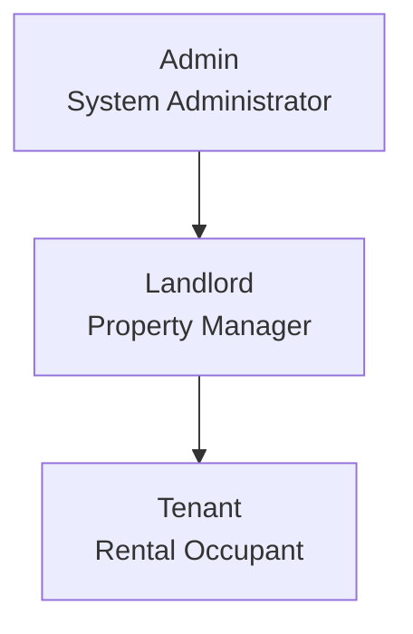

| Role | Description | Scope |
|------|-------------|-------|
| **Admin** | System Administrator | Full system access, can manage all properties and users |
| **Landlord** | Property Owner/Manager | Can manage their own properties, units, tenants |
| **Tenant** | Rental Occupant | Can only access personal data and make payments |

### Role Assignment

Roles are stored in the `users.role` column as a string backed by the PHP 8.1 enum `App\Enums\Role`:
```php
namespace App\Enums;

enum Role: string
{
    case Admin = 'admin';
    case Landlord = 'landlord';
    case Tenant = 'tenant';
}
```

The `User` model casts the `role` column to `App\Enums\Role`:
```php
protected function casts(): array
{
    return [
        'role' => \App\Enums\Role::class,
    ];
}
```

> **Architecture Rule**: No string role literals (e.g., `'admin'`, `'landlord'`, `'tenant'`) exist anywhere in the active codebase. All role comparisons use `App\Enums\Role::Admin`, `Role::Landlord`, `Role::Tenant`.

---

## Permissions and Access Control

### Permission Matrix

| Permission | Admin | Landlord | Tenant |
|------------|:-----:|:--------:|:------:|
| **User Management** |
| View all users | ✅ | ❌ | ❌ |
| Create users | ✅ | ❌ | ❌ |
| Edit users | ✅ | ❌ | ❌ |
| Delete users | ✅ | ❌ | ❌ |
| Toggle user status | ✅ | ❌ | ❌ |
| **Property Management** |
| View all properties | ✅ | Own only | ❌ |
| Create properties | ✅ | ✅ | ❌ |
| Edit properties | ✅ | Own only | ❌ |
| Delete properties | ✅ | Own only | ❌ |
| View property analytics | ✅ | Own only | ❌ |
| **Unit Management** |
| View all units | ✅ | Property units | ❌ |
| Create units | ✅ | Own properties | ❌ |
| Edit units | ✅ | Own units | ❌ |
| Delete units | ✅ | Own units | ❌ |
| **Tenant Management** |
| View all tenants | ✅ | Own tenants | ❌ |
| Create tenants | ✅ | ✅ | ❌ |
| Edit tenants | ✅ | Own tenants | ❌ |
| Delete/end tenancies | ✅ | Own tenancies | ❌ |
| View tenant details | ✅ | Own tenants | Own |
| **Payment Management** |
| View all payments | ✅ | Related | Own |
| Record payments | ✅ | ✅ | ❌ |
| View payment history | ✅ | Own tenants | Own |
| **Utility Management** |
| Manage utilities | ✅ | Own units | Own |
| View utility data | ✅ | Own tenants | Own |
| **Notification Management** |
| Send notifications | ✅ | ✅ | ❌ |
| View notifications | All | Own | Own |
| **Settings** |
| Profile settings | Own | Own | Own |
| Password change | Own | Own | Own |
| Two-factor auth | Own | Own | Own |

---

## User Relationships and Associations

### Relationship Diagram

```mermaid
erDiagram
    USER_ADMIN {
        bigint id PK
        string name
        string email
        enum role="admin"
    }
    
    USER_LANDLORD {
        bigint id PK
        string name
        string email
        enum role="landlord"
    }
    
    USER_TENANT {
        bigint id PK
        string name
        string email
        enum role="tenant"
        bigint tenant_id FK
    }
    
    TENANT {
        bigint id PK
        string tenant_code UK
        string full_name
        string phone
        string email
    }
    
    PROPERTY {
        bigint id PK
        bigint owner_id FK
    }
    
    UNIT {
        bigint id PK
        bigint property_id FK
    }
    
    TENANCY {
        bigint id PK
        bigint tenant_id FK
        bigint unit_id FK
    }
    
    USER_ADMIN --|> USER_LANDLORD : "inherits from"
    USER_ADMIN --|> USER_TENANT : "inherits from"
    USER_LANDLORD ||--o{ PROPERTY : "owns"
    USER_TENANT ||--|| TENANT : "is"
    PROPERTY ||--o{ UNIT : "contains"
    TENANT ||--o{ TENANCY : "has"
    UNIT ||--o{ TENANCY : "has"
```

### User Type Relationships

#### 1. Admin User
```php
// Admin can:
// - Access all properties (regardless of owner)
// - Access all users
// - Manage system settings
// - View all payment data

// All Policies have a before() hook for admin bypass:
public function before(User $user, string $ability): ?bool
{
    if ($user->role === Role::Admin) {
        return true;
    }
    return null;
}
```

#### 2. Landlord User
```php
// Landlord can:
// - Own multiple properties
// - Manage units within their properties
// - Create and manage tenants for their units

$landlord = User::where('role', Role::Landlord)->first();
$properties = $landlord->properties; // Their properties
$tenants = $properties->units->tenancies->tenants; // Their tenants
```

#### 3. Tenant User
```php
// Tenant:
// - Is linked to a Tenant record
// - Has one active tenancy at a time
// - Can view their own payments and utilities

$tenant = Tenant::where('user_id', auth()->id())->first();
$user = $tenant->user;
$activeTenancy = $tenant->tenancies()->where('status', 'active')->first();
```

---

## CRUD Operations

### 1. User Management (Standalone)

#### Create / Update / Delete User
**Who**: Admin (Full access), Landlord (Read-only access to their tenants)

**Constraints**:
- Users are primarily created passively when establishing a Tenant or Landlord record.
- Direct User CRUD is typically reserved for Administrative overrides.
- `UserController` protects data by dynamically eager-loading `$user->loadMissing('tenant.tenancies.unit.property')` to verify that Landlords can only `show()` or `index()` users who are assigned to their owned properties.

---

### 2. Property Management

#### Create Property
**Who**: Admin, Landlord

**Flow**:
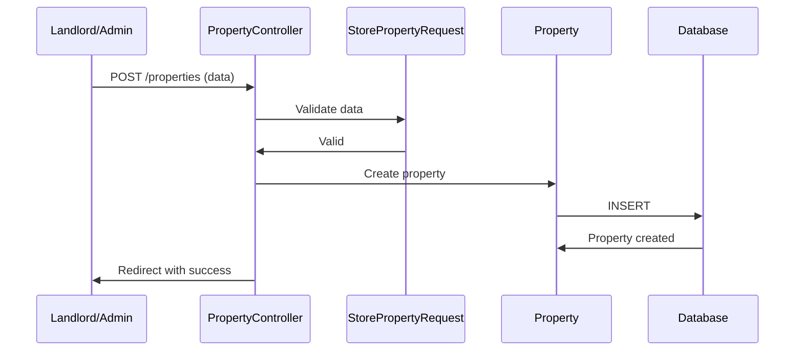

**Validation Rules**:
```php
'name' => 'required|string|max:255',
'address' => 'required|string',
'type' => 'required|in:apartment,house,commercial,mixed',
'description' => 'nullable|string',
```

**Example Request**:
```json
POST /landlord/properties
{
  "name": "Sunset Apartments",
  "address": "123 Main Street, City",
  "type": "apartment",
  "description": "Modern apartment complex with 20 units"
}
```

#### Read Properties
**Who**: Admin (all), Landlord (own only)

**Example**:
```php
// Admin sees all (handled by Policy before() hook)
$properties = Property::all();

// Landlord sees own
$properties = Property::where('owner_id', auth()->id())->paginate();
```

#### Update Property
**Who**: Admin, Owner Landlord

**Example** (now handled by `PropertyPolicy`):
```php
// Policy enforces ownership — no inline role checks needed
$this->authorize('update', $property);
$property->update($request->validated());
```

#### Delete Property
**Who**: Admin only (delete/restore/forceDelete restricted to Admin in PropertyPolicy)

**Constraints**:
- Cannot delete property with active tenancies
- Must end all tenancies first

**Example**:
```php
$property = Property::with('units.tenancies')->findOrFail($id);

$hasActiveTenancies = $property->units->flatMap->tenancies
    ->where('status', 'active')->isNotEmpty();

if ($hasActiveTenancies) {
    return back()->with('error', 'Cannot delete property with active tenancies');
}

$property->delete();
```

---

### 2. Unit Management

#### Create Unit
**Who**: Admin, Landlord (for own properties)

**Validation**:
```php
'property_id' => 'required|exists:properties,id',
'unit_number' => 'required|string|max:50',
'type' => 'required|in:studio,1bedroom,2bedroom,3bedroom,commercial',
'floor' => 'nullable|integer|min:0',
'size_sqm' => 'nullable|numeric|min:1',
'bedrooms' => 'nullable|integer|min:0',
'bathrooms' => 'nullable|numeric|min:0',
'rent_amount' => 'required|numeric|min:0',
'description' => 'nullable|string',
'features' => 'nullable|array',
```

**Ownership Check**:
```php
$property = Property::findOrFail($request->property_id);
if ($property->owner_id !== auth()->id() && auth()->user()->role !== 'admin') {
    abort(403);
}
```

#### Unit Status Management
| Status | Description |
|--------|-------------|
| available | Unit is ready for rent |
| occupied | Unit has active tenancy |
| maintenance | Unit is under maintenance |
| unavailable | Unit not available for rent |

**State Transition**:
```
available → occupied (when tenancy starts)
occupied → available (when tenancy ends)
available → maintenance
maintenance → available
any → unavailable
```

---

### 3. Tenant Management

#### Create Tenant
**Who**: Admin, Landlord

This is a complex operation that creates:
1. Tenant record
2. User account (with auto-generated credentials)
3. Optional tenancy

**Flow**:
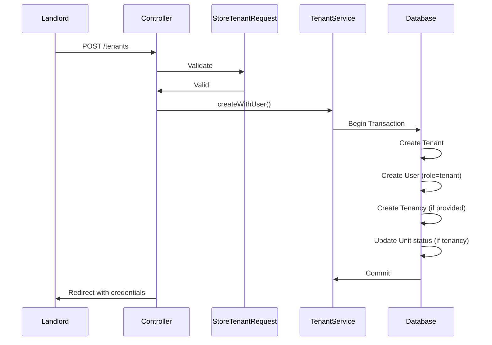

**Validation** (StoreTenantRequest):
```php
'first_name' => 'required|string|max:255',
'last_name' => 'required|string|max:255',
'email' => 'required|email|unique:tenants',
'phone' => 'nullable|string|max:50',
'emergency_contact' => 'nullable|string|max:255',
```

**Validation** (StoreTenantWithTenancyRequest extends StoreTenantRequest):
```php
'unit_id' => 'required|exists:units,id',
'start_date' => 'required|date|after_or_equal:today',
'end_date' => 'nullable|date|after:start_date',
'rent_amount' => 'required|numeric|min:0',
'security_deposit' => 'nullable|numeric|min:0',
```

**Auto-Generated Username**:
While self-registering users manually set their `username`, the system auto-generates usernames for landlord-created tenants using the format:
```
firstname.lastname{randomNumber}
```
Example: `john.doe837`. NOTE: Primary mobile login relies on `username`.

**Service Implementation**:
```php
public function createWithUser(array $data): array
{
    return DB::transaction(function () use ($data) {
        // Generate unique username
        $username = strtolower($data['first_name'] . '.' . $data['last_name']);
        $baseUsername = $username;
        $counter = 1;
        
        while (User::where('username', $username)->exists()) {
            $username = $baseUsername . $counter;
            $counter++;
        }
        
        // Create tenant
        $tenant = Tenant::create([
            'full_name' => $data['full_name'],
            'email' => $data['email'],
            'phone' => $data['phone'] ?? null,
            'emergency_contact_name' => $data['emergency_contact_name'] ?? null,
            'emergency_contact_phone' => $data['emergency_contact_phone'] ?? null,
            'emergency_contact_relation' => $data['emergency_contact_relation'] ?? null,
        ]);
        
        // Generate temporary password
        $tempPassword = Str::random(12);
        
        // Create user account
        $user = User::create([
            'name' => $data['full_name'],
            'username' => $username,
            'email' => $data['email'],
            'password' => Hash::make($tempPassword),
            'role' => 'tenant',
            'tenant_id' => $tenant->id,
        ]);
        
        // Create tenancy if provided
        $tenancy = null;
        if (isset($data['unit_id'])) {
            $tenancy = Tenancy::create([
                'tenant_id' => $tenant->id,
                'unit_id' => $data['unit_id'],
                'move_in_date' => $data['move_in_date'],
                'monthly_rent' => $data['monthly_rent'],
                'rent_due_day' => $data['rent_due_day'] ?? 5,
                'security_deposit' => $data['security_deposit'] ?? null,
                'status' => 'active',
            ]);
            
            // Update unit status
            Unit::where('id', $data['unit_id'])->update(['status' => 'occupied']);
        }
        
        return [
            'tenant' => $tenant,
            'user' => $user,
            'temporary_password' => $tempPassword,
            'tenancy' => $tenancy,
        ];
    });
}
```

#### End Tenancy (Delete Tenant)
**Who**: Admin, Landlord (own tenants)

**Flow**:
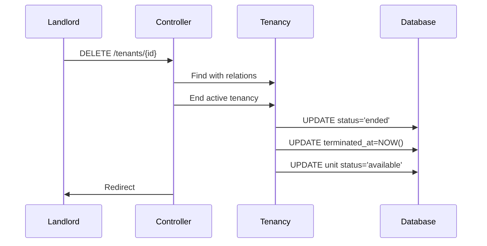

**Code**:
```php
public function destroy(Tenant $tenant)
{
    // End active tenancy
    $activeTenancy = $tenant->tenancies()
        ->where('status', 'active')
        ->first();
    
    if ($activeTenancy) {
        $activeTenancy->update([
            'status' => 'ended',
            'terminated_at' => now(),
        ]);
        
        // Make unit available again
        $activeTenancy->unit->update(['status' => 'available']);
    }
    
    // Soft delete tenant (optional)
    $tenant->delete();
    
    return redirect()->back()->with('success', 'Tenant tenancy ended successfully');
}
```

---

### 4. Payment Management

#### Record Payment
**Who**: Admin, Landlord

**Validation**:
```php
'tenancy_id' => 'required|exists:tenancies,id',
'amount' => 'required|numeric|min:0.01',
'type' => 'required|in:rent,deposit,utility,penalty,other',
'method' => 'required|in:cash,bank_transfer,mobile_money,card,other',
'payment_date' => 'required|date',
'due_date' => 'required|date',
'reference_number' => 'nullable|string|max:100',
'notes' => 'nullable|string',
```

#### Record Utility Payment
**Who**: Admin, Landlord

**Additional Validation for utility payments**:
```php
'utility_bill_id' => 'required_if:type,utility|exists:utility_bills,id',
```

**Flow**:
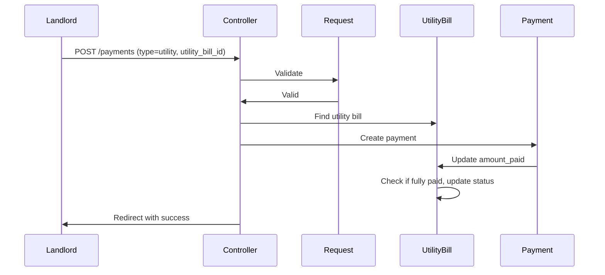

#### Payment Status Flow
```
pending → paid (payment confirmed)
pending → partial (partial payment received)
pending → overdue (payment not received by due date)
partial → paid (additional payment completes the amount)
partial → overdue (due date passed without full payment)
overdue → paid (late payment received)
cancelled (payment cancelled by landlord)
```

**Payment Status Values**:
| Status | Description |
|--------|-------------|
| pending | Payment recorded but not yet confirmed/cleared |
| partial | Partial payment received, amount outstanding remains |
| paid | Full payment received |
| overdue | Payment not received by due date |
| cancelled | Payment was cancelled |

**Note**: The 'pending' status is particularly important for utility payments which may require landlord approval before being considered complete. When a utility payment is created, its status is synced from the associated utility bill's status.

---

### 5. Utility Management

The utility system has been refactored to use a three-table pattern: `utility_types` → `tenancy_utilities` → `utility_bills`.

#### Add Utility to Tenancy
**Who**: Admin, Landlord

**Flow**:
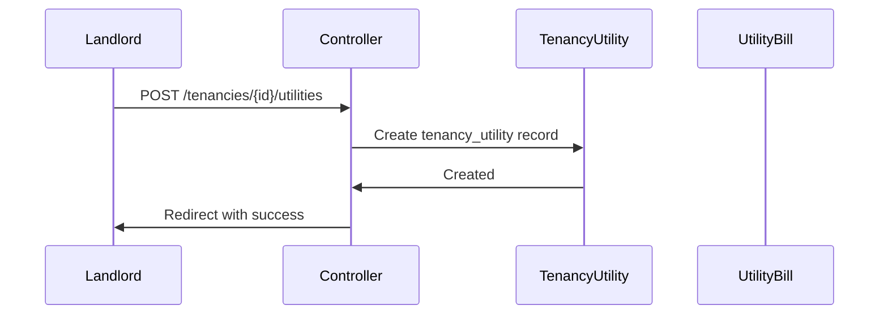

**Validation**:
```php
'utility_type_id' => 'required|exists:utility_types,id',
'amount' => 'required|numeric|min:0',
'billing_cycle' => 'required|in:monthly,quarterly,annual',
'provider' => 'nullable|string|max:255',
'meter_number' => 'nullable|string|max:100',
'status' => 'required|in:active,suspended,disconnected',
```

#### Generate Monthly Utility Bills
**Who**: System (scheduled command)

**Console Command**: `php artisan utility-bills:generate-monthly`

**Flow**:
1. Gets all active tenancy_utilities
2. For each, creates a utility_bill for the current month
3. Uses firstOrCreate to avoid duplicates
4. Sets amount_due from tenancy_utility.amount
5. Sets due_date to end of month
6. Status defaults to 'pending'

#### Mark Bills Overdue
**Who**: System (scheduled command)

**Console Command**: `php artisan utility-bills:mark-overdue`

**Flow**:
1. Finds all utility_bills where status is 'pending' or 'partial'
2. Checks if due_date < today()
3. Updates status to 'overdue'

#### Utility Bill Status Flow
```
pending → partial (partial payment received)
partial → paid (full payment received)
partial → overdue (due_date passed)
pending → overdue (due_date passed without payment)
overdue → paid (late payment received)
overdue → waived (bill waived by landlord)
```

**Utility Bill Status Values**:
| Status | Description |
|--------|-------------|
| pending | Bill created, awaiting payment |
| partial | Partial payment received |
| paid | Full payment received |
| overdue | Payment not received by due date |
| waived | Bill waived by landlord |

**Overdue Logic**: A utility bill is considered overdue if:
1. Its status is explicitly 'overdue', OR
2. Its status is 'pending' OR 'partial' AND the due_date has passed

This means partial payments that are past their due date are also marked as overdue, ensuring landlords can track incomplete payments effectively.

---

### 6. Rent Billing System

The rent billing system generates monthly rent bills for active tenancies, tracks payment status, and automatically marks bills as overdue.

#### Rent Bill Generation
**Who**: System (scheduled command)

**Console Command**: `php artisan rent-bills:generate-monthly`

**Scheduled**: Monthly on the 1st at 00:02

**Flow**:
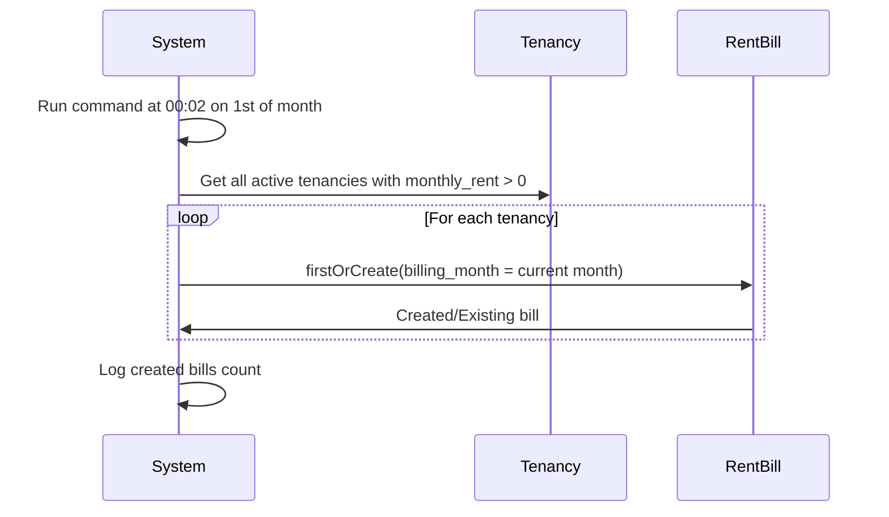

**Logic**:
1. Gets all active tenancies with `monthly_rent > 0`
2. For each tenancy:
   - Skips if monthly_rent is null or ≤ 0
   - Calculates due date (default: 5th of the month)
   - Uses `firstOrCreate()` to avoid duplicates (unique constraint on tenancy_id + billing_month)
3. Returns SUCCESS/FAILURE status

#### Mark Rent Bills Overdue
**Who**: System (scheduled command)

**Console Command**: `php artisan rent-bills:mark-overdue`

**Scheduled**: Daily at 00:30

**Flow**:
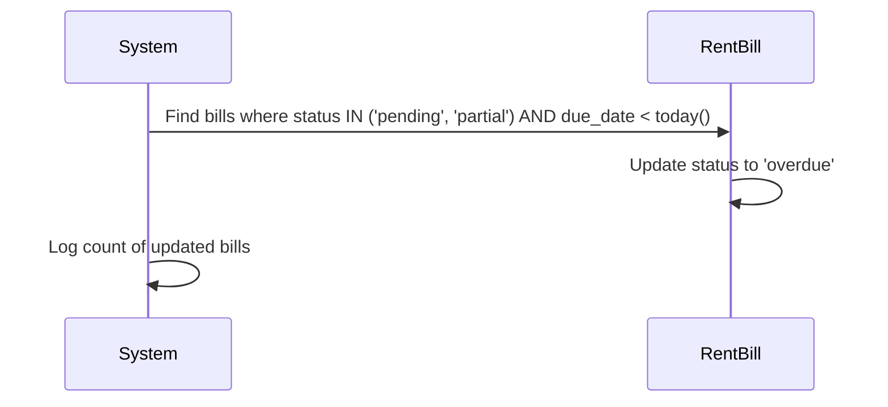

**Logic**:
1. Updates all bills where:
   - status IN ('pending', 'partial') AND
   - due_date < today()
2. Sets status to 'overdue'
3. Logs count of updated bills

#### Rent Bill Status Flow
```
pending → partial (partial payment received)
partial → paid (full payment received)
partial → overdue (due_date passed)
pending → overdue (due_date passed without payment)
overdue → paid (late payment received)
overdue → waived (bill waived by landlord)
```

**Rent Bill Status Values**:
| Status | Description |
|--------|-------------|
| pending | Bill created, awaiting payment |
| partial | Partial payment received |
| paid | Full payment received |
| overdue | Payment not received by due date |
| waived | Bill waived by landlord |

**Overdue Logic**: A rent bill is considered overdue if:
1. Its status is explicitly 'overdue', OR
2. Its status is 'pending' OR 'partial' AND the due_date has passed

This ensures partial payments that are past their due date are also marked as overdue.

#### Payment-Rent Bill Synchronization

When recording rent payments, the payment can be linked to a specific rent bill:

1. **Optional rent_bill_id**: When recording a payment, you can optionally specify `rent_bill_id` to link the payment to a specific rent bill
2. **Auto-linking**: If `rent_bill_id` is not provided, the system automatically links to the current month's rent bill if one exists
3. **Validation**: The system validates that the payment's tenancy matches the rent bill's tenancy

```php
// RentBillService handles payment processing
$rentBillService->linkPaymentToBill($tenancyId, $requestedBillId, $required);
$rentBillService->createPaymentWithRentBill($paymentData, $rentBillId, $paymentAmount);
```

After payment is created:
- The rent bill's `amount_paid` is updated
- The rent bill's status is automatically recalculated:
  - If amount_paid >= amount_due → 'paid'
  - If amount_paid > 0 → 'partial'
  - If amount_paid = 0 → 'pending'

#### Waiving Rent Bills
**Who**: Landlord

Landlords can waive (forgive) a rent bill using the `/api/landlord/rent-bills/{id}/waive` endpoint. This sets the bill's status to 'waived' with optional notes.

---

### Receipt Generation

Triggered by two paths:
1. **Direct request** — tenant or landlord calls `GET /payments/{id}/receipt`
2. **Async confirmation** — `ProcessPaymentConfirmed` listener calls it after gateway confirms

`ReceiptService::generate(Payment $payment)`:
1. Loads the `Payment` model with relationships (`tenant`, `tenancy.unit.property`, `rentBill`)
2. Renders `resources/views/receipts/payment.blade.php` via DomPDF
3. Saves PDF to `storage/app/receipts/payment-{id}-{timestamp}.pdf`
4. Updates `payments.receipt_path` with the stored path
5. Returns the PDF binary for streaming to the client

---

### Security Event Logging

`SecurityEvent` is a write-only audit log model. It records sensitive operations:

| Event | Controller | Trigger |
|---|---|---|
| `login` | `AuthController@login` | Successful login |
| `logout` | `AuthController@logout` | Token revocation |
| `password_change` | `PasswordController@update` | Password changed |
| `profile_update` | `Landlord\ProfileController@update` | Landlord profile updated |
| `profile_update` | `Tenant\ProfileController@update` | Tenant profile updated |
| `utility_update` | `TenancyUtilityController@update` | Utility record modified |

---

### Payment Event Chain (Async — Gateway-Dependent)

> [!NOTE]
> This chain is wired but only fires if the gateway layer is activated (Phase 3 scaffold).

1. M-Pesa sends callback → `MpesaWebhookController` (route not yet registered)
2. Controller fires `PaymentConfirmed` event
3. `ProcessPaymentConfirmed` listener handles it asynchronously (queued):
   - Sets `gateway_confirmed_at = now()`
   - Calls `RentBillService::syncPaymentWithRentBill()` (has double-credit guard: skips if `status !== 'pending'`)
   - Derives payment `status` from linked bill (`RentBill.status` or `UtilityBill.status`) — never hardcodes `'paid'`
   - Calls `ReceiptService::generate()`
   - Calls `NotificationService::sendPaymentReceivedNotification()`

---

## State Machines

---

## State Machines

### Tenancy State Machine

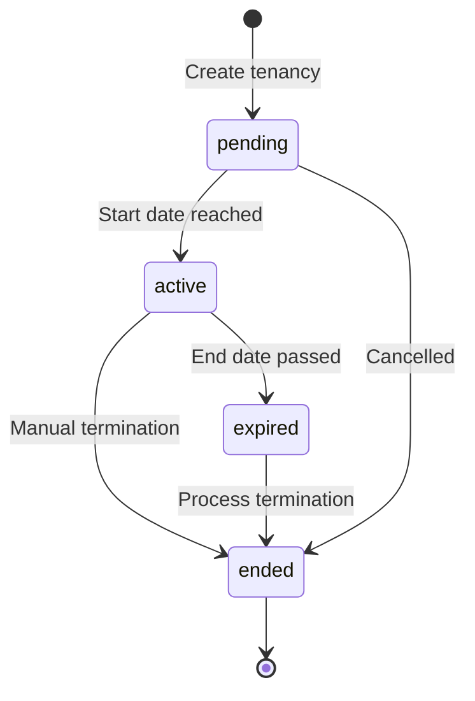

**States**:
| State | Description | Valid Transitions |
|-------|-------------|------------------|
| pending | Tenancy created, not yet started | → active, → ended |
| active | Tenancy is ongoing | → expired, → ended |
| expired | End date passed automatically | → ended |
| ended | Tenancy terminated | → (terminal) |

**State Validation Rules**:
1. Can only create payment for active tenancies
2. Can only add utilities to active tenancies
3. Unit status must be 'occupied' when tenancy is active
4. Cannot delete unit with active tenancy

### Unit State Machine

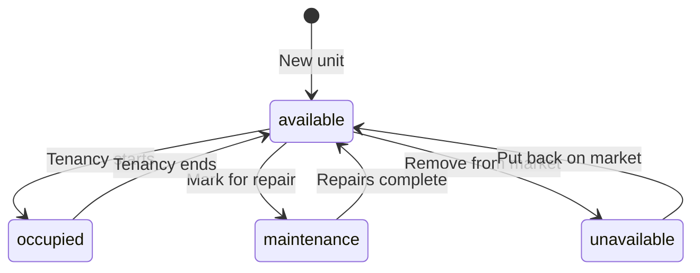

---

## Business Validation Rules

### 1. Tenant Creation Validation
```php
// Email must be unique in tenants table
'email' => 'unique:tenants,email'

// Phone format validation
'phone' => 'regex:/^[0-9+\-\s()]*$/'

// Emergency contact should not be the same as tenant
'emergency_contact' => 'different:phone'
```

### 2. Tenancy Validation
```php
// End date must be after start date
'end_date' => 'after:start_date'

// Cannot create tenancy for occupied unit
'unit_id' => function ($attribute, $value, $fail) {
    $unit = Unit::find($value);
    if ($unit && $unit->status === 'occupied') {
        $fail('This unit is already occupied');
    }
}

// Rent amount cannot be zero for active tenancy
'rent_amount' => 'required|numeric|min:0.01'
```

### 3. Payment Validation

#### Payment Status Calculation

The system calculates payment status based on total paid vs. expected amount:

```php
// For rent payments
if ($totalPaid >= $monthlyRent) {
    return 'paid';      // Fully paid
} elseif ($totalPaid > 0) {
    return 'partial';    // Partially paid
}

return 'pending';       // No payments made yet
```

**Key Changes**:
- Previously returned 'overdue' when no payments were made
- Now returns 'pending' for unpaid rent - more accurate representation of payment state
- Rent payments and utility payments are calculated separately

#### Payment-Utility Bill Synchronization

When recording utility payments, the payment status is synchronized with the utility bill status:

1. Landlord records a utility payment linked to a utility bill
2. After payment is created, the system refreshes the utility bill
3. The payment status is updated to match the utility bill's current status
4. This ensures payment status always reflects the actual state of the utility bill

```php
// Payment status is synced from utility bill after creation
$utilityBill->refresh();
$paymentData['status'] = $utilityBill->status;
```

**Valid synced statuses**: 'paid', 'partial', 'overdue', 'pending'

If an unexpected status is encountered, it defaults to 'partial' as a safe fallback.
```php
// Payment cannot exceed remaining balance
'amount' => function ($attribute, $value, $fail) use ($tenancy) {
    $remainingBalance = $tenancy->rent_amount - $tenancy->payments()
        ->where('type', 'rent')
        ->where('status', 'completed')
        ->sum('amount');
    
    if ($value > $remainingBalance) {
        $fail('Payment exceeds remaining balance of ' . $remainingBalance);
    }
}

// Cannot record future payments
'payment_date' => 'before_or_equal:today'
```

### 4. Property Ownership Validation
```php
// User can only edit their own properties
public function update(Request $request, Property $property)
{
    if ($property->owner_id !== auth()->id() && auth()->user()->role !== 'admin') {
        abort(403, 'You do not own this property');
    }
    
    $property->update($request->validated());
}
```

---

## Workflows

### 1. Onboarding a New Tenant

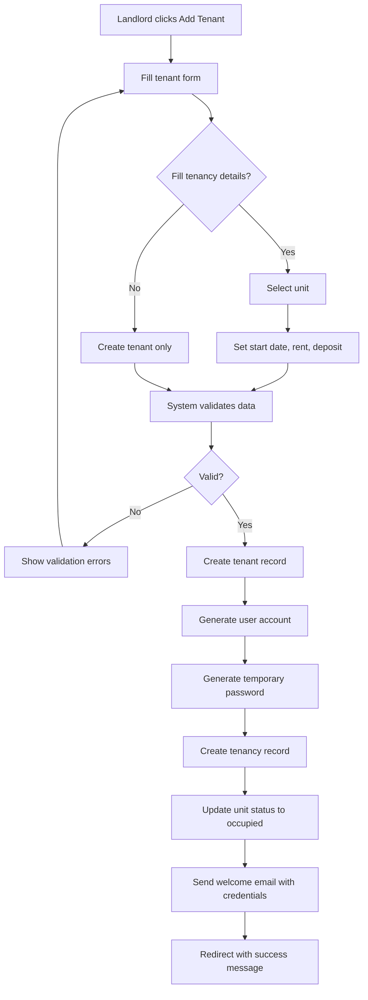

**Steps**:
1. Landlord navigates to Tenant management
2. Fills in tenant personal details (first name, last name, email, phone)
3. Optionally selects a unit and tenancy details
4. System validates all data
5. System creates:
   - Tenant record
   - User account with tenant role
   - Tenancy (if unit selected)
6. Unit status changes to 'occupied'
7. Temporary password generated and emailed to tenant

---

### 2. Processing Rent Payment

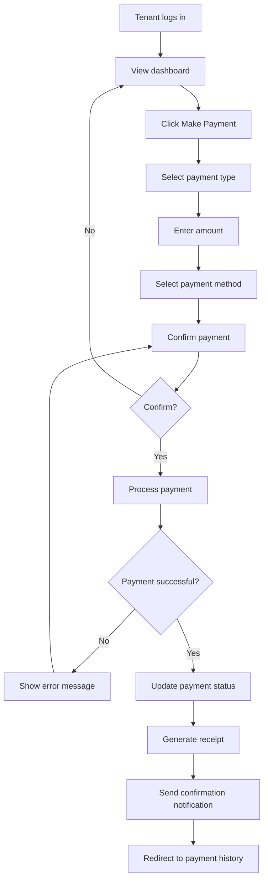

---

### 3. Ending a Tenancy

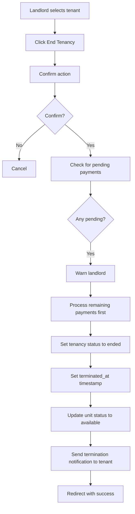

---

## Role Interaction Examples

### Example 1: Landlord Creating a Tenant

```php
// Landlord creates a new tenant with tenancy
$request = new Request([
    'first_name' => 'John',
    'last_name' => 'Doe',
    'email' => 'john.doe@example.com',
    'phone' => '+255712345678',
    'unit_id' => 5,
    'start_date' => '2024-01-01',
    'end_date' => '2024-12-31',
    'rent_amount' => 500.00,
    'security_deposit' => 1000.00,
]);

// Validation passes because:
// 1. User is landlord (role check)
// 2. Unit 5 belongs to landlord's property (ownership check)
// 3. All required fields present
// 4. Email unique in tenants table

// Result:
// - Tenant record created
// - User account created with username: john.doe[random] (or manually set if self-registered)
// - Tenancy created for unit 5
// - Unit 5 status changed to 'occupied'
```

### Example 2: Tenant Accessing Their Data

```php
// Tenant user logs in
$tenantUser = User::where('role', 'tenant')->first();

// Can only access their own data
$tenant = $tenantUser->tenant;

// Get active tenancy
$activeTenancy = $tenant->tenancies()
    ->where('status', 'active')
    ->with('unit.property')
    ->first();

// Get payment history
$payments = $tenant->payments()
    ->orderBy('payment_date', 'desc')
    ->paginate(10);

// CANNOT access:
// - Other tenants' data
// - Property list
// - Other tenants' payment history
```

### Example 3: Admin Managing All Properties

```php
// Admin user logs in
$admin = User::where('role', 'admin')->first();

// Can view all properties
$allProperties = Property::with('units')->paginate();

// Can view all tenants
$allTenants = Tenant::with('user', 'tenancies')->paginate();

// Can view all payments
$allPayments = Payment::with('tenant', 'tenancy')->paginate();

// Can modify any property
$property = Property::find(1);
$property->update(['name' => 'Updated Name']);
```

---

## Security Events

The system tracks security events for audit purposes:

### Event Types
| Event | Description | Severity |
|-------|-------------|----------|
| password_changed | User changed password | low |
| password_reset_requested | Password reset requested | medium |
| suspicious_activity | Suspicious activity detected | high |
| unusual_location | Login from unusual location | medium |
| multiple_failed_attempts | Multiple failed login attempts | high |
| token_revoked | API token revoked | low |
| session_terminated | Session terminated | low |
| device_added | New device registered | medium |
| device_removed | Device removed | medium |

### Logging Security Events
```php
// In any controller or service
SecurityEvent::log(
    user: auth()->user(),
    type: 'password_changed',
    data: ['ip' => request()->ip()],
    severity: 'low'
);
```

---

## Notifications

### Notification Types

1. **TenancyExpiringNotification**
   - Sent 30 days before tenancy ends
   - To: Tenant
   - From: System

2. **TenancyEndedNotification**
   - Sent when tenancy is ended
   - To: Tenant
   - From: Landlord

### Notification Flow
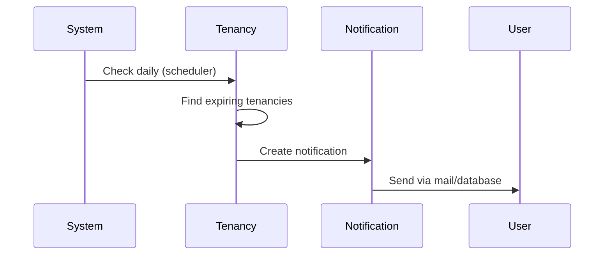

---

## Command Scheduler

The application includes scheduled commands:

### 1. EndExpiredTenancies
```bash
# Runs daily at midnight
php artisan schedule:run
# Or manually
php artisan tenancies:end-expired
```

**Functionality**:
- Finds tenancies where end_date < today
- Updates status from 'active' to 'expired'
- Updates unit status to 'available'
- Sends notification to tenant

### 2. TestTenancyNotifications
```bash
# Manual testing
php artisan tenancies:test-notifications
```

**Functionality**:
- Tests the notification system
- Can send test notifications to verify email configuration

### 3. MarkOverdueUtilityBills
```bash
# Runs daily (configured in Kernel.php - see schedule)
php artisan schedule:run
# Or manually
php artisan utility-bills:mark-overdue
```

**Functionality**:
- Marks pending and partial utility bills as overdue
- Updates status to 'overdue' when due_date < today
- Runs automatically daily (configured in app/Console/Kernel.php)

### 4. GenerateMonthlyUtilityBills
```bash
# Runs on the 1st of every month at 00:01 (via scheduler)
php artisan schedule:run
# Or manually
php artisan utility-bills:generate-monthly
```

**Functionality**:
- Creates monthly utility bills for all active tenancy_utilities
- Uses firstOrCreate to avoid duplicates
- Sets billing_month to current month, due_date to end of month
- Status defaults to 'pending'

---

## Summary

This business logic documentation covers:

1. **Three-tier role hierarchy**: Admin → Landlord → Tenant
2. **Comprehensive permission matrix**: Details what each role can/cannot do
3. **User relationships**: How users relate to tenants, properties, units
4. **CRUD operations**: With validation, ownership checks, and examples
5. **State machines**: For tenancies and units
6. **Business validation rules**: Domain-specific validation beyond simple field validation
7. **Workflows**: Onboarding tenants, processing payments, ending tenancies
8. **Security events**: Audit logging for security-sensitive actions
9. **Notifications**: Automated notifications for tenancy lifecycle
10. **Scheduled commands**: Automated background tasks
