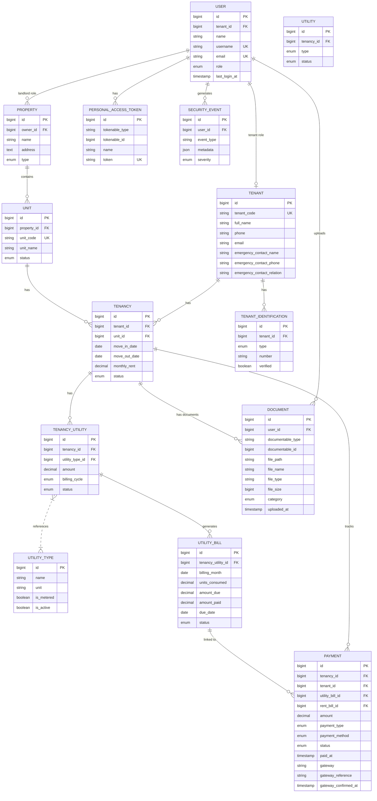

# Database Schema Documentation

> Last updated: 2026-05-20

## Overview
This document provides complete documentation of all database tables in the Estate Practice property management system. Each table includes its purpose, attributes, data types, constraints, relationships, and indexes.

## Entity-Relationship Diagram

```mermaid
erDiagram
    USER ||--o| TENANT : "belongs to"
    USER ||--o{ PROPERTY : "owns"
    PROPERTY ||--o{ UNIT : "contains"
    TENANT ||--o{ TENANCY : "has"
    UNIT ||--o{ TENANCY : "has active"
    TENANCY ||--o{ PAYMENT : "tracks"
    TENANCY ||--o{ TENANCY_UTILITY : "has"
    TENANCY ||--o{ RENT_BILL : "generates"
    TENANCY_UTILITY ||--o{ UTILITY_BILL : "generates"
    TENANCY_UTILITY }|..| UTILITY_TYPE : "references"
    UTILITY_BILL ||--o{ PAYMENT : "linked to"
    RENT_BILL ||--o{ PAYMENT : "linked to"
    USER ||--o{ NOTIFICATION : "receives"
    USER ||--o{ PERSONAL_ACCESS_TOKEN : "has"
    USER ||--o{ SECURITY_EVENT : "generates"
    USER ||--o{ DOCUMENT : "uploads"
    TENANT ||--o{ TENANT_IDENTIFICATION : "has"
    TENANT ||--o{ MESSAGE : "sends/receives"
    TENANCY ||--o{ DOCUMENT : "has documents"
    
    RENT_BILL {
        bigint id PK
        bigint tenancy_id FK
        date billing_month
        decimal amount_due
        decimal amount_paid
        date due_date
        enum status
    }
    
    UTILITY_TYPE {
        bigint id PK
        string name
        string unit
        text description
        boolean is_metered
        boolean is_active
    }
    
    TENANCY_UTILITY {
        bigint id PK
        bigint tenancy_id FK
        bigint utility_type_id FK
        decimal amount
        enum billing_cycle
        string provider
        string meter_number
        enum status
    }
    
    UTILITY_BILL {
        bigint id PK
        bigint tenancy_utility_id FK
        date billing_month
        decimal units_consumed
        decimal amount_due
        decimal amount_paid
        date due_date
        enum status
    }
```

## Tables

### 1. users

**Purpose**: Main user authentication and profile table for all system users.

**Migration**: `database/migrations/2026_01_30_115721_create_users_table.php`

**Attributes**:
| Column | Type | Constraints | Description |
|--------|------|-------------|-------------|
| id | BIGINT | PRIMARY KEY, AUTO-INCREMENT | Unique identifier |
| tenant_id | BIGINT | FOREIGN KEY (nullable, cascade) | Reference to tenant (for tenant role) |
| name | VARCHAR(255) | NOT NULL | User's full name |
| username | VARCHAR(255) | UNIQUE, NOT NULL | Unique username (primary credential for mobile login) |
| email | VARCHAR(255) | UNIQUE, NOT NULL | User's email address (secondary/web login) |
| email_verified_at | TIMESTAMP | NULLABLE | Email verification timestamp |
| password | VARCHAR(255) | NOT NULL | Bcrypt hashed password |
| remember_token | VARCHAR(100) | NULLABLE | Remember me token |
| role | ENUM('tenant', 'landlord', 'admin') | NOT NULL, INDEXED | User role |
| phone | VARCHAR(255) | NULLABLE | User phone number |
| must_change_password | TINYINT(1) | DEFAULT 0 | Force password change on next login |
| expo_push_token | VARCHAR(255) | NULLABLE | Expo push notification token |
| expo_push_token_updated_at | TIMESTAMP | NULLABLE | When Expo push token was last updated |
| push_platform | VARCHAR(255) | NULLABLE | Mobile push platform (ios/android) |
| two_factor_secret | TEXT | NULLABLE | Two-factor authentication secret |
| two_factor_recovery_codes | TEXT | NULLABLE | Recovery codes for 2FA |
| two_factor_confirmed_at | TIMESTAMP | NULLABLE | When 2FA was confirmed |
| last_login_at | TIMESTAMP | NULLABLE | Last login timestamp |
| created_at | TIMESTAMP | NOT NULL | Record creation timestamp |
| updated_at | TIMESTAMP | NOT NULL | Record update timestamp |

**Indexes**:
- PRIMARY KEY (id)
- UNIQUE INDEX on username
- UNIQUE INDEX on email
- INDEX on role

**Relationships**:
- BelongsTo Tenant (when role is 'tenant')
- HasMany Property (when role is 'landlord' or 'admin')
- HasMany PersonalAccessToken (Sanctum)
- HasMany SecurityEvent

---

### 2. tenants

**Purpose**: Stores tenant-specific information for rental occupants.

**Migration**: `database/migrations/2026_01_30_115040_create_tenants_table.php`

**Attributes**:
| Column | Type | Constraints | Description |
|--------|------|-------------|-------------|
| id | BIGINT | PRIMARY KEY, AUTO-INCREMENT | Unique identifier |
| tenant_code | VARCHAR(255) | UNIQUE, NOT NULL | Unique tenant code |
| full_name | VARCHAR(255) | NOT NULL | Tenant's full name |
| phone | VARCHAR(50) | NOT NULL | Contact phone number |
| email | VARCHAR(255) | NULLABLE | Tenant's email |
| emergency_contact_name | VARCHAR(255) | NOT NULL | Emergency contact name |
| emergency_contact_phone | VARCHAR(255) | NOT NULL | Emergency contact phone |
| emergency_contact_relation | VARCHAR(255) | NOT NULL | Emergency contact relation |
| deleted_at | TIMESTAMP | NULLABLE | Soft delete timestamp |
| created_at | TIMESTAMP | NOT NULL | Record creation timestamp |
| updated_at | TIMESTAMP | NOT NULL | Record update timestamp |

**Indexes**:
- PRIMARY KEY (id)
- UNIQUE INDEX on tenant_code
- INDEX on email

**Relationships**:
- HasOne User (via users.tenant_id)
- HasMany Tenancy
- HasMany TenantIdentification
- HasMany Payment
- MorphMany Notification (notifiable)

---

### 3. properties

**Purpose**: Stores property information managed by landlords.

**Migration**: `database/migrations/2026_02_20_114922_create_properties_table.php`

**Additional Migrations**:
- `database/migrations/2026_02_20_115146_add_property_id_to_units_table.php` - Adds property_id to units
- `database/migrations/2026_02_20_182200_add_remaining_fields_to_properties_table.php` - Adds additional fields

**Attributes**:
| Column | Type | Constraints | Description |
|--------|------|-------------|-------------|
| id | BIGINT | PRIMARY KEY, AUTO-INCREMENT | Unique identifier |
| owner_id | BIGINT | FOREIGN KEY (users.id) | Property owner (landlord) |
| name | VARCHAR(255) | NOT NULL | Property name |
| address | TEXT | NOT NULL | Full property address |
| property_type | ENUM('apartment', 'house', 'commercial', 'mixed') | NOT NULL | Property type |
| status | ENUM('active', 'inactive', 'maintenance') | DEFAULT 'active' | Property operational status |
| description | TEXT | NULLABLE | Property description |
| amenities | JSON | NULLABLE | Property amenities list |
| policies | JSON | NULLABLE | Property policies and rules |
| city | VARCHAR(255) | NULLABLE | City |
| state | VARCHAR(255) | NULLABLE | State/province |
| postal_code | VARCHAR(20) | NULLABLE | Postal/ZIP code |
| country | VARCHAR(255) | NULLABLE | Country |
| created_at | TIMESTAMP | NOT NULL | Record creation timestamp |
| updated_at | TIMESTAMP | NOT NULL | Record update timestamp |

**Indexes**:
- PRIMARY KEY (id)
- INDEX on owner_id

**Relationships**:
- BelongsTo User (owner)
- HasMany Unit

---

### 4. units

**Purpose**: Individual rental units within a property.

**Migration**: `database/migrations/2026_01_30_120134_create_units_table.php`

**Additional Migrations**:
- `database/migrations/2026_02_20_115146_add_property_id_to_units_table.php`

**Attributes**:
| Column | Type | Constraints | Description |
|--------|------|-------------|-------------|
| id | BIGINT | PRIMARY KEY, AUTO-INCREMENT | Unique identifier |
| property_id | BIGINT | FOREIGN KEY (properties.id) | Parent property |
| unit_code | VARCHAR(255) | UNIQUE, NOT NULL | Unit identifier |
| unit_name | VARCHAR(255) | NOT NULL | Human-readable unit name |
| status | ENUM('available', 'occupied') | DEFAULT 'available' | Unit availability |
| created_at | TIMESTAMP | NOT NULL | Record creation timestamp |
| updated_at | TIMESTAMP | NOT NULL | Record update timestamp |

**Indexes**:
- PRIMARY KEY (id)
- UNIQUE INDEX on unit_code
- INDEX on property_id
- INDEX on status

**Relationships**:
- BelongsTo Property
- HasMany Tenancy

---

### 5. tenancies

**Purpose**: Tracks rental agreements between tenants and landlords.

**Migration**: `database/migrations/2026_01_30_120532_create_tenancies_table.php`

**Additional Migrations**:
- `database/migrations/2026_02_26_203809_add_rent_fields_to_tenancies_table.php`
- `database/migrations/2026_03_01_143000_add_tenancy_ending_fields.php`
- `database/migrations/2026_03_02_153000_fix_tenancy_rent_values.php`

**Attributes**:
| Column | Type | Constraints | Description |
|--------|------|-------------|-------------|
| id | BIGINT | PRIMARY KEY, AUTO-INCREMENT | Unique identifier |
| tenant_id | BIGINT | FOREIGN KEY (tenants.id) | Tenant reference |
| unit_id | BIGINT | FOREIGN KEY (units.id) | Rented unit |
| move_in_date | DATE | NOT NULL | Tenancy start date |
| move_out_date | DATE | NULLABLE | Tenancy end date (planned) |
| monthly_rent | DECIMAL(12,2) | NOT NULL | Monthly rent amount |
| rent_due_day | INT | DEFAULT 5 | Day of month rent is due (1-31) |
| security_deposit | DECIMAL(12,2) | NULLABLE | Security deposit amount |
| status | ENUM('active', 'ended') | DEFAULT 'active' | Tenancy status |
| end_reason | VARCHAR(255) | NULLABLE | Reason for tenancy ending |
| deposit_return_status | VARCHAR(255) | NULLABLE | Security deposit return status |
| final_meter_readings | TEXT | NULLABLE | Final utility meter readings at end |
| created_at | TIMESTAMP | NOT NULL | Record creation timestamp |
| updated_at | TIMESTAMP | NOT NULL | Record update timestamp |

**Indexes**:
- PRIMARY KEY (id)
- INDEX on tenant_id
- INDEX on unit_id
- INDEX on status

**Relationships**:
- BelongsTo Tenant
- BelongsTo Unit
- HasMany Payment
- HasMany RentBill
- HasMany TenancyUtility
- MorphMany Document (documentable)

---

### 6. payments

**Purpose**: Tracks rent payments and other financial transactions.

**Migration**: `database/migrations/2026_02_03_154927_create_payments_table.php`

**Additional Migrations**:
- `database/migrations/2026_03_20_000004_add_utility_bill_id_to_payments_table.php` - Adds utility_bill_id for linkage to utility bills
- `database/migrations/2026_03_20_000005_add_pending_status_to_payments_table.php` - Adds 'pending' status to payment status enum
- `database/migrations/2026_03_21_000002_add_rent_bill_id_to_payments_table.php` - Adds rent_bill_id for linkage to rent bills
- `database/migrations/2026_05_02_205519_remove_receipt_path_from_payments_table.php` - Removes receipt_path column (PDF receipt generation now uses on-demand streaming)

**Attributes**:
| Column | Type | Constraints | Description |
|--------|------|-------------|-------------|
| id | BIGINT | PRIMARY KEY, AUTO-INCREMENT | Unique identifier |
| tenancy_id | BIGINT | FOREIGN KEY (tenancies.id) | Related tenancy |
| tenant_id | BIGINT | FOREIGN KEY (tenants.id) | Tenant making payment |
| utility_bill_id | BIGINT | FOREIGN KEY (nullable, nullOnDelete) | Link to utility bill (for utility payments) |
| rent_bill_id | BIGINT | FOREIGN KEY (nullable, nullOnDelete) | Link to rent bill (for rent payments) |
| amount | DECIMAL(12,2) | NOT NULL | Payment amount |
| payment_type | ENUM('rent', 'utility') | NOT NULL | Payment type |
| payment_method | VARCHAR(255) | NOT NULL | Payment method (free-form string) |
| status | ENUM('paid', 'partial', 'overdue', 'cancelled', 'pending') | DEFAULT 'pending' | Payment status |
| paid_at | TIMESTAMP | NOT NULL | Date payment was made |
| due_date | DATE | NOT NULL | Date payment was due |
| reference_number | VARCHAR(100) | NULLABLE | External payment reference |
| notes | TEXT | NULLABLE | Payment notes |
| gateway | VARCHAR(255) | NULLABLE | Payment gateway driver used (`manual`, `mpesa`) |
| checkout_request_id | VARCHAR(255) | NULLABLE | M-Pesa STK push checkout request ID |
| gateway_reference | VARCHAR(255) | NULLABLE | Gateway transaction reference |
| gateway_status | VARCHAR(255) | NULLABLE | Raw status string from the gateway |
| gateway_metadata | JSON | NULLABLE | Full gateway response payload |
| gateway_confirmed_at | TIMESTAMP | NULLABLE | When the gateway confirmed the payment |
| reference_number | VARCHAR(255) | NULLABLE | External payment reference |
| notes | TEXT | NULLABLE | Payment notes |
| created_at | TIMESTAMP | NOT NULL | Record creation timestamp |
| updated_at | TIMESTAMP | NOT NULL | Record update timestamp |
| deleted_at | TIMESTAMP | NULLABLE | Soft delete timestamp |

**Indexes**:
- PRIMARY KEY (id)
- INDEX on tenancy_id
- INDEX on tenant_id
- INDEX on utility_bill_id
- INDEX on rent_bill_id
- INDEX on status
- INDEX on paid_at

**Relationships**:
- BelongsTo Tenancy
- BelongsTo Tenant
- BelongsTo UtilityBill (optional, for utility payments)
- BelongsTo RentBill (optional, for rent payments)
- Uses SoftDeletes trait

---

### Performance Indexes

The following indexes were added during the pre-Phase 3 stabilization to improve query performance:

```
payments:   status, paid_at, tenant_id, tenancy_id, rent_bill_id, utility_bill_id
tenancies:  status
rent_bills: status, due_date, billing_month
```

Migration file reference: `database/migrations/2026_05_02_080758_add_performance_indexes_to_core_tables.php`

---

### 7. utility_types

**Purpose**: Catalog of utility categories (admin-managed). Replaces hardcoded ENUM values.

**Migration**: `database/migrations/2026_03_20_000001_create_utility_types_table.php`

**Seeder**: `database/seeders/UtilityTypeSeeder.php` - Seeds default utility types (Water, Electricity, Gas, Internet, Security, Janitor, Garbage, Parking)

**Attributes**:
| Column | Type | Constraints | Description |
|--------|------|-------------|-------------|
| id | BIGINT | PRIMARY KEY, AUTO-INCREMENT | Unique identifier |
| name | VARCHAR(100) | NOT NULL | Utility name (e.g., 'Water', 'Electricity', 'Security') |
| unit | VARCHAR(50) | NULLABLE | Unit of measurement (e.g., 'cubic metres', 'kWh', 'flat rate') |
| description | TEXT | NULLABLE | Optional detail for landlord UI |
| is_metered | BOOLEAN | DEFAULT false | true = usage-based billing, false = flat rate |
| is_active | BOOLEAN | DEFAULT true | Whether utility type is available |
| created_at | TIMESTAMP | NOT NULL | Record creation timestamp |
| updated_at | TIMESTAMP | NOT NULL | Record update timestamp |

**Indexes**:
- PRIMARY KEY (id)
- UNIQUE INDEX on name

**Relationships**:
- HasMany TenancyUtility

---

### 8. tenancy_utilities

**Purpose**: Links a tenancy to the utility types that apply to it, with agreed billing amounts. This is the join table between tenancies and utility types.

**Migration**: `database/migrations/2026_03_20_000002_create_tenancy_utilities_table.php`

**Attributes**:
| Column | Type | Constraints | Description |
|--------|------|-------------|-------------|
| id | BIGINT | PRIMARY KEY, AUTO-INCREMENT | Unique identifier |
| tenancy_id | BIGINT | FOREIGN KEY (tenancies.id, cascadeOnDelete) | Related tenancy |
| utility_type_id | BIGINT | FOREIGN KEY (utility_types.id, restrictOnDelete) | Utility type reference |
| amount | DECIMAL(12,2) | NOT NULL | Agreed fixed amount (for flat-rate utilities) |
| billing_cycle | ENUM('monthly', 'quarterly', 'annual') | DEFAULT 'monthly' | Billing frequency |
| provider | VARCHAR(255) | NULLABLE | Service provider name |
| account_number | VARCHAR(100) | NULLABLE | Utility account number |
| meter_number | VARCHAR(100) | NULLABLE | Meter number |
| status | ENUM('active', 'suspended', 'disconnected') | DEFAULT 'active' | Utility status |
| notes | TEXT | NULLABLE | Additional notes |
| created_at | TIMESTAMP | NOT NULL | Record creation timestamp |
| updated_at | TIMESTAMP | NOT NULL | Record update timestamp |

**Indexes**:
- PRIMARY KEY (id)
- UNIQUE CONSTRAINT on (tenancy_id, utility_type_id) - 'uq_tenancy_utility'
- INDEX on tenancy_id
- INDEX on utility_type_id
- INDEX on status

**Relationships**:
- BelongsTo Tenancy
- BelongsTo UtilityType
- HasMany UtilityBill

---

### 9. utility_bills

**Purpose**: Individual monthly charge records. One row per utility per billing period.

**Migration**: `database/migrations/2026_03_20_000003_create_utility_bills_table.php`

**Attributes**:
| Column | Type | Constraints | Description |
|--------|------|-------------|-------------|
| id | BIGINT | PRIMARY KEY, AUTO-INCREMENT | Unique identifier |
| tenancy_utility_id | BIGINT | FOREIGN KEY (tenancy_utilities.id, cascadeOnDelete) | Reference to tenancy utility |
| billing_month | DATE | NOT NULL | First day of billing month (e.g., 2026-03-01) |
| units_consumed | DECIMAL(10,3) | NULLABLE | Usage amount (null for flat-rate utilities) |
| amount_due | DECIMAL(12,2) | NOT NULL | Total amount due |
| amount_paid | DECIMAL(12,2) | DEFAULT 0 | Amount paid so far |
| due_date | DATE | NOT NULL | Payment due date |
| status | ENUM('pending', 'paid', 'partial', 'overdue', 'waived') | DEFAULT 'pending' | Bill status |
| notes | TEXT | NULLABLE | Additional notes |
| created_at | TIMESTAMP | NOT NULL | Record creation timestamp |
| updated_at | TIMESTAMP | NOT NULL | Record update timestamp |

**Indexes**:
- PRIMARY KEY (id)
- UNIQUE CONSTRAINT on (tenancy_utility_id, billing_month) - 'uq_utility_bill_month'
- INDEX on tenancy_utility_id
- INDEX on billing_month
- INDEX on status
- INDEX on due_date

**Relationships**:
- BelongsTo TenancyUtility
- HasMany Payment

---

### 10. rent_bills

**Purpose**: Individual monthly rent charge records. One row per tenancy per billing month. Tracks rent payments, outstanding amounts, and payment status.

**Migration**: `database/migrations/2026_03_21_000001_create_rent_bills_table.php`

**Attributes**:
| Column | Type | Constraints | Description |
|--------|------|-------------|-------------|
| id | BIGINT | PRIMARY KEY, AUTO-INCREMENT | Unique identifier |
| tenancy_id | BIGINT | FOREIGN KEY (tenancies.id, cascadeOnDelete) | Reference to tenancy |
| billing_month | DATE | NOT NULL | First day of billing month (e.g., 2026-03-01) |
| amount_due | DECIMAL(12,2) | NOT NULL | Monthly rent amount |
| amount_paid | DECIMAL(12,2) | DEFAULT 0 | Amount paid so far |
| due_date | DATE | NOT NULL | Payment due date (default: 5th of month) |
| status | ENUM('pending', 'paid', 'partial', 'overdue', 'waived') | DEFAULT 'pending' | Bill status |
| notes | TEXT | NULLABLE | Additional notes |
| created_at | TIMESTAMP | NOT NULL | Record creation timestamp |
| updated_at | TIMESTAMP | NOT NULL | Record update timestamp |

**Indexes**:
- PRIMARY KEY (id)
- UNIQUE CONSTRAINT on (tenancy_id, billing_month) - 'uq_rent_bill_month'
- INDEX on tenancy_id
- INDEX on billing_month
- INDEX on status
- INDEX on due_date

**Relationships**:
- BelongsTo Tenancy
- HasMany Payment

---

### 11. utilities (DROPPED)

**Purpose**: **DROPPED** - Original utility tracking table. Has been replaced by the utility_types + tenancy_utilities + utility_bills system.

> **Warning**: This table was dropped in migration `database/migrations/2026_03_19_120000_drop_deprecated_utilities_table.php`. The new three-table utility system (utility_types, tenancy_utilities, utility_bills) should be used instead.

**Migration**: `database/migrations/2026_01_30_120843_create_utilities_table.php` (original creation)

**Dropped Migration**: `database/migrations/2026_03_19_120000_drop_deprecated_utilities_table.php`

**Historical Attributes** (for reference only):
| Column | Type | Constraints | Description |
|--------|------|-------------|-------------|
| id | BIGINT | PRIMARY KEY, AUTO-INCREMENT | Unique identifier |
| tenancy_id | BIGINT | FOREIGN KEY (tenancies.id) | Related tenancy |
| type | ENUM('water', 'electricity', 'gas', 'internet', 'other') | NOT NULL | Utility type |
| provider | VARCHAR(255) | NULLABLE | Service provider name |
| account_number | VARCHAR(100) | NULLABLE | Utility account number |
| meter_number | VARCHAR(100) | NULLABLE | Meter number |
| status | ENUM('active', 'disconnected', 'pending') | DEFAULT 'active' | Utility status |
| created_at | TIMESTAMP | NOT NULL | Record creation timestamp |
| updated_at | TIMESTAMP | NOT NULL | Record update timestamp |

**Indexes**:
- PRIMARY KEY (id)
- INDEX on tenancy_id
- INDEX on type

**Relationships**:
- BelongsTo Tenancy

---

### 11. documents

**Purpose**: Polymorphic document storage for tenancy agreements, receipts, inspection photos, ID documents, and other file attachments.

**Migration**: `database/migrations/2026_05_16_000001_create_documents_table.php`

**Attributes**:
| Column | Type | Constraints | Description |
|--------|------|-------------|-------------|
| id | BIGINT | PRIMARY KEY, AUTO-INCREMENT | Unique identifier |
| user_id | BIGINT | FOREIGN KEY (nullable, users.id) | User who uploaded the document |
| documentable_type | VARCHAR(255) | NOT NULL | Polymorphic model type (Tenancy, Payment, Property) |
| documentable_id | BIGINT | NOT NULL | Polymorphic model ID |
| file_path | VARCHAR(500) | NOT NULL | Storage path within documents disk |
| file_name | VARCHAR(255) | NOT NULL | Original filename |
| file_type | VARCHAR(50) | NOT NULL | MIME type of the file |
| file_size | BIGINT | NOT NULL | File size in bytes |
| category | ENUM | NOT NULL | tenancy_agreement, receipt, inspection_photo, id_document, other |
| uploaded_at | TIMESTAMP | NOT NULL | Upload timestamp |
| deleted_at | TIMESTAMP | NULLABLE | Soft delete timestamp |
| created_at | TIMESTAMP | NOT NULL | Record creation timestamp |
| updated_at | TIMESTAMP | NOT NULL | Record update timestamp |

**Indexes**:
- PRIMARY KEY (id)
- INDEX on user_id
- COMPOSITE INDEX on (documentable_type, documentable_id, category)
- COMPOSITE INDEX on (documentable_type, documentable_id, uploaded_at)
- INDEX on deleted_at

**Relationships**:
- BelongsTo User (uploader)
- MorphTo documentable (Tenancy, Payment, Property)

**File Structure**: `storage/app/documents/{category}/{ModelType}/{model_id}/{uuid}.{ext}`

---

### 12. tenant_identifications

**Purpose**: Stores tenant identification documents.

**Migration**: `database/migrations/2026_01_30_120729_create_tenant_identifications_table.php`

**Attributes**:
| Column | Type | Constraints | Description |
|--------|------|-------------|-------------|
| id | BIGINT | PRIMARY KEY, AUTO-INCREMENT | Unique identifier |
| tenant_id | BIGINT | FOREIGN KEY (tenants.id) | Tenant reference |
| id_type | VARCHAR(255) | NOT NULL | ID type (national_id, passport, etc.) |
| id_number | VARCHAR(255) | NOT NULL | ID number |
| document_path | VARCHAR(255) | NULLABLE | Path to scanned document |
| verified_at | TIMESTAMP | NULLABLE | When ID was verified |
| created_at | TIMESTAMP | NOT NULL | Record creation timestamp |
| updated_at | TIMESTAMP | NOT NULL | Record update timestamp |

**Indexes**:
- PRIMARY KEY (id)
- INDEX on tenant_id

**Relationships**:
- BelongsTo Tenant

---

### 13. notifications

**Purpose**: In-app notifications for users.

**Migration**: `database/migrations/2026_01_30_120958_create_notifications_table.php`

**Attributes**:
| Column | Type | Constraints | Description |
|--------|------|-------------|-------------|
| id | UUID | PRIMARY KEY | Unique identifier |
| notifiable_type | VARCHAR(255) | NOT NULL | Model type (User/Tenant) |
| notifiable_id | BIGINT | NOT NULL | Model ID |
| type | VARCHAR(255) | NOT NULL | Notification class/type |
| data | JSON | NOT NULL | Notification payload |
| read_at | TIMESTAMP | NULLABLE | When notification was read |
| created_at | TIMESTAMP | NOT NULL | Record creation timestamp |
| updated_at | TIMESTAMP | NOT NULL | Record update timestamp |

**Indexes**:
- PRIMARY KEY (id)
- INDEX on (notifiable_type, notifiable_id)
- INDEX on read_at

**Relationships**:
- MorphTo notifiable

---

### 14. messages

**Purpose**: Internal messaging between users.

**Migration**: `database/migrations/2026_01_30_121057_create_messages_table.php`

**Attributes**:
| Column | Type | Constraints | Description |
|--------|------|-------------|-------------|
| id | BIGINT | PRIMARY KEY, AUTO-INCREMENT | Unique identifier |
| sender_id | BIGINT | FOREIGN KEY (users.id) | Message sender |
| receiver_id | BIGINT | FOREIGN KEY (users.id) | Message receiver |
| message | TEXT | NOT NULL | Message content |
| created_at | TIMESTAMP | NOT NULL | Record creation timestamp |
| updated_at | TIMESTAMP | NOT NULL | Record update timestamp |

**Indexes**:
- PRIMARY KEY (id)
- INDEX on sender_id
- INDEX on receiver_id

**Relationships**:
- BelongsTo User (sender)
- BelongsTo User (receiver)

---

---

### 15. personal_access_tokens (Sanctum)

**Purpose**: API authentication tokens for mobile/web API access using Laravel Sanctum.

**Migration**: Created by Laravel Sanctum default migration.

**Attributes**:
| Column | Type | Constraints | Description |
|--------|------|-------------|-------------|
| id | BIGINT | PRIMARY KEY, AUTO-INCREMENT | Unique identifier |
| tokenable_type | VARCHAR(255) | NOT NULL | Morph type (App\Models\User) |
| tokenable_id | BIGINT | NOT NULL | Morph ID |
| name | VARCHAR(255) | NOT NULL | Token name (e.g. 'mobile-app') |
| token | VARCHAR(64) | UNIQUE, NOT NULL | Hashed token value |
| abilities | TEXT | NULLABLE | Token permissions/abilities |
| last_used_at | TIMESTAMP | NULLABLE | Last token usage |
| expires_at | TIMESTAMP | NULLABLE | Token expiration |
| created_at | TIMESTAMP | NOT NULL | Record creation timestamp |
| updated_at | TIMESTAMP | NOT NULL | Record update timestamp |

**Indexes**:
- PRIMARY KEY (id)
- UNIQUE INDEX on token
- INDEX on (tokenable_type, tokenable_id)

**Relationships**:
- MorphTo User (tokenable)
---

### 16. security_events

**Purpose**: Audit log for security-related events.

**Migration**: `database/migrations/2026_03_07_200100_create_security_events_table.php`

**Attributes**:
| Column | Type | Constraints | Description |
|--------|------|-------------|-------------|
| id | BIGINT | PRIMARY KEY, AUTO-INCREMENT | Unique identifier |
| user_id | BIGINT | FOREIGN KEY (users.id) | User associated with event |
| event_type | VARCHAR(100) | NOT NULL | Type of security event |
| ip_address | VARCHAR(45) | NULLABLE | IP address |
| user_agent | TEXT | NULLABLE | Browser/device user agent |
| device_id | CHAR(36) | NULLABLE | UUID of the device |
| location | VARCHAR(255) | NULLABLE | Geographic location |
| metadata | JSON | NULLABLE | Additional event metadata |
| severity | ENUM('low', 'medium', 'high', 'critical') | NOT NULL | Event severity |
| created_at | TIMESTAMP | NOT NULL | Record creation timestamp |
| updated_at | TIMESTAMP | NULLABLE | Record update timestamp |

**Event Types**:
- login
- logout
- password_change
- password_reset_requested
- suspicious_activity
- unusual_location
- multiple_failed_attempts
- token_revoked
- session_terminated
- biometric_enabled
- biometric_disabled
- device_added
- device_removed
- profile_update
- utility_update

**Indexes**:
- PRIMARY KEY (id)
- INDEX on user_id
- INDEX on event_type
- INDEX on severity
- INDEX on created_at

**Relationships**:
- BelongsTo User

---

### 17. Laravel System Tables

The following tables are created by Laravel framework:

#### cache
**Purpose**: Cache key-value storage.

**Migration**: `database/migrations/0001_01_01_000001_create_cache_table.php`

#### cache_locks
**Purpose**: Cache lock storage for atomic operations.

**Migration**: Created alongside cache table.

#### jobs
**Purpose**: Queue job storage.

**Migration**: `database/migrations/0001_01_01_000002_create_jobs_table.php`

#### job_batches
**Purpose**: Batched queue job tracking.

**Migration**: Created alongside jobs table.

#### failed_jobs
**Purpose**: Failed queue job storage for retry/inspection.

**Migration**: Created alongside jobs table.

#### sessions
**Purpose**: User session storage.

**Migration**: `database/migrations/2026_02_19_133943_create_sessions_table.php`

#### password_reset_tokens
**Purpose**: Password reset token storage.

**Migration**: Created by Laravel Fortify.

#### notifications
**Purpose**: Laravel notification table (polymorphic, UUID primary key).

**Migration**: `database/migrations/2026_01_30_120958_create_notifications_table.php`

---

## Custom Field Definitions

#### security_events.metadata
Stores event-specific data:
```json
{
  "old_email": "old@example.com",
  "new_email": "new@example.com"
}
```

#### properties.amenities
JSON array of property amenities:
```json
["parking", "gym", "pool", "security"]
```

#### properties.policies
JSON object of property policies:
```json
{
  "pets_allowed": true,
  "smoking_allowed": false,
  "max_occupants": 4
}
```

---

## Relationships Summary


