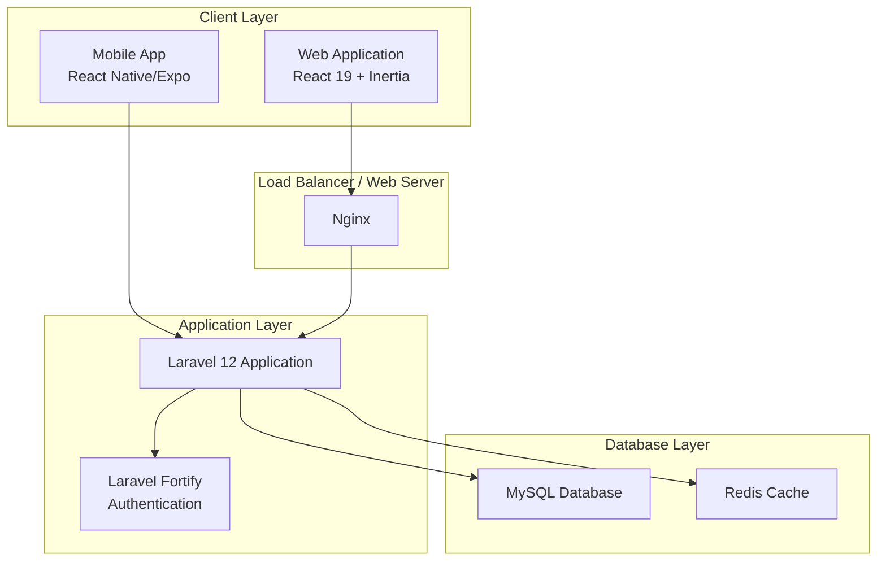
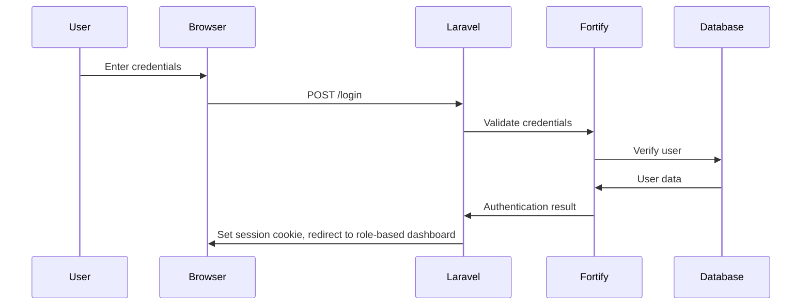
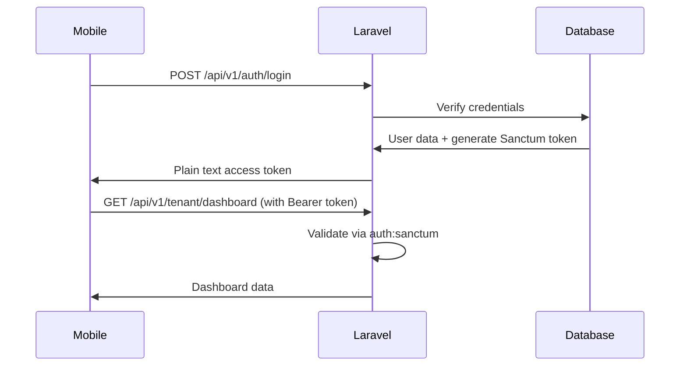
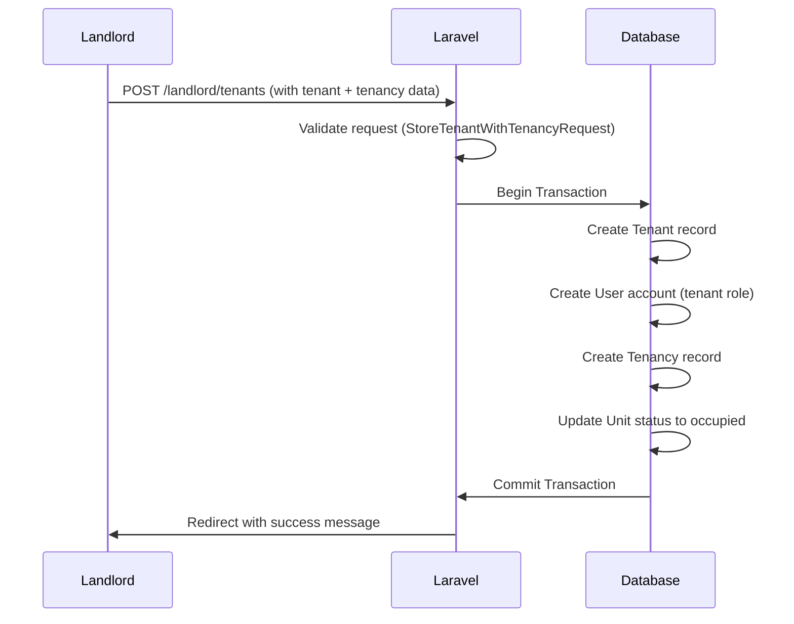

## Overview
This is a Laravel 12 + React 19 full-stack property management application called "Estate Practice". It provides a multi-tenant property management system with three user roles: Admin, Landlord, and Tenant.

All role-based authorization is enforced through `App\Enums\Role` — a PHP 8.1 backed string enum. This enum is the single source of truth for all authorization decisions across Policies, FormRequests, Controllers, and redirect logic. No string role literals exist in the active codebase.

## Technology Stack

### Backend
- **Framework**: Laravel 12.x (12.56.0)
- **PHP Version**: 8.5
- **Authentication**: Laravel Fortify (web), Laravel Sanctum (API)
- **Authorization**: `App\Enums\Role` — PHP 8.1 backed enum; Policies with `before()` admin bypass
- **Server-Side Rendering**: Inertia.js with React 19
- **Notification Channels**: `WhatsAppChannel` (Twilio), `ExpoPushChannel` (Expo Push Service)

### Frontend (Web)
- **UI Framework**: React 19 with TypeScript
- **Styling**: TailwindCSS 4.0 with CSS variables
- **Component Library**: shadcn/ui (New York style, neutral base color, lucide icons)
- **Charts**: Recharts
- **Build Tool**: Vite 7.0.4

### Mobile (React Native/Expo)
- **Framework**: React Native with Expo
- **Target**: iOS and Android
- **State Management**: React Context for auth, React Query for server state
- **Navigation**: React Navigation with bottom tabs and nested stacks
- **UI Component Strategy**: Hybrid approach using `react-native-paper` for foundational elements and custom `react-native-reanimated` components (like Skeleton Loaders) for polished interfaces.

## Mobile App Screens

### Tenant Screens
```
mobile/src/screens/tenant/
├── DashboardScreen.tsx         # Tenant dashboard with tenancy overview
├── PaymentsScreen.tsx          # Payment history and status
├── MakePaymentScreen.tsx       # Make rent or utility payments
├── UtilitiesScreen.tsx         # List of assigned utilities
├── UtilityBillsScreen.tsx      # View utility bills with summary
├── RentBillsScreen.tsx         # View rent bills with summary (NEW)
├── RentBillDetailsScreen.tsx   # View rent bill details with payment history (NEW)
├── ProfileScreen.tsx          # Tenant profile management
├── EditProfileScreen.tsx      # Tenant profile and password update (NEW)
├── DocumentsScreen.tsx        # Tenant documents (read-only, download) (NEW)
└── LoginScreen.tsx            # Authentication
```

### Landlord Screens
```
mobile/src/screens/landlord/
├── DashboardScreen.tsx         # Landlord dashboard with metrics
├── PropertiesScreen.tsx        # Property management
├── PropertyDetailsScreen.tsx  # Property details and units
├── UnitsScreen.tsx            # Unit management
├── TenantsScreen.tsx          # Tenant list
├── TenantDetailsScreen.tsx    # Tenant details with utilities button
├── TenancyUtilitiesScreen.tsx # Manage utilities for a tenancy
├── PaymentsScreen.tsx         # Payment history
├── UtilityBillsScreen.tsx     # View and manage tenant utility bills
├── RentBillsScreen.tsx        # View and manage rent bills (NEW)
├── RentBillDetailsScreen.tsx  # View/edit rent bill details (NEW)
├── AddTenantScreen.tsx        # Handle complex tenant creation
├── ProfileScreen.tsx         # Landlord profile management
├── EditProfileScreen.tsx     # Landlord profile and password update (NEW)
├── DocumentsScreen.tsx       # Landlord documents (upload, list, download, delete) (NEW)
└── LoginScreen.tsx           # Authentication
```

### Navigation Structure
- Bottom tab navigation for main sections
- Nested stack navigators for detail screens
- Modal screens for forms (add/edit utilities, bills)

**New Navigation Routes (Rent Bills):**
- Tenant Payments Stack: `RentBills`, `RentBillDetails`
- Landlord Payments Stack: `RentBills`, `RentBillDetails`
- MakePayment Screen: Now accepts optional `rentBillId` parameter

**Splash Screen Logic:**
- `SplashScreen.tsx`: Custom animated entry screen with "Deep Teal & Gold" branding.
- **Background Loading Pattern**: The main app navigator mounts *behind* the splash overlay to pre-fetch data and pre-render components during the animation, ensuring a flicker-free transition.

### API Client Structure
```
mobile/src/
├── api/
│   ├── client.ts              # Axios instance with interceptors
│   ├── landlord.ts            # Landlord API endpoints
│   └── tenant.ts              # Tenant API endpoints
├── types/
│   └── index.ts               # TypeScript type definitions (Consolidated User Updates)
├── components/
│   ├── SplashScreen.tsx       # Elegant animated entry screen (NEW)
│   └── profile/
│       └── ChangePasswordForm.tsx # Reusable nested password update UI (NEW)
├── hooks/
│   └── useAddTenant.ts        # Custom abstraction hook for tenant additions (NEW)
└── utils/
    └── statusColors.ts        # Status color utility for bills/payments (NEW)
```

### Key API Endpoints Used by Mobile

**Tenant API** (`/api/tenant/*`):
- `GET /tenant/dashboard` - Dashboard data with rent bill summary
- `GET /tenant/payments` - Payment history with pending amount
- `POST /tenant/payments` - Create payment (rent/utility) with optional rent_bill_id
- `GET /tenant/utilities` - List assigned utilities with tenancy info
- `GET /tenant/utility-bills` - List utility bills with summary
- `GET /tenant/rent-bills` - List tenant's rent bills with summary (NEW)
- `GET /tenant/rent-bills/current` - Get current month's rent bill (NEW)
- `GET /tenant/rent-bills/{id}` - Get rent bill details (NEW)
- `GET /tenant/profile` - Get authenticated tenant profile
- `PUT /tenant/profile` - Update profile particulars
- `PUT /password` - Update password (Shared Universal Controller)
- `GET /tenant/documents` - List documents for tenant's active tenancy (NEW)
- `GET /tenant/documents/{id}/download` - Download a document (NEW)

**Landlord API** (`/api/landlord/*`):
- `GET /landlord/dashboard` - Dashboard metrics with rent bill stats
- `GET /landlord/utility-types` - List all utility types
- `GET /landlord/utility-bills` - List all utility bills (paginated)
- `PUT /landlord/utility-bills/{id}` - Update utility bill
- `POST /landlord/utility-bills/{id}/waive` - Waive a bill
- `GET /landlord/tenancies/{id}/utilities` - List tenancy utilities
- `POST /landlord/tenancies/{id}/utilities` - Add utility to tenancy
- `PUT /landlord/tenancy-utilities/{id}` - Update tenancy utility
- `DELETE /landlord/tenancy-utilities/{id}` - Remove utility from tenancy
- `GET /landlord/rent-bills` - List all rent bills with filtering (NEW)
- `GET /landlord/rent-bills/{id}` - Get rent bill details with payments (NEW)
- `POST /landlord/rent-bills/{id}/waive` - Waive a rent bill (NEW)
- `GET /landlord/rent-bills/overdue` - List overdue rent bills (NEW)
- `GET /landlord/rent-bills/pending` - List pending rent bills (NEW)
- `GET /landlord/profile` - Get authenticated landlord profile
- `PUT /landlord/profile` - Update landlord details
- `PUT /password` - Update password (Shared Universal Controller)
- `GET /landlord/tenancies/{id}/documents` - List documents for a tenancy (NEW)
- `POST /landlord/tenancies/{id}/documents` - Upload document to a tenancy (NEW)
- `GET /landlord/documents/{id}/download` - Download a document (NEW)
- `DELETE /landlord/documents/{id}` - Soft-delete a document (NEW)

### Mobile TypeScript Types

Key types defined in `mobile/src/types/index.ts`:

```typescript
// Utility Bill - represents a monthly charge for a utility
interface UtilityBill {
  id: number;
  tenancy_utility_id: number;
  billing_month: string;
  units_consumed: number | null;
  amount_due: number;
  amount_paid: number;
  due_date: string;
  status: 'pending' | 'paid' | 'partial' | 'overdue' | 'waived';
  notes: string | null;
  tenancy_utility?: {
    id: number;
    utility_type: UtilityType | null;
    // ... other tenancy utility fields
  };
}

// Utility Bill Summary - aggregated statistics for tenant
interface UtilityBillSummary {
  total_due: number;
  total_paid: number;
  total_outstanding: number;
  bill_count: number;
}

// Rent Bill - represents a monthly rent charge (NEW)
type RentBillStatus = 'pending' | 'paid' | 'partial' | 'overdue' | 'waived';

interface RentBill {
  id: number;
  tenancy_id: number;
  billing_month: string; // YYYY-MM-01
  amount_due: number;
  amount_paid: number;
  due_date: string;
  status: RentBillStatus;
  notes: string | null;
  tenant?: {
    id: number;
    full_name: string;
    email: string;
  };
  unit?: {
    id: number;
    unit_code: string;
  };
  property?: {
    id: number;
    name: string;
  };
  payments?: Payment[];
}

// Rent Bill Summary - aggregated statistics for tenant
interface RentBillSummary {
  total_outstanding: number;
  pending_count: number;
  overdue_count: number;
  paid_count: number;
}

// Payment Form Data - with rent bill linking (NEW)
interface PaymentFormData {
  amount: number;
  payment_type: 'rent' | 'utility';
  payment_method: 'mobile_money' | 'bank_transfer';
  utility_bill_id?: number;
  rent_bill_id?: number; // Link payment to specific rent bill
  reference_number?: string;
  notes?: string;
}

// Payment with gateway fields (Phase 5)
interface Payment {
  id: number;
  amount: number;
  payment_type: 'rent' | 'utility' | 'deposit' | 'penalty' | 'other';
  payment_method: 'cash' | 'bank_transfer' | 'mobile_money' | 'card' | 'other';
  status: 'pending' | 'paid' | 'partial' | 'overdue' | 'cancelled';
  gateway?: string | null;
  gateway_status?: string | null;
  gateway_reference?: string | null;
  receipt_path?: string | null;
  gateway_confirmed_at?: string | null;
  // ... other fields
}
```

## System Architecture Diagram



## Application Layers

### 1. Presentation Layer (React + Inertia)
Located in the root (not resources/js), using Inertia.js for SSR:
- **Web Controllers**: `app/Http/Controllers/Web/`
- **Pages**: Inertia page components rendered server-side
- **Persistent Layouts**: Inertia continuous layouts mapping (`AdminLayout`, `LandlordLayout`) resolving toggle-state resets and visual flashing globally.
- **Middleware**: HandleInertiaRequests, HandleAppearance

### 2. API Layer (REST)
Located in `app/Http/Controllers/Api/`:
- **Authentication API**: `app/Http/Controllers/Api/Auth/`
- **Tenant API**: `app/Http/Controllers/Api/Tenant/`
- **Landlord API**: `app/Http/Controllers/Api/Landlord/`

### 3. Business Logic Layer
Located in:
- **Services**: `app/Services/` containing exhaustive business rules divorced from controllers (e.g. `PaymentService`, `TenantService`, `UtilityService`, `OnboardingService`, `DashboardServices`, `RentBillService`, `NotificationService`, `ReceiptService`, `DocumentService`). **Note**: `ReceiptService` uses storage-based PDF generation—receipts are generated and stored on disk with URL caching. `DocumentService` handles polymorphic document upload/download/listing/deletion with MIME validation, size limits, and UUID-based file paths.
- **Models**: `app/Models/` (User, Property, Unit, Tenant, Tenancy, Payment, RentBill, Document, etc.)
- **Actions**: `app/Actions/Fortify/` (User creation, password validation)
- **Channels**: `app/Channels/` (`WhatsAppChannel` via Twilio, `ExpoPushChannel` via Expo Push)
- **Notifications**: `app/Notifications/` (`PaymentReceived`, `RentBillGenerated`, `RentBillOverdue` — all implement `ShouldQueue`)

### 4. Data Access Layer
- **Eloquent Models**: `app/Models/`
- **Migrations**: `database/migrations/`
- **Seeders**: `database/seeders/`

## Module Structure

### User Management Module
```
app/Models/User.php
app/Http/Controllers/Web/Settings/
app/Actions/Fortify/
```
- **Roles**: admin, landlord, tenant
- **Features**: Profile management, password changes, two-factor authentication

### Property Management Module
```
app/Http/Controllers/Web/Admin/AdminPropertyController.php
app/Http/Controllers/Web/Landlord/LandlordPropertyController.php
app/Models/Property.php
```
- **Features**: CRUD operations, property details, images

### Unit Management Module
```
app/Http/Controllers/Web/Landlord/LandlordUnitController.php
app/Models/Unit.php
```
- **Features**: Unit CRUD, property association, availability status

### Tenant Management Module
```
app/Http/Controllers/Web/Landlord/LandlordTenantController.php
app/Models/Tenant.php
app/Models/Tenancy.php
app/Services/TenantService.php
```
- **Features**: Tenant registration, tenancy creation, tenant identification

### Payment Module
```
app/Http/Controllers/Web/Landlord/LandlordPaymentController.php
app/Models/Payment.php
app/Services/PaymentService.php
```
- **Features**: Payment tracking, payment history

### Notification Module
```
app/Http/Controllers/Web/*/NotificationController.php
app/Models/Notification.php
app/Notifications/
```
- **Features**: In-app notifications, email notifications, tenancy expiry alerts

### Utility Module
```
app/Http/Controllers/Web/Landlord/LandlordUtilityController.php
app/Http/Controllers/Web/Landlord/LandlordUtilityBillController.php
app/Http/Controllers/Web/Tenant/TenantUtilitiesController.php
app/Http/Controllers/Api/Landlord/TenancyUtilityController.php
app/Http/Controllers/Api/Landlord/UtilityBillController.php
app/Http/Controllers/Api/Landlord/UtilityTypeController.php
app/Models/UtilityType.php
app/Models/TenancyUtility.php
app/Models/UtilityBill.php
app/Services/UtilityService.php
```
- **Features**: Utility tracking (water, electricity, etc.), utility bill management, utility type catalog
- **New Three-Table System**: Replaced the old single `utilities` table with:
  - `UtilityType` - Catalog of utility categories (admin-managed)
  - `TenancyUtility` - Links tenancies to utility types with billing details
  - `UtilityBill` - Individual monthly charge records

### Security Module
```
app/Models/SecurityEvent.php
```
- **Features**: Security event logging and auditing.

### Document Storage Module
```
app/Models/Document.php
app/Services/DocumentService.php
app/Http/Controllers/Web/Landlord/DocumentController.php
app/Http/Controllers/Web/Tenant/DocumentController.php
app/Http/Controllers/Api/Landlord/DocumentController.php
app/Http/Controllers/Api/Tenant/DocumentController.php
app/Policies/DocumentPolicy.php
app/Http/Requests/StoreDocumentRequest.php
app/Http/Resources/DocumentResource.php
app/Console/Commands/BackfillDocuments.php
config/documents.php
database/factories/DocumentFactory.php
```
- **Features**: Polymorphic document attachment to tenancies, payments, and properties
- **Categories**: tenancy_agreement, receipt, inspection_photo, id_document, other
- **Storage**: `documents` disk (local/S3-ready) with UUID-based file paths
- **Validation**: MIME type + file size checks via `config/documents.php`
- **Authorization**: `DocumentPolicy` — landlords own property documents, tenants view their tenancy documents, admins bypass all
- **Web UI**: landlord tenant show page (upload/list/delete), tenant `/tenant/documents` page (read-only), tenant dashboard document section
- **Mobile**: tenant DocumentsScreen (read-only + download), landlord DocumentsScreen (full CRUD with `expo-document-picker`)
- **Migration**: `php artisan documents:backfill` migrates legacy `tenancy_agreement_path` records

---

## Payment Gateway Scaffold (Phase 3 — Inactive)

The following infrastructure exists on disk but is NOT wired into the application.
`PaymentGatewayServiceProvider` is not registered in `bootstrap/providers.php`.

| File | Purpose |
|---|---|
| `app/Contracts/PaymentGatewayInterface.php` | Gateway contract |
| `app/PaymentGateways/ManualGateway.php` | Manual/cash gateway driver |
| `app/PaymentGateways/MpesaGateway.php` | M-Pesa STK push driver |
| `app/Providers/PaymentGatewayServiceProvider.php` | Binds contract to driver — NOT registered |
| `app/Events/PaymentConfirmed.php` | Fired when gateway confirms a payment |
| `app/Listeners/ProcessPaymentConfirmed.php` | Syncs bills, generates receipt, sends notification |

To activate: register `PaymentGatewayServiceProvider` in `bootstrap/providers.php`
and add `routes/webhooks.php` to `bootstrap/app.php`. See `docs/plans/porting-plan.md`.

---

## Event System

| Event | Listener | Queue | Trigger |
|---|---|---|---|
| `PaymentConfirmed` | `ProcessPaymentConfirmed` | Yes (ShouldQueue) | Gateway webhook callback |

Wired in `AppServiceProvider::boot()` via `Event::listen()`. The event is only fired
by the gateway layer, which is currently inactive (Phase 3 scaffold).

---

## Data Flow

### Web Authentication Flow


### API Authentication Flow


### Tenant Creation Flow


## Route Structure

### Web Routes (Session-based)
```
/admin/dashboard        -> AdminDashboardController
/admin/users           -> AdminUserController
/admin/properties      -> AdminPropertyController

/landlord/dashboard    -> LandlordDashboardController
/landlord/properties   -> LandlordPropertyController
/landlord/units       -> LandlordUnitController
/landlord/tenants     -> LandlordTenantController
/landlord/payments       -> LandlordPaymentController
/landlord/utilities      -> LandlordUtilityController
/landlord/utility-bills  -> LandlordUtilityBillController
/landlord/notifications  -> LandlordNotificationController
/landlord/tenancies/{tenancy}/documents -> LandlordDocumentController@store
/landlord/documents/{document}/download -> LandlordDocumentController@download
/landlord/documents/{document}          -> LandlordDocumentController@destroy

/tenant/dashboard      -> TenantDashboardController
/tenant/payments      -> TenantPaymentsController
/tenant/utilities     -> TenantUtilitiesController
/tenant/utilities/bills -> TenantUtilitiesController (bills)
/tenant/notifications  -> TenantNotificationController
/tenant/documents      -> TenantDocumentController@index
/tenant/documents/{document}/download -> TenantDocumentController@download

/settings/profile     -> ProfileController
/settings/password   -> PasswordController
```

### API Routes (Token-based, `/api/v1/` prefix — strictly versioned)
```
/api/v1/auth/login       -> AuthController@login
/api/v1/auth/logout      -> AuthController@logout
/api/v1/auth/me          -> AuthController@me
/api/v1/auth/register    -> AuthController@register

/api/v1/tenant/dashboard    -> Tenant\DashboardController
/api/v1/tenant/payments     -> Tenant\PaymentsController
/api/v1/tenant/rent-bills   -> Tenant\RentBillController
/api/v1/tenant/utilities    -> Tenant\UtilitiesController
/api/v1/tenant/utility-bills -> Tenant\UtilitiesController (bills)
/api/v1/tenant/profile      -> Tenant\ProfileController
/api/v1/tenant/password     -> PasswordController

/api/v1/landlord/dashboard        -> Landlord\DashboardController
/api/v1/landlord/properties       -> Landlord\PropertyController
/api/v1/landlord/units            -> Landlord\UnitController
/api/v1/landlord/tenants          -> Landlord\TenantController
/api/v1/landlord/payments         -> Landlord\PaymentController
/api/v1/landlord/rent-bills       -> Landlord\RentBillController
/api/v1/landlord/utility-types    -> Landlord\UtilityTypeController
/api/v1/landlord/tenancy-utilities -> Landlord\TenancyUtilityController
/api/v1/landlord/utility-bills    -> Landlord\UtilityBillController
/api/v1/landlord/notifications    -> Landlord\NotificationController
/api/v1/landlord/profile          -> Landlord\ProfileController
/api/v1/landlord/password         -> PasswordController
/api/v1/landlord/tenancies/{id}/documents  -> Landlord\DocumentController@index,store
/api/v1/landlord/documents/{id}/download   -> Landlord\DocumentController@download
/api/v1/landlord/documents/{id}            -> Landlord\DocumentController@destroy

/api/v1/tenant/documents                   -> Tenant\DocumentController@index
/api/v1/tenant/documents/{id}/download     -> Tenant\DocumentController@download

/api/v1/users  -> UserController (admin/landlord scoped)
```
**Total: 77 active routes**. Unversioned `/api/*` routes have been removed.

## Middleware Stack

1. **web** - Session encryption, cookie signing, CSRF protection
2. **auth** - User authentication verification
3. **auth.role** - Role-based redirect after login
4. **auth:sanctum** - API token authentication
5. **throttle** - Rate limiting
6. **HandleAppearance** - Inertia theme handling
7. **HandleInertiaRequests** - Inertia share data, version checking

## Database Connections

- **MySQL**: Primary database for application data
- **Redis**: Caching, session storage, queue management
- **File Storage**: Laravel filesystem for property images, documents

## Environment Configuration

The application uses environment variables for configuration:
- Database credentials
- Application key
- Session driver
- Cache driver
- Mail configuration
- API URLs for mobile

## Command Scheduler

Laravel scheduler handles:
- `EndExpiredTenancies` - Automatically ends expired tenancies
- `TestTenancyNotifications` - Tests expiry notifications
- `MarkOverdueUtilityBills` - Marks pending/partial bills as overdue (daily)
- `GenerateMonthlyUtilityBills` - Creates monthly bills for active utilities (monthly)

## Quality Assurance & Testing Architecture

The project maintains a rigorous, phased testing approach powered by **Pest 4**.
The test footprints are completely isolated, ensuring reliable test environments, preventing data leaks across partitions, and validating correct API behavior via Sanctum.

**Test count: 457 tests, 1354 assertions — 100% passing.**

All API tests target the `/api/v1/` prefix exclusively.

Testing is divided into core phases:
1. **Core Service Testing**: Isolated behavior-driven tests validating business logic inside `app/Services/` (e.g. `RentBillService`, `PaymentService`).
2. **Tenant Data Isolation**: Assertions guaranteeing cross-tenancy data is never accessible.
3. **API Contracts**: Exhaustive feature testing targeting Mobile API endpoints via `Sanctum::actingAs`.
4. **Architectural Guardrails**: `arch()` tests enforcing global layout restrictions (no `dd()`, FormRequest extensions, etc.).
5. **API Response Standardization**: Contract layer ensuring all single-resource API responses are wrapped in a `'data'` key and complex nested objects are flattened.

## Summary

This architecture follows:
- **MVC pattern** with Laravel
- **Repository pattern** through Eloquent
- **Service layer** for complex business logic
- **Middleware pattern** for cross-cutting concerns
- **Policy-based RBAC** enforced via `App\Enums\Role`
- **API-first design** supporting both web and mobile clients
- **Strict API versioning** — all endpoints exclusively under `/api/v1/`
- **Test-Driven Architecture** supported by Pest 4
- **Server-side rendering** with Inertia.js for optimal performance
- **Queue-based notifications** via WhatsApp and Expo Push channels
