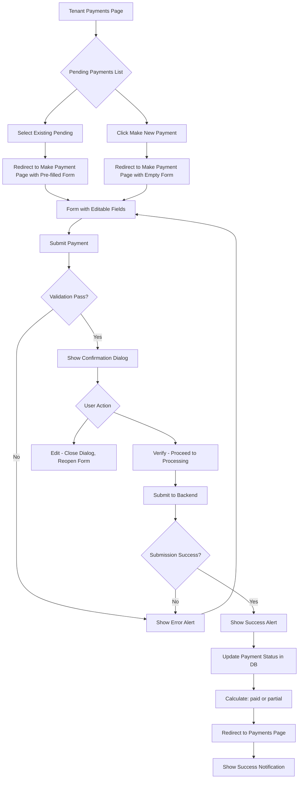

# Payment Processing Workflow Implementation Plan

## Overview

This document outlines the implementation plan for the Tenant Portal Payment Processing Workflow. The workflow allows tenants to:
1. View pending/unpaid rent amounts (calculated from monthly rent minus payments made)
2. Select an existing pending payment or make a new payment
3. Fill out a comprehensive payment form with pre-filled or empty fields
4. Validate inputs and confirm payment details
5. Submit payment and receive confirmation

---

## Architecture Overview



---

## Part 1: Backend Implementation

### 1.1 Database Migration

**File**: `database/migrations/2026_03_XX_XXXXXX_add_fields_to_payments_table.php`

Add columns to track due dates and reference information:

```php
Schema::table('payments', function (Blueprint $table) {
    $table->date('due_date')->nullable()->after('paid_at');
    $table->string('reference_number')->nullable()->after('status');
    $table->text('notes')->nullable()->after('reference_number');
});
```

**Current table structure:**
- `payment_type` - ENUM('rent', 'utility')
- `payment_method` - STRING
- `status` - ENUM('paid', 'partial', 'overdue')

No other columns need to be added - the existing fields handle payment type, method, and status.

### 1.2 Payment Model Updates

**File**: `app/Models/Payment.php`

Add new fields to fillable array:

```php
protected $fillable = [
    'tenant_id',
    'tenancy_id',
    'amount',
    'payment_type',      // rent, utility
    'payment_method',   // bank_transfer, mobile_money, etc.
    'status',           // paid, partial, overdue
    'paid_at',
    'receipt_path',
    'due_date',         // NEW
    'reference_number', // NEW
    'notes',            // NEW
];

// Helper method to calculate payment status based on amount paid vs rent due
public function calculateStatus(Tenancy $tenancy): string
{
    $monthlyRent = $tenancy->monthly_rent;
    $totalPaid = $tenancy->payments()
        ->where('status', '!=', 'overdue')
        ->sum('amount');
    
    if ($totalPaid >= $monthlyRent) {
        return 'paid';
    } elseif ($totalPaid > 0) {
        return 'partial';
    }
    return 'overdue';
}
```

### 1.3 TenantPaymentsController Updates

**File**: `app/Http/Controllers/Web/Tenant/TenantPaymentsController.php`

Add new methods:

```php
// GET /tenant/payments - Already exists, needs enhancement to include pending
public function index(Request $request)
{
    // ... existing code ...
    
    // NEW: Calculate pending payments
    $pendingAmount = $this->calculatePendingRent($activeTenancy);
    
    return Inertia::render('tenant/payments', [
        // ... existing data ...
        'pendingAmount' => $pendingAmount,
    ]);
}

// NEW: Show make payment page
public function makePayment(Request $request, ?int $pendingId = null)
{
    $user = $request->user();
    $tenant = $user->tenant;
    
    $activeTenancy = $tenant->tenancies()
        ->where('status', 'active')
        ->with(['payments'])
        ->first();
    
    $pendingPayment = null;
    if ($pendingId) {
        $pendingPayment = $activeTenancy->payments()->find($pendingId);
    }
    
    return Inertia::render('tenant/payments/make', [
        'tenant' => [...],
        'tenancy' => [...],
        'pendingPayment' => $pendingPayment,
        'paymentMethods' => ['mobile', 'bank_transfer'],
    ]);
}

// NEW: Store payment
public function storePayment(Request $request)
{
    $validated = $request->validate([
        'amount' => 'required|numeric|min:1',
        'payment_type' => 'required|in:rent,utility,deposit,other',
        'payment_method' => 'required|in:mobile,bank_transfer',
        'reference_number' => 'nullable|string|max:100',
        'notes' => 'nullable|string|max:500',
    ]);
    
    // Create payment and calculate status
    $payment = Payment::create([...]);
    
    // Redirect with success
}

// Helper: Calculate pending rent
private function calculatePendingRent(Tenancy $tenancy): float
{
    $monthlyRent = $tenancy->monthly_rent;
    $totalPaid = $tenancy->payments()
        ->where('status', 'paid')
        ->sum('amount');
    
    return max(0, $monthlyRent - $totalPaid);
}
```

### 1.4 Route Definitions

**File**: `routes/web.php`

Add new routes:

```php
Route::prefix('tenant')->middleware(['auth'])->group(function () {
    // ... existing routes ...
    
    Route::get('/payments/make', [TenantPaymentsController::class, 'makePayment'])
        ->name('tenant.payments.make');
    
    Route::post('/payments', [TenantPaymentsController::class, 'storePayment'])
        ->name('tenant.payments.store');
});
```

---

## Part 2: Frontend Implementation

### 2.1 Tenant Payments Page Enhancement

**File**: `resources/js/pages/tenant/payments.tsx`

Add:
- Pending payments list/display
- "Make New Payment" button
- Selection handling for existing pending payments

### 2.2 Make Payment Page

**File**: `resources/js/pages/tenant/payments/make.tsx` (new)

Create comprehensive form with sections:

```tsx
// Form Structure - matches database columns
interface PaymentFormData {
    amount: number;
    paymentType: 'rent' | 'utility';
    paymentMethod: string;  // Flexible - bank_transfer, mobile_money, etc.
    referenceNumber?: string;
    notes?: string;
    dueDate?: string;
}

// Component Sections:
// 1. Payment Details Section (pre-filled if pending selected)
//    - Amount input
//    - Payment type selector (rent, utility)
//
// 2. Payment Method Section
//    - Radio/select for Mobile or Bank Transfer
//    - Store in React state
//
// 3. Additional Fields Section
//    - Reference number input
//    - Notes textarea
```

### 2.3 Form Validation

Use Zod for validation (already in project dependencies):

```tsx
const paymentSchema = z.object({
    amount: z.number().min(1, 'Amount must be at least 1'),
    paymentType: z.enum(['rent', 'utility']),
    paymentMethod: z.string().min(1, 'Payment method is required'),
    referenceNumber: z.string().max(100).optional(),
    notes: z.string().max(500).optional(),
    dueDate: z.string().optional(),
});
```

**Enum values from database:**
- `payment_type`: 'rent', 'utility'
- `payment_method`: string (flexible)
- `status`: 'paid', 'partial', 'overdue'

### 2.4 Confirmation Dialog

**Component**: Using shadcn Dialog component

```tsx
<Dialog open={showConfirmation} onOpenChange={setShowConfirmation}>
    <DialogContent>
        <DialogHeader>
            <DialogTitle>Confirm Payment</DialogTitle>
            <DialogDescription>
                Please review your payment details
            </DialogDescription>
        </DialogHeader>
        
        {/* Summary: amount, payment method, reference */}
        
        <DialogFooter>
            <Button variant="outline" onClick={handleEdit}>
                Edit
            </Button>
            <Button onClick={handleVerify}>
                Verify
            </Button>
        </DialogFooter>
    </DialogContent>
</Dialog>
```

### 2.5 Success Handling

```tsx
// Show success alert (shadcn Alert)
<Alert variant="default" className="bg-green-50 border-green-200">
    <CheckCircle2 className="h-4 w-4" />
    <AlertTitle>Payment Submitted</AlertTitle>
    <AlertDescription>
        Your payment of {formatCurrency(amount)} has been received.
    </AlertDescription>
</Alert>

// Then redirect and show toast
router.visit(route('tenant.payments'), {
    onSuccess: () => {
        toast.success('Payment processed successfully!');
    }
});
```

---

## Part 3: UI/UX Flow

### 3.1 Tenant Payments Page

```
┌─────────────────────────────────────────────────────┐
│  Tenant Payments                           [+ New] │
├─────────────────────────────────────────────────────┤
│                                                     │
│  ┌─────────────────────────────────────────────┐   │
│  │  Pending Rent: TZS 500,000                  │   │
│  │  Due: March 31, 2026                        │   │
│  │  [Pay Now]                                   │   │
│  └─────────────────────────────────────────────┘   │
│                                                     │
│  Recent Payments                                   │
│  ┌─────────────────────────────────────────────┐   │
│  │  Jan 15  - TZS 500,000 - Rent - Paid       │   │
│  │  Dec 15  - TZS 500,000 - Rent - Paid       │   │
│  └─────────────────────────────────────────────┘   │
└─────────────────────────────────────────────────────┘
```

### 3.2 Make Payment Page

```
┌─────────────────────────────────────────────────────┐
│  ← Back                      Make Payment           │
├─────────────────────────────────────────────────────┤
│                                                     │
│  Payment Details                                    │
│  ┌─────────────────────────────────────────────┐   │
│  │  Amount *                    [500,000    ] │   │
│  │  Payment Type *              [Rent      v] │   │
│  └─────────────────────────────────────────────┘   │
│                                                     │
│  Payment Method                                     │
│  ┌──────────┐  ┌──────────┐                       │
│  │  (o)     │  │  ( )     │                       │
│  │ Mobile   │  │ Bank     │                       │
│  └──────────┘  └──────────┘                       │
│                                                     │
│  Additional Information                             │
│  ┌─────────────────────────────────────────────┐   │
│  │  Reference Number           [        ]     │   │
│  │  Notes                      [        ]     │   │
│  └─────────────────────────────────────────────┘   │
│                                                     │
│                    [ Submit Payment ]               │
└─────────────────────────────────────────────────────┘
```

### 3.3 Confirmation Dialog

```
┌─────────────────────────────────────────────────────┐
│                      ×                              │
│                                                     │
│              Confirm Payment                        │
│                                                     │
│  Please review your payment details:               │
│                                                     │
│  Amount:        TZS 500,000                        │
│  Method:        Mobile Money                      │
│  Reference:     MNO-2026-001                       │
│                                                     │
│  ─────────────────────────────────────            │
│                                                     │
│         [ Edit ]        [ Verify ]                  │
└─────────────────────────────────────────────────────┘
```

---

## Part 4: Implementation Steps Summary

| Step | Component | File(s) | Description |
|------|-----------|---------|-------------|
| 1 | Migration | `database/migrations/` | Add pending payment fields |
| 2 | Model | `app/Models/Payment.php` | Add fillables, status logic |
| 3 | Controller | `app/Http/Controllers/Web/Tenant/TenantPaymentsController.php` | Add makePayment, storePayment |
| 4 | Routes | `routes/web.php` | Add new endpoints |
| 5 | Payments Page | `resources/js/pages/tenant/payments.tsx` | Add pending display, buttons |
| 6 | Make Payment Page | `resources/js/pages/tenant/payments/make.tsx` | New - full form |
| 7 | Routes TS | `resources/js/routes/tenant/index.ts` | Add route definitions |
| 8 | Integration | - | Connect FE to BE |
| 9 | Testing | - | End-to-end verification |

---

## Technology Stack Used

- **Backend**: Laravel 12, PHP 8.2+
- **Frontend**: React 19, TypeScript, Inertia.js
- **UI Components**: shadcn/ui (Dialog, Alert, Button, Input, etc.)
- **Validation**: Zod
- **Icons**: Lucide React
- **State**: React useState/useReducer
- **Forms**: React Hook Form (recommended) or controlled components

---

## Payment Status Calculation Logic

```php
// After payment is recorded
$tenancy = $activeTenancy;
$monthlyRent = $tenancy->monthly_rent;
$totalPaid = $tenancy->payments()
    ->where('status', '!=', 'overdue')
    ->sum('amount');

if ($totalPaid >= $monthlyRent) {
    $payment->status = 'paid';
} elseif ($totalPaid > 0) {
    $payment->status = 'partial';
} else {
    $payment->status = 'overdue';
}
$payment->save();
```

**Status Enum Values**: 'paid', 'partial', 'overdue'

---

## Success Criteria

1. ✅ Tenant can view pending rent amount on payments page
2. ✅ Tenant can click "Make New Payment" to create a new payment
3. ✅ Tenant can select existing pending payment (pre-filled form)
4. ✅ Form validation shows clear error messages for invalid fields
5. ✅ Confirmation dialog shows summary before final submission
6. ✅ "Edit" button reopens form for modifications
7. ✅ "Verify" button proceeds to final submission
8. ✅ Success alert shown after submission
9. ✅ Payment status correctly calculated (paid/partial)
10. ✅ Tenant redirected to payments page with success notification
